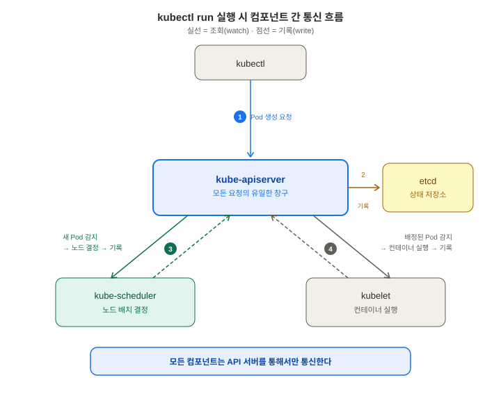
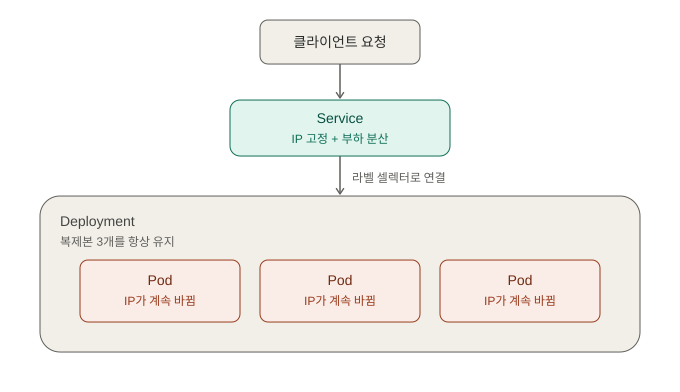
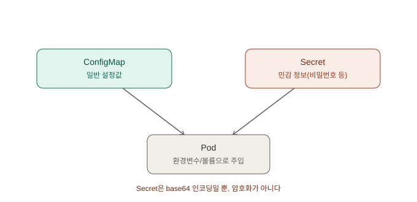
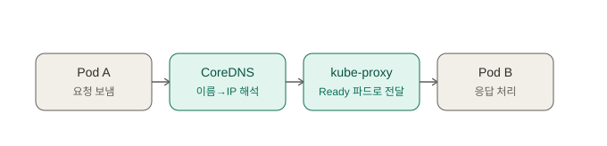
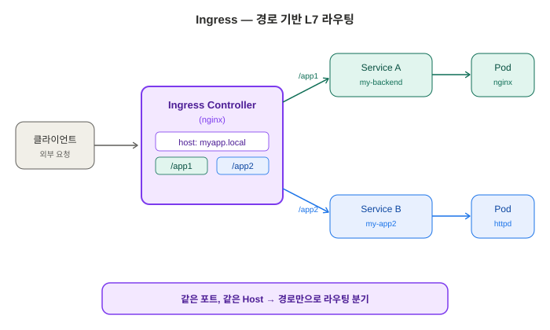
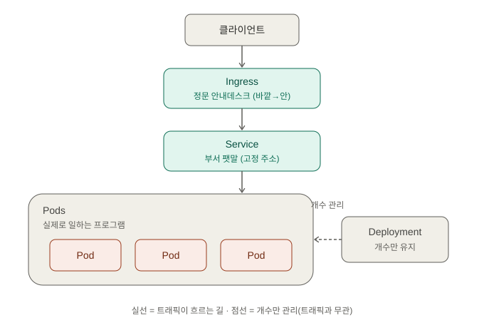
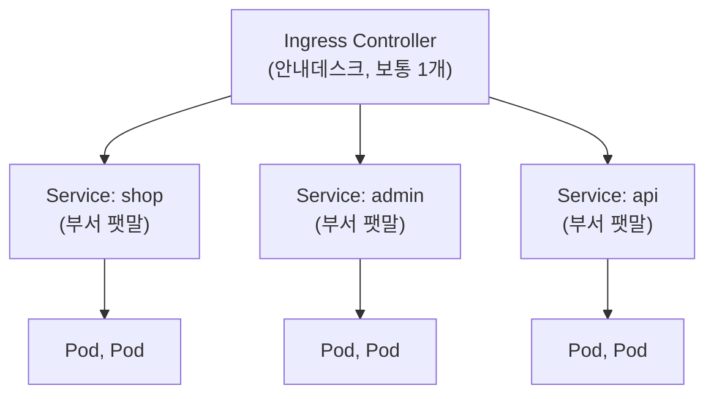
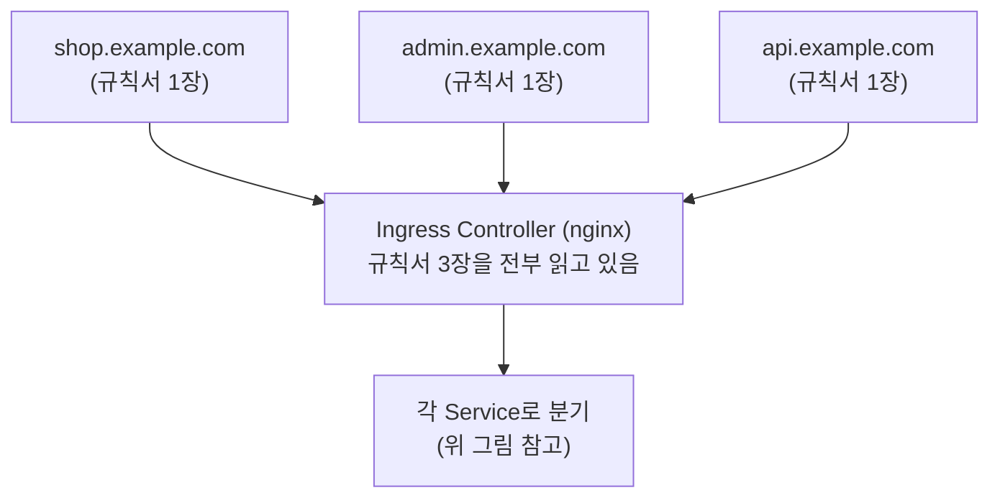
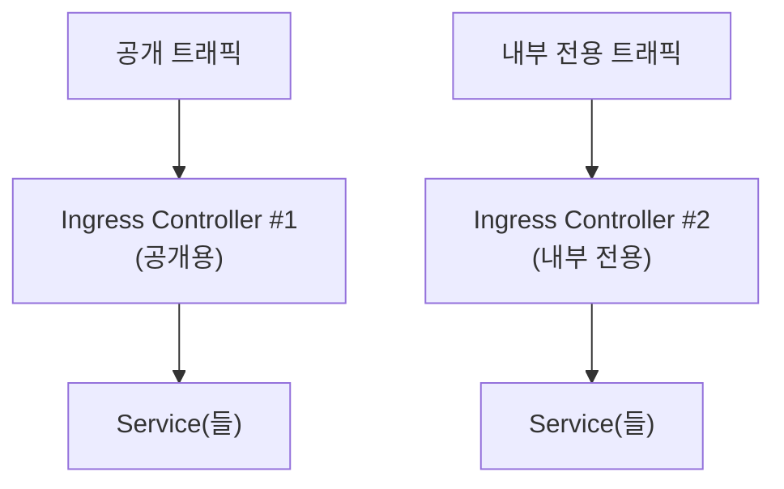

# 쿠버네티스 기초 — 면접 대비 학습 정리

> 학습 목적: 이직/면접 대비. Docker 기초 학습([Day 1](day01-docker-basics.md))에 이어, 쿠버네티스 핵심 개념을 minikube에서
> 직접 실습하며 "왜 이렇게 설계됐는지"와 "면접에서 어떻게 설명할지" 관점으로 정리.
> 이 문서는 실행한 명령어와 실제 출력 결과를 그대로 포함한다.

---

## 1. minikube 설치 및 클러스터 시작

쿠버네티스는 원래 여러 대의 서버(노드)를 묶어 운영하도록 설계됐지만, minikube는 **학습/개발용으로
단일 노드에 전체 쿠버네티스 컨트롤 플레인과 워커 기능을 압축해 넣은 로컬 클러스터**다.
`kubectl` 명령어와 YAML 문법은 실제 프로덕션 멀티노드 클러스터와 동일하게 동작하지만,
고가용성이나 노드 장애 시나리오 같은 건 재현할 수 없다.

**Windows 환경 참고**: Docker Desktop for Windows는 WSL2 안에서 동작하며,
`docker-desktop`이라는 WSL2 배포판을 사용한다 (과거에는 `docker-desktop-data` 배포판을
따로 뒀지만 **Docker Desktop 4.30(2024년 5월)부터** 단일 배포판으로 통합 —
[Day 1](day01-docker-basics.md) 정정 내용 참고).
minikube는 내부적으로 이 Docker Desktop을 driver로 사용해 클러스터를 띄운다.

### 설치
```powershell
winget install Kubernetes.minikube
```

### 버전 확인
```powershell
C:\Users\user>minikube version
minikube version: v1.38.1
commit: c93a4cb9311efc66b90d33ea03f75f2c4120e9b0
```

### 클러스터 시작 (실제 실행 로그)
```powershell
C:\Users\user>minikube start
* Microsoft Windows 11 Home 25H2 의 minikube v1.38.1
* 자동적으로 docker 드라이버가 선택되었습니다. 다른 드라이버 목록: hyperv, ssh
! Starting v1.39.0, minikube will default to "containerd" container runtime. See #21973 for more info.
* Docker Desktop 드라이버를 루트 권한으로 사용 중
* "minikube" 클러스터의 "minikube" primary control-plane 노드를 시작하는 중
* 기본 이미지 v0.0.50를 가져오는 중 ...
* 쿠버네티스 v1.35.1 을 다운로드 중 ...
    > preloaded-images-k8s-v18-v1...:  272.45 MiB / 272.45 MiB  100.00% 9.41 Mi
    > gcr.io/k8s-minikube/kicbase...:  519.58 MiB / 519.58 MiB  100.00% 8.56 Mi
* docker container (CPUs=2, 메모리=16300MB) 를 생성하는 중 ...
* 쿠버네티스 v1.35.1 을 Docker 29.2.1 런타임으로 설치하는 중/
* bridge CNI (Container Networking Interface) 를 구성하는 중 ...
* Kubernetes 구성 요소를 확인...
  - 이미지 gcr.io/k8s-minikube/storage-provisioner:v5 사용 중
* 애드온 활성화 : storage-provisioner, default-storageclass
* 끝났습니다! kubectl이 "minikube" 클러스터와 "default" 네임스페이스를 기본적으로 사용하도록 구성되었습니다
```

> `! Starting v1.39.0, minikube will default to "containerd" container runtime` 문구는
> 눈여겨볼 부분 — 지금은 Docker 드라이버로 자동 선택됐지만, K8s는 Docker 없이도 containerd
> 같은 다른 컨테이너 런타임(CRI, Container Runtime Interface)으로 동작할 수 있다는 뜻.

### 클러스터 상태 확인
```powershell
C:\Users\prist>kubectl get nodes
NAME       STATUS   ROLES           AGE   VERSION
minikube   Ready    control-plane   9s    v1.35.1
```

```powershell
C:\Users\prist>kubectl get pods
No resources found in default namespace.
```
→ 클러스터는 떠 있지만 아직 사용자가 배포한 Pod가 하나도 없는 상태(정상).

---

## 2. 쿠버네티스 클러스터 컴포넌트 (컨트롤 플레인 + 노드 컴포넌트 + 애드온)

"컴포넌트"란 시스템을 이루는 개별 구성 요소(독립적으로 실행되는 프로그램)를 뜻하는 일반 용어.
자동차의 엔진, 브레이크, 배터리처럼, 쿠버네티스도 여러 독립된 프로그램이 협력해서 하나의
클러스터 시스템을 이룬다.

### 확인 명령어와 실제 결과
```powershell
C:\Users\prist>kubectl get pods -n kube-system
NAME                               READY   STATUS    RESTARTS        AGE
coredns-7d764666f9-ntk97           1/1     Running   0               3m45s
etcd-minikube                      1/1     Running   0               3m52s
kube-apiserver-minikube            1/1     Running   0               3m51s
kube-controller-manager-minikube   1/1     Running   0               3m52s
kube-proxy-m7c74                   1/1     Running   0               3m45s
kube-scheduler-minikube            1/1     Running   0               3m52s
storage-provisioner                1/1     Running   1 (3m23s ago)   3m48s
```

| 분류 | 컴포넌트 | 역할 |
|---|---|---|
| 컨트롤 플레인 | `kube-apiserver` | 모든 요청의 유일한 창구. `kubectl` 명령도 결국 이 API 서버에 REST 요청을 보내는 것 |
| 컨트롤 플레인 | `etcd` | 클러스터의 모든 상태를 저장하는 key-value DB. 유일한 진실 저장소 |
| 컨트롤 플레인 | `kube-scheduler` | 새 Pod를 어느 노드에 배치할지 결정 |
| 컨트롤 플레인 | `kube-controller-manager` | 현재 상태를 목표 상태와 계속 맞추는 여러 컨트롤러의 묶음 (예: ReplicaSet 개수 유지) |
| 노드 컴포넌트 | `kube-proxy` | Service의 트래픽을 실제 Pod로 라우팅하는 규칙을 각 노드에 설정 |
| 애드온 | `coredns` | 클러스터 내부 DNS. **Service 이름**으로 서로 찾아갈 수 있게 함 (7번 섹션 참고) |
| 애드온 | `storage-provisioner` | 볼륨이 필요할 때 실제 저장 공간을 자동 생성 (minikube 전용, 실클라우드는 AWS EBS 등으로 대체) |

**면접 주의 — "컨트롤 플레인 컴포넌트"의 공식 범위**는 apiserver, etcd, scheduler,
controller-manager(+클라우드 환경의 cloud-controller-manager)까지다. `kube-proxy`와 `kubelet`은
각 노드에서 도는 **노드 컴포넌트**, coredns는 **애드온**으로 분류된다.
위 `kubectl get pods -n kube-system` 출력에 `kubelet`이 안 보이는 이유: kubelet은 Pod가 아니라
노드 자체에서 직접 실행되는 프로세스(systemd 서비스 등)이기 때문. Pod를 띄우는 주체가 kubelet인데
자기 자신이 Pod일 수는 없다.

`storage-provisioner`만 `RESTARTS 1`인 것은 부팅 순서 경쟁(etcd가 아직 준비 안 된 상태에서
먼저 접속을 시도했다가 실패)으로 흔히 발생하는 정상적인 현상.

**왜 여러 컴포넌트로 쪼갰는가**: 한 컴포넌트가 죽어도 다른 컴포넌트는 영향받지 않는 장애 격리,
독립적인 업그레이드/스케일, 관심사 분리(API 처리·상태 저장·스케줄링·감시)를 위해서다.

### 컴포넌트 간 통신 흐름 — "모두 API 서버를 통해서만 대화한다"



`kubectl run` 실행 시 실제 순서:
1. `kubectl` → API 서버로 "Pod 만들어줘" 요청
2. API 서버가 검증 후 etcd에 "새 Pod 필요" 기록
3. scheduler가 API 서버를 감시하다가 새 Pod를 발견 → 배치할 노드 결정 → 다시 API 서버에 기록
4. 해당 노드의 kubelet이 API 서버를 감시하다가 자기 노드에 배정된 Pod 발견 → 컨테이너 런타임으로 이미지 받아 컨테이너 실행
5. kubelet이 결과를 API 서버에 보고 → API 서버가 etcd에 반영

**중요**: scheduler와 kubelet은 서로 직접 통신하지 않는다. 오직 API 서버만 거친다.

> **면접 답변**: "쿠버네티스의 모든 컴포넌트는 서로 직접 통신하지 않고 API 서버를 통해서만
> 정보를 주고받는다. API 서버가 유일한 진입점이며 실제 상태는 etcd에 저장된다. 이 구조 덕분에
> 인증/권한 관리가 한 곳에 집중되고 컴포넌트 간 결합도가 낮아진다."

### kube-apiserver vs 사용자의 백엔드 서버 — 다른 개념

이름이 겹쳐서 헷갈리기 쉽지만 완전히 다른 계층이다.

| | kube-apiserver | 사용자의 백엔드 서버 (예: Express, Django) |
|---|---|---|
| 역할 | 쿠버네티스 **클러스터 자체**를 관리 (Pod, Node 등) | 사용자의 **비즈니스 로직** 처리 (회원가입, 주문 등) |
| 위치 | `kube-system` 네임스페이스 | `default` 네임스페이스 (일반 워크로드) |
| 관계 | 백엔드 서버 Pod를 관리하는 주체 | kube-apiserver가 관리하는 대상 중 하나일 뿐 |

---

## 3. Pod — 왜 컨테이너가 아니라 새 단위를 만들었나

도커 컨테이너는 각자 독립된 네트워크 네임스페이스(자기만의 IP)를 갖는다. 하지만 실무에서는
메인 앱 컨테이너와 이를 돕는 보조 컨테이너(로그 수집, 프록시 등)를 **네트워크와 특정 볼륨을
공유하면서, 항상 함께 스케줄링되고 생명주기를 같이하는 하나의 세트**로 묶어야 하는 경우가 많다.
도커 자체엔 이런 "묶음 관리" 개념이 없어서, K8s가 **Pod**라는 단위를 새로 만들었다.

- **Pod = 네트워크 네임스페이스(같은 IP)와 지정된 볼륨을 공유하는 컨테이너 그룹**
- 각 컨테이너는 여전히 독립된 파일시스템 쓰기 레이어(copy-on-write)를 가진다 — 완전히
  하나로 합쳐지는 게 아니라 네트워크/볼륨만 공유
- Pod 안 컨테이너들은 같은 IP를 쓰므로 `localhost:포트`로 즉시 통신 가능. 단, **같은 포트는
  동시에 못 씀** (일반 프로세스가 포트를 놓고 충돌하는 것과 동일한 원리)
- 대부분의 경우 Pod 안에는 컨테이너가 **1개**뿐. 여러 개를 넣는 건 "사이드카 패턴"이라는 특수 케이스

**비유 (로컬 협동 게임)**: 같은 콘솔 하나로 2인 협동 플레이 = 같은 네트워크(즉시 상호작용) +
공용 창고(공유 볼륨). 하지만 각자의 개인 인벤토리(파일시스템 레이어)는 안 섞인다.
온라인 매칭이었다면(Pod 없이 컨테이너 따로 실행) 서로 다른 IP로 네트워크를 거쳐야만 통신 가능.

> **면접 답변**: "Pod는 쿠버네티스의 최소 배포 단위다. 메인 컨테이너와 사이드카처럼 네트워크와
> 볼륨을 공유하며 생명주기를 같이해야 하는 컨테이너 묶음을 표현하기 위해 만들어졌다. 같은
> 네트워크 네임스페이스(같은 IP)를 공유하되, 각 컨테이너는 독립된 파일시스템 레이어를 가진다."

### 첫 Pod 띄우기

```powershell
C:\Users\prist>kubectl run my-first-pod --image=nginx:latest
pod/my-first-pod created

C:\Users\prist>kubectl get pods
NAME           READY   STATUS              RESTARTS   AGE
my-first-pod   0/1     ContainerCreating   0          4s
```

몇 초 후:
```powershell
C:\Users\prist>kubectl get pods
NAME           READY   STATUS    RESTARTS   AGE
my-first-pod   1/1     Running   0          24s
```

### 컨테이너 장애 vs Pod 장애 — 복구 메커니즘이 다르다

**컨테이너 프로세스만 강제 종료해보기**:
```powershell
C:\Users\prist>kubectl exec my-first-pod -- nginx -s stop
2026/07/09 01:41:32 [notice] 45#45: signal process started

C:\Users\prist>kubectl get pods
NAME           READY   STATUS    RESTARTS     AGE
my-first-pod   1/1     Running   1 (3s ago)   49s

C:\Users\prist>kubectl get pods
NAME           READY   STATUS    RESTARTS     AGE
my-first-pod   1/1     Running   1 (6s ago)   52s

C:\Users\prist>kubectl get pods
NAME           READY   STATUS    RESTARTS     AGE
my-first-pod   1/1     Running   1 (7s ago)   53s

C:\Users\prist>kubectl get pods
NAME           READY   STATUS    RESTARTS      AGE
my-first-pod   1/1     Running   1 (16s ago)   62s
```

`AGE`(49s → 62s)는 계속 누적되고 `RESTARTS`(0 → 1)만 증가 = **Pod 객체는 그대로, 컨테이너만
재시작됐다**는 것을 정확히 보여준다. kubelet이 Pod 안의 컨테이너를 개별 감시하다가,
`restartPolicy`(기본값 `Always`)에 따라 죽은 컨테이너만 다시 살린 것.

**Pod 자체를 완전히 삭제해보기** (Deployment 실습에서 이어짐, 아래 4번 참고):
```powershell
C:\Users\prist>kubectl delete pod my-backend-85646c7ff-bckw2
pod "my-backend-85646c7ff-bckw2" deleted from default namespace

C:\Users\prist>kubectl get pods
NAME                         READY   STATUS    RESTARTS      AGE
my-backend-85646c7ff-gxgp6   1/1     Running   0             4s
my-backend-85646c7ff-k4vcj   1/1     Running   0             81s
my-backend-85646c7ff-r4dbf   1/1     Running   0             81s
my-first-pod                 1/1     Running   2 (50m ago)   52m
```
`bckw2`는 사라지고 `gxgp6`라는 **완전히 새 이름의 Pod**가 `AGE 4s`, `RESTARTS 0`으로 생성됨
= **ReplicaSet 컨트롤러가 새 Pod를 통째로 만든 것**. IP도 이때 새로 발급된다 (5번 Service
섹션에서 직접 비교).

| | 컨테이너 프로세스만 죽었을 때 | Pod 객체 자체가 삭제됐을 때 |
|---|---|---|
| 복구 주체 | kubelet (같은 노드, 같은 Pod 안에서) | ReplicaSet 컨트롤러 (새 Pod 생성) |
| 결과 | 같은 Pod 유지, `RESTARTS`만 증가, `AGE` 계속 누적 | 다른 이름의 새 Pod, `RESTARTS 0`, `AGE` 0부터 시작, **IP도 새로 발급** |

> **면접 답변**: "컨테이너가 죽으면 kubelet이 같은 Pod 안에서 재시작하지만(IP 유지), Pod 객체
> 자체가 삭제되면 ReplicaSet이 완전히 새로운 Pod를 생성한다(새 IP). 이 때문에 Pod의 IP는
> 신뢰할 수 없고, 안정적인 접근을 위해 Service가 필요하다."

---

## 4. Deployment와 ReplicaSet — 왜 Pod를 직접 안 만드는가

`kubectl run`으로 만든 Pod는 "관리자가 없는" Pod다. 노드가 죽으면 그 Pod는 영영 사라지고,
개수를 늘리려면 명령어를 반복 실행해야 하며, 버전 업데이트 로직도 없다.

K8s는 이를 2단계 계층으로 해결한다:

- **ReplicaSet**: "Pod가 항상 N개 떠 있어야 한다"는 목표를 계속 감시. Pod가 어떤 이유로든
  사라지면 즉시 새 Pod를 만들어 개수를 채운다.
- **Deployment**: ReplicaSet을 감싸며 **버전 이력과 롤링 업데이트**를 관리. 이미지를 업데이트하면
  새 ReplicaSet을 만들고 기존 Pod를 하나씩 새 걸로 바꿔치기하며, 문제 생기면 이전 ReplicaSet으로
  롤백 가능.

**왜 두 단계로 나눴는가**: "지금 이 순간 Pod 개수 유지"(ReplicaSet)와 "시간에 따른 버전 관리"
(Deployment)는 서로 다른 관심사이기 때문. 업데이트 시 Deployment는 새 ReplicaSet을 만들고
기존/신규 ReplicaSet의 Pod 개수를 서서히 교체하는 방식으로 롤링 업데이트를 구현한다.

### 실제 실행 결과

```powershell
C:\Users\prist>kubectl create deployment my-backend --image=nginx:latest --replicas=3
deployment.apps/my-backend created

C:\Users\prist>kubectl get deployments
NAME         READY   UP-TO-DATE   AVAILABLE   AGE
my-backend   0/3     3            0           0s

C:\Users\prist>kubectl get replicasets
NAME                   DESIRED   CURRENT   READY   AGE
my-backend-85646c7ff   3         3         0       0s

C:\Users\prist>kubectl get pods
NAME                         READY   STATUS              RESTARTS      AGE
my-backend-85646c7ff-bckw2   0/1     ContainerCreating   0             2s
my-backend-85646c7ff-k4vcj   0/1     ContainerCreating   0             2s
my-backend-85646c7ff-r4dbf   0/1     ContainerCreating   0             2s
my-first-pod                 1/1     Running             2 (49m ago)   50m
```

몇 초 후 전부 Running:
```powershell
C:\Users\prist>kubectl get pods
NAME                         READY   STATUS    RESTARTS      AGE
my-backend-85646c7ff-bckw2   1/1     Running   0             53s
my-backend-85646c7ff-k4vcj   1/1     Running   0             53s
my-backend-85646c7ff-r4dbf   1/1     Running   0             53s
my-first-pod                 1/1     Running   2 (50m ago)   51m
```

### 이름 규칙으로 보는 계층 구조
```
my-backend                    ← Deployment
my-backend-85646c7ff          ← ReplicaSet (Deployment 이름 + 해시값)
my-backend-85646c7ff-bckw2    ← Pod (ReplicaSet 이름 + 랜덤 suffix)
my-backend-85646c7ff-k4vcj    ← Pod
my-backend-85646c7ff-r4dbf    ← Pod
```
`85646c7ff` 해시값은 Pod 설정(이미지, 환경변수 등)을 기반으로 계산된다. 이미지를 업데이트하면
이 해시값이 바뀌면서 새 ReplicaSet(예: `my-backend-7d9f8b6c4`)이 생성되는 것을 이름으로 확인할
수 있다 — 이게 "업데이트 시 새 ReplicaSet을 만든다"는 설계가 실제로 드러나는 부분.

> **면접 답변**: "Pod를 직접 만들면 노드 장애나 삭제 시 아무도 재생성해주지 않는다. ReplicaSet은
> 지정된 개수의 Pod를 유지하는 컨트롤러이고, Deployment는 그 위에서 버전 이력과 롤링 업데이트를
> 관리한다. 실무에서는 항상 Deployment를 통해 배포한다."

---

## 5. Service — 왜 필요한가



> 클라이언트 요청 → Service(고정 IP) → Deployment가 유지하는 Pod 3개. Pod는 재생성될 때마다
> IP가 바뀌므로, 그 앞에서 라벨 셀렉터로 고정 창구 역할을 하는 게 Service다.

Pod는 재생성될 때마다 IP가 바뀐다. 만약 프론트엔드가 백엔드 Pod의 IP를 직접 알고 접속한다면,
Pod가 재생성될 때마다 설정을 바꿔야 하는 문제가 생긴다.

**Service는 "IP 대신 label로 찾는다"는 방식으로 해결한다**:
- Service는 자기만의 **고정된 IP(ClusterIP)와 고정된 이름**을 가짐 (절대 안 바뀜)
- **label selector**로 "이 label을 가진 Pod들에게 트래픽을 보내라"고 지정
- 실제 Pod가 무엇이든 상관없이, 같은 label을 가진 Pod가 새로 생기면 자동으로 연결 대상에 포함
- 이를 실제로 구현하는 게 `kube-proxy` (바로 아래에서 자세히)

### kube-proxy는 실제로 무엇을 하는가 — "중계자"가 아니라 "규칙 설치자"

이름과 달리 kube-proxy는 트래픽을 **직접 중계하지 않는다.** 각 노드에 하나씩 뜨는 DaemonSet으로,
API 서버의 Service/EndpointSlice 변화를 감시하다가 **커널 네트워킹 계층에 라우팅 규칙만 심어둔다.**
ClusterIP로 온 패킷을 실제 Pod IP 중 하나로 바꿔치기(DNAT)하는 실제 처리는 **커널이** 한다.

**동작 모드** — 규칙을 어디에 심느냐의 차이:

| 모드 | 방식 | 특징 |
|---|---|---|
| userspace | kube-proxy 프로세스가 직접 중계 | 커널↔유저공간 왕복으로 느림. 사실상 폐기된 레거시 |
| **iptables** | 넷필터에 규칙 설치, 처리는 커널 | 현재도 **기본값**. Service가 많으면 규칙이 선형으로 늘어남(O(n)) |
| IPVS | 커널 내장 로드밸런서(해시 테이블) | Service 수천 개여도 성능 저하 적음(O(1)) |
| nftables | iptables 후속. 커널 5.13+ 필요 | **v1.33(2025-04-23 릴리스)에서 GA**(1.29 alpha → 1.31 beta → 1.33 stable, KEP-3866). 성능은 개선됐지만 호환성 때문에 기본값은 여전히 iptables |

**중요 — "Ready 파드로만 보낸다"의 진짜 주체**: kube-proxy는 readiness를 직접 판단하지 않는다.
Ready 여부로 파드를 거르는 건 **EndpointSlice 컨트롤러**다 — Service의 label selector와 맞는 파드
중 Ready인 것만 EndpointSlice 목록에 올린다([Day 7 §4](day07-docker-k8s-bridge.md) 실습에서
readiness 실패 파드가 목록에서 빠지는 것을 확인). kube-proxy는 그 목록을 **그대로 믿고** 규칙을
만들 뿐이다. 즉 **"EndpointSlice가 거르고, kube-proxy가 반영한다."**

### Service 생성 및 확인
```powershell
C:\Users\prist>kubectl expose deployment my-backend --port=80 --target-port=80
service/my-backend exposed

C:\Users\prist>kubectl get services
NAME         TYPE        CLUSTER-IP     EXTERNAL-IP   PORT(S)   AGE
kubernetes   ClusterIP   10.96.0.1      <none>        443/TCP   79m
my-backend   ClusterIP   10.96.223.42   <none>        80/TCP    3s
```
> `kubernetes`라는 Service는 사용자가 만든 게 아니라 클러스터가 자동 생성한 것으로,
> `kube-apiserver`에 접근하기 위한 Service다. 쿠버네티스 자기 자신도 쿠버네티스 위에서
> 관리된다는 재밌는 예시.

### Pod 삭제 전/후 IP 비교 (핵심 증명)

**삭제 전** — 현재 Pod들의 IP 확인:
```powershell
C:\Users\prist>kubectl get pods -o wide
NAME                         READY   STATUS    RESTARTS      AGE   IP           NODE       NOMINATED NODE   READINESS GATES
my-backend-85646c7ff-gxgp6   1/1     Running   0             28m   10.244.0.7   minikube   <none>           <none>
my-backend-85646c7ff-k4vcj   1/1     Running   0             29m   10.244.0.5   minikube   <none>           <none>
my-backend-85646c7ff-r4dbf   1/1     Running   0             29m   10.244.0.4   minikube   <none>           <none>
my-first-pod                 1/1     Running   2 (79m ago)   80m   10.244.0.3   minikube   <none>           <none>
```

Pod 하나 삭제:
```powershell
C:\Users\prist>kubectl delete pod my-backend-85646c7ff-gxgp6
pod "my-backend-85646c7ff-gxgp6" deleted from default namespace
```

**삭제 후**:
```powershell
C:\Users\prist>kubectl get pods -o wide
NAME                         READY   STATUS    RESTARTS      AGE   IP           NODE       NOMINATED NODE   READINESS GATES
my-backend-85646c7ff-k4vcj   1/1     Running   0             30m   10.244.0.5   minikube   <none>           <none>
my-backend-85646c7ff-r4dbf   1/1     Running   0             30m   10.244.0.4   minikube   <none>           <none>
my-backend-85646c7ff-xqqs6   1/1     Running   0             6s    10.244.0.8   minikube   <none>           <none>
my-first-pod                 1/1     Running   2 (80m ago)   81m   10.244.0.3   minikube   <none>           <none>

C:\Users\prist>kubectl get services
NAME         TYPE        CLUSTER-IP     EXTERNAL-IP   PORT(S)   AGE
kubernetes   ClusterIP   10.96.0.1      <none>        443/TCP   82m
my-backend   ClusterIP   10.96.223.42   <none>        80/TCP    3m2s
```

| | 삭제 전 | 삭제 후 |
|---|---|---|
| 사라진 Pod | `gxgp6` (IP `10.244.0.7`) | — |
| 새로 생긴 Pod | — | `xqqs6` (IP `10.244.0.8`, `AGE 6s`) |
| **Service의 CLUSTER-IP** | `10.96.223.42` | **`10.96.223.42` (그대로)** |

Pod는 완전히 새로운 이름과 IP로 재생성됐지만, Service의 IP는 단 1비트도 바뀌지 않았다.
프론트엔드가 `my-backend`(Service 이름) 또는 `10.96.223.42`(Service IP)로 접속하도록
설정돼 있었다면, 이 Pod 교체는 전혀 눈치채지 못했을 것이다.

> **면접 답변**: "Pod IP는 재생성될 때마다 바뀌지만, Service는 label selector로 Pod를 찾기
> 때문에 CLUSTER-IP 자체는 Pod 교체와 무관하게 안정적으로 유지된다. 클라이언트는 Pod가 아니라
> 항상 Service를 통해 접근해야 한다."

---

## 6. ConfigMap과 Secret — 설정과 민감정보 분리



이미지는 **불변(immutable)** 레이어다. 그런데 개발/스테이징/프로덕션마다 DB 주소, API URL
같은 설정값이 다르다. 이걸 이미지 안에 하드코딩하면, 환경이 바뀔 때마다 이미지를 새로 빌드해야
한다 — 코드는 하나도 안 바뀌었는데도. 이는 "코드와 설정을 분리하라"는 원칙(12-factor app 등)에
위배된다.

그래서 K8s는 **설정값을 이미지 밖으로 완전히 분리**해서, Pod가 뜰 때 환경변수나 볼륨 마운트
형태로 "주입"할 수 있게 했다. 이는 [Day 1에서 배운 볼륨의 mount 개념](day01-docker-basics.md)과
원리가 동일하다 — ConfigMap/Secret도 결국 Pod의 특정 경로나 환경변수에 주입되는 별도 객체다.

### ConfigMap과 Secret을 왜 나눴는가

둘 다 매커니즘은 거의 동일하지만(키-값 데이터를 Pod에 주입), K8s는 일부러 두 개의 다른 객체
타입으로 나눴다:

| | ConfigMap | Secret |
|---|---|---|
| 용도 | 일반 설정값 (DB 주소, 로그 레벨, feature flag) | 민감한 정보 (비밀번호, API 키, 인증서) |
| 저장 형식 | 평문 | base64 인코딩 |
| 접근 제어 | 일반 | RBAC로 더 엄격하게 제한 가능, etcd 암호화 대상으로 별도 지정 가능 |

**중요한 오해 포인트**: base64는 암호화가 아니라 인코딩이다 (누구나 디코딩 가능). Secret이
"안전"한 이유는 인코딩 자체가 아니라, K8s가 Secret 타입에 한해 더 엄격한 접근 제어 정책을
적용할 수 있게 설계했기 때문이다.

> **면접 답변**: "ConfigMap과 Secret은 설정값을 이미지 밖으로 분리해 환경변수나 볼륨으로 Pod에
> 주입하는 객체다. 둘을 나눈 이유는 접근 제어 수준을 다르게 적용하기 위해서다 — Secret은 base64로
> 인코딩되고 RBAC나 etcd 암호화 등 더 엄격한 보안 정책의 대상이 될 수 있지만, base64 자체는
> 암호화가 아니라는 점에 유의해야 한다."

### 실제 실행 결과

```powershell
C:\Users\prist>kubectl create configmap my-config --from-literal=DB_HOST=mysql-service --from-literal=LOG_LEVEL=debug
configmap/my-config created

C:\Users\prist>kubectl create secret generic my-secret --from-literal=DB_PASSWORD=supersecret123
secret/my-secret created

C:\Users\prist>kubectl get configmaps
NAME               DATA   AGE
kube-root-ca.crt   1      93m
my-config          2      1s

C:\Users\prist>kubectl get secrets
NAME        TYPE     DATA   AGE
my-secret   Opaque   1      2s
```
`TYPE Opaque`는 가장 일반적인 Secret 타입 — "특별한 용도가 정해지지 않은 범용 시크릿"이라는 뜻.

### Pod에 실제로 주입해서 확인하기

```yaml
apiVersion: v1
kind: Pod
metadata:
  name: config-test
spec:
  containers:
  - name: test-container
    image: busybox
    command: ["sleep", "3600"]
    envFrom:
    - configMapRef:
        name: my-config
    - secretRef:
        name: my-secret
```
PowerShell here-string으로 바로 적용:
```powershell
@"
apiVersion: v1
kind: Pod
metadata:
  name: config-test
spec:
  containers:
  - name: test-container
    image: busybox
    command: ["sleep", "3600"]
    envFrom:
    - configMapRef:
        name: my-config
    - secretRef:
        name: my-secret
"@ | kubectl apply -f -
```
```
pod/config-test created
```

컨테이너 안 환경변수 확인:
```powershell
C:\Users\prist>kubectl exec config-test -- env
PATH=/usr/local/sbin:/usr/local/bin:/usr/sbin:/usr/bin:/sbin:/bin
HOSTNAME=config-test
DB_HOST=mysql-service
LOG_LEVEL=debug
DB_PASSWORD=supersecret123
MY_BACKEND_PORT_80_TCP=tcp://10.96.223.42:80
MY_BACKEND_PORT_80_TCP_PROTO=tcp
KUBERNETES_SERVICE_PORT_HTTPS=443
KUBERNETES_PORT=tcp://10.96.0.1:443
KUBERNETES_PORT_443_TCP_PORT=443
KUBERNETES_PORT_443_TCP_ADDR=10.96.0.1
MY_BACKEND_PORT_80_TCP_PORT=80
MY_BACKEND_PORT_80_TCP_ADDR=10.96.223.42
KUBERNETES_SERVICE_PORT=443
KUBERNETES_PORT_443_TCP=tcp://10.96.0.1:443
KUBERNETES_PORT_443_TCP_PROTO=tcp
MY_BACKEND_SERVICE_PORT=80
KUBERNETES_SERVICE_HOST=10.96.0.1
MY_BACKEND_SERVICE_HOST=10.96.223.42
MY_BACKEND_PORT=tcp://10.96.223.42:80
HOME=/root
```
`DB_HOST=mysql-service`, `LOG_LEVEL=debug`, `DB_PASSWORD=supersecret123` 세 값 모두 확인됨.
`busybox` 이미지 자체에는 이 값들이 전혀 없었는데, Pod가 뜨면서 ConfigMap/Secret 내용이
실제로 주입된 것.

### 덤으로 확인된 것 — Service 자동 환경변수 주입 (레거시 방식)

`MY_BACKEND_SERVICE_HOST=10.96.223.42`, `KUBERNETES_SERVICE_HOST=10.96.0.1` 같은 값들은
쿠버네티스가 **Pod 생성 시점에 그 네임스페이스에 이미 존재하는 모든 Service의 정보를 자동으로
환경변수로 주입**해주는 기능 때문에 나타난 것. 초창기 도커의 "links" 기능에서 유래한 오래된
메커니즘으로, **Pod 생성 이후에 만들어진 Service는 반영되지 않는다**는 치명적 한계가 있다.
그래서 실무에서는 아래의 DNS 방식을 표준으로 사용한다.

---

## 7. Service를 DNS로 찾기 — coredns 상세 설명



### 환경변수 방식의 근본적 한계

환경변수 방식(`MY_BACKEND_SERVICE_HOST=...`)은 Pod가 시작되는 **그 순간** 값이 고정되어 들어간다.
Pod가 뜬 이후에 새 Service가 생기면, 이미 떠 있는 Pod들은 그 정보를 영원히 받을 수 없다
(환경변수는 시작 시 딱 한 번만 주입되고 이후 갱신되지 않음).

### DNS 방식의 동작 원리

쿠버네티스는 Service를 만들 때마다 `coredns`(kube-system의 그 컴포넌트)에 자동으로 DNS
레코드를 등록한다. Pod 안에서 Service 이름으로 접속하면, coredns가 **접속을 시도하는 바로 그
순간**의 최신 Service IP를 조회해서 알려준다 — 값이 미리 박히는 게 아니라 매번 실시간으로 물어보는 것.

**정식 이름 형식**:
```
<서비스이름>.<네임스페이스>.svc.cluster.local
```
같은 네임스페이스 안에서는 축약해서 `<서비스이름>`만 써도 된다.

### 실제 실행 결과와 해설

```powershell
C:\Users\prist>kubectl exec config-test -- nslookup my-backend
Server:         10.96.0.10
Address:        10.96.0.10:53
** server can't find my-backend.cluster.local: NXDOMAIN
Name:   my-backend.default.svc.cluster.local
Address: 10.96.223.42
** server can't find my-backend.cluster.local: NXDOMAIN
** server can't find my-backend.svc.cluster.local: NXDOMAIN
** server can't find my-backend.svc.cluster.local: NXDOMAIN
command terminated with exit code 1
```

**결과 해설**:
- `Server: 10.96.0.10`은 coredns 자신의 IP.
- Pod 안의 DNS 설정(`/etc/resolv.conf`)에는 짧은 이름을 완전한 이름으로 확장해주는 **search
  목록**이 있다 (`default.svc.cluster.local`, `svc.cluster.local`, `cluster.local` 순서).
- 핵심 결과: `my-backend.default.svc.cluster.local` → **`10.96.223.42`** (아까 `kubectl get
  services`에서 확인한 그 CLUSTER-IP와 정확히 일치).
- 출력에 NXDOMAIN이 성공 응답 앞뒤로 뒤섞여 보이는 이유: busybox의 간단한 `nslookup` 구현체는
  search 접미사별 쿼리(+A/AAAA 레코드 각각)를 **병렬로 전부 날리고 도착하는 순서대로 출력**하기
  때문. 순서대로 하나씩 시도하다 멈추는 게 아니라서, 매칭 실패한 접미사들(`*.cluster.local`,
  `*.svc.cluster.local`)의 NXDOMAIN과 성공 응답이 섞여 나온다. `exit code 1`도 일부 쿼리가
  NXDOMAIN이라 나오는 것일 뿐, 핵심 조회(`default.svc.cluster.local`)는 성공했다.

### 왜 DNS가 환경변수 방식보다 나은가

DNS는 접속을 시도하는 **그때마다** 새로 조회하는 방식이라, Service가 나중에 생겼든 Pod가
재생성되어 IP가 바뀌었든 항상 최신 정보를 받는다. 이는 앞서 확인한 "Pod가 재생성되면 IP가
바뀌지만 Service는 안 바뀐다"는 사실과 정확히 맞물린다 — DNS로 이름만 알고 있으면, 뒤에서
Pod가 몇 번을 재생성되든 이름 하나로 계속 정확한 IP를 얻을 수 있다.

> **면접 답변**: "환경변수 방식은 Pod 시작 시점에 존재하는 Service 정보만 한 번 주입되어 이후
> 생성된 Service를 반영하지 못한다. 반면 coredns 기반 DNS 방식은 접속 시점마다 실시간으로
> 이름을 조회하므로, Service가 나중에 생기거나 Pod가 재생성되어 IP가 바뀌어도 항상 최신 IP를
> 정확히 찾아낼 수 있다. 그래서 실무에서는 DNS 방식을 표준으로 사용한다."

---

## 8. Ingress — 하나의 진입점에서 여러 Service로 라우팅



전체 트래픽 흐름과 Deployment의 역할을 한 그림으로 보면:



> 요청은 항상 위에서 아래로(실선) 흐른다 — 클라이언트 → Ingress(정문 안내데스크) →
> Service(부서 팻말) → Pod. **Deployment는 이 흐름에 끼어 있지 않고**(점선), Pod
> 개수만 유지한다 — Service가 파드를 관리하지 않는 것과 정확히 같은 이유다.

### Service는 여러 개, Ingress는 "규칙서"와 "안내데스크"를 구분해야 함

**Service는 여러 개 있는 게 당연하다** — 부서(백엔드 앱)마다 각자의 팻말이 있는 것이므로:



**Ingress는 "규칙서"와 "그걸 읽는 안내데스크"를 구분해야 헷갈리지 않는다.** Ingress
**리소스**(어느 도메인/경로를 어느 Service로 보낼지 적은 규칙서)는 앱마다 따로 만드는 게
흔하지만, 그 규칙서들을 읽고 실제로 안내하는 소프트웨어(Ingress **Controller**)는 보통
**하나**가 전부 읽는다:



다만 건물에 공개 출입구와 직원/VIP 전용 출입구를 따로 두듯, Ingress Controller 자체를
**여러 개** 띄워서 역할을 분리하는 것도 실무에서 쓴다 (`ingressClassName`으로 규칙서마다
"이건 몇 번 데스크가 처리해"라고 지정):



**정리**: 규칙서(Ingress 리소스)는 앱 개수만큼 많은 게 정상, 안내데스크(Controller)는
보통 하나가 다 처리하지만 필요하면 여러 개로 나눌 수도 있다.

### 왜 Service만으로는 부족한가

Service는 "고정된 IP로 Pod 집합을 찾는다"는 문제까지만 해결한다. 하지만 실무에서는:

- 외부에서 접속 가능한 IP/포트는 보통 **1개**만 열어두고 싶다 (Service마다 외부 포트를 다 열면
  관리가 안 됨)
- 그 하나의 진입점에서, **경로**(`/app1`, `/app2`)나 **도메인**(`a.com`, `b.com`)에 따라 서로
  다른 백엔드로 트래픽을 나누고 싶다
- HTTPS 인증서 처리도 한 곳에서 몰아서 하고 싶다

Service 하나로는 이런 "한 진입점에서 여러 서비스로 분기"하는 로직을 표현할 수 없다. **Ingress**는
L7(HTTP) 레벨에서 호스트/경로 기반 라우팅 규칙을 정의하는 객체이며, 실제 라우팅은 **Ingress
컨트롤러**(예: `ingress-nginx`, 사실상 nginx를 리버스 프록시로 사용)가 처리한다.

### Service 타입과 Ingress 비교

| 타입 | 외부 노출 | 설명 |
|---|---|---|
| `ClusterIP` | ❌ | 클러스터 내부에서만 접근 (기본값) |
| `NodePort` | ✅ | 각 노드 IP + 포트로 직접 접근 (30000~32767) |
| `LoadBalancer` | ✅ | 클라우드 LB 연동 (AWS ALB 등). minikube에서는 `minikube tunnel`로 흉내 가능 |
| `Ingress` | ✅ | L7 HTTP 라우팅 — 하나의 진입점에서 여러 Service로 분기 가능 |

**주의**: Ingress는 Service의 네 번째 타입이 아니라 **완전히 별개의 리소스**(`kind: Ingress`)다.
Service 타입은 ClusterIP/NodePort/LoadBalancer(+ExternalName) 뿐이고, Ingress는 그 Service들
**앞단**에서 L7 라우팅을 얹는 다른 계층이다. 표에 같이 넣은 건 "외부 노출 방법" 비교 목적일 뿐.

> **면접 답변**: "Service는 Pod 집합에 대한 고정된 내부 접근점을 제공하지만, 외부에서 여러
> 서비스로 접근할 단일 진입점과 호스트/경로 기반 라우팅은 제공하지 않는다. Ingress는 이 역할을
> 담당하는 L7 라우팅 규칙이며, 실제 트래픽 처리는 Ingress 컨트롤러가 리버스 프록시로 수행한다."

### 실습 순서 및 실제 실행 결과

**1) ingress-nginx 컨트롤러 활성화 및 확인**
```powershell
minikube addons enable ingress
kubectl get pods -n ingress-nginx
```
→ `ingress-nginx-controller-...` Pod가 `Running`이 될 때까지 확인.

**2) 라우팅 분기를 보여주기 위한 두 번째 백엔드 생성**
```powershell
kubectl create deployment my-app2 --image=httpd:latest --replicas=2
kubectl expose deployment my-app2 --port=80 --target-port=80
```
기존 `my-backend`(nginx)와 새로 만든 `my-app2`(Apache httpd), 서로 다른 이미지의 두 백엔드로
라우팅 분기를 시각적으로 확인할 수 있게 준비.

**3) 경로 기반 라우팅 규칙을 정의하는 Ingress 리소스 작성**
```powershell
@"
apiVersion: networking.k8s.io/v1
kind: Ingress
metadata:
  name: my-ingress
  annotations:
    nginx.ingress.kubernetes.io/rewrite-target: /
spec:
  ingressClassName: nginx
  rules:
  - host: myapp.local
    http:
      paths:
      - path: /app1
        pathType: Prefix
        backend:
          service:
            name: my-backend
            port:
              number: 80
      - path: /app2
        pathType: Prefix
        backend:
          service:
            name: my-app2
            port:
              number: 80
"@ | kubectl apply -f -
```

`rewrite-target: /`는 nginx·httpd 둘 다 웰컴 페이지가 루트(`/`)에 있으므로, 어떤 경로로 들어오든
백엔드에는 항상 `/`로 재작성해 전달하기 위한 설정. 이게 없으면 백엔드 입장에서 `/app1`이라는
존재하지 않는 경로로 요청이 가서 404가 날 수 있다.

`pathType: Prefix`는 `/app1`뿐 아니라 `/app1/anything`처럼 해당 경로로 시작하는 모든 요청을
매칭한다. 정확히 그 경로만 매칭하려면 `pathType: Exact`를 쓴다.

**4) Ingress 확인 (실제 결과)**
```powershell
C:\Users\prist>kubectl describe ingress my-ingress
Name:             my-ingress
Labels:           <none>
Namespace:        default
Address:
Ingress Class:    nginx
Default backend:  <default>
Rules:
  Host         Path  Backends
  ----         ----  --------
  myapp.local
               /app1   my-backend:80 (10.244.0.4:80,10.244.0.5:80,10.244.0.8:80)
               /app2   my-app2:80 (10.244.0.13:80,10.244.0.14:80)
Annotations:   nginx.ingress.kubernetes.io/rewrite-target: /
Events:
  Type    Reason  Age   From                      Message
  ----    ------  ----  ----                      -------
  Normal  Sync    7s    nginx-ingress-controller  Scheduled for sync
```
경로별로 정확히 다른 Service/Pod가 연결된 것을 확인.

**5) 접속 테스트 — Windows + Docker driver 환경의 특수성**

Windows에서 Docker driver를 쓰면 NodePort가 호스트에 직접 뚫리지 않아, `minikube service`로
임시 포트 포워딩 터널을 만들어야 한다:
```powershell
C:\Users\prist>kubectl get svc -n ingress-nginx
NAME                                 TYPE        CLUSTER-IP       EXTERNAL-IP   PORT(S)                      AGE
ingress-nginx-controller             NodePort    10.106.221.223   <none>        80:32339/TCP,443:30489/TCP   29m
ingress-nginx-controller-admission   ClusterIP   10.101.75.123    <none>        443/TCP                      29m

C:\Users\prist>minikube service ingress-nginx-controller -n ingress-nginx --url
http://127.0.0.1:52213
http://127.0.0.1:52214
! windows 에서 Docker 드라이버를 사용하고 있기 때문에, 터미널을 열어야 실행할 수 있습니다.
```
`52213`은 Ingress의 80번(HTTP) 포트로 연결되는 터널, `52214`는 443번(HTTPS) 포트로 연결되는
터널. 이 터미널 창을 켜둔 채로 다른 창에서 테스트해야 한다 (창을 닫으면 터널도 끊김).

**실제 curl 테스트 결과** (새 PowerShell 창에서, `Host` 헤더로 가상 도메인 지정):
```powershell
PS C:\WINDOWS\System32> curl.exe -H "Host: myapp.local" http://127.0.0.1:52213/app1
<!DOCTYPE html>
<html>
<head><title>Welcome to nginx!</title>...
<h1>Welcome to nginx!</h1>
...

PS C:\WINDOWS\System32> curl.exe -H "Host: myapp.local" http://127.0.0.1:52213/app2
<!DOCTYPE HTML PUBLIC "-//W3C//DTD HTML 4.01//EN" "http://www.w3.org/TR/html4/strict.dtd">
<html>
<head><title>It works! Apache httpd</title></head>
<body><p>It works!</p></body>
</html>
```

| 요청 | 응답 |
|---|---|
| `http://127.0.0.1:52213/app1` (Host: myapp.local) | nginx 웰컴 페이지 (`my-backend`) |
| `http://127.0.0.1:52213/app2` (Host: myapp.local) | Apache 웰컴 페이지 (`my-app2`) |

**같은 포트, 같은 Host로 들어온 요청이 경로만으로 완전히 다른 백엔드로 라우팅됨**을 직접 확인.

> 참고: 처음 `52214`(443/HTTPS용 포트)로 평문 HTTP 요청을 보냈을 때는
> `400 The plain HTTP request was sent to HTTPS port` 에러가 발생했다 — 포트와 프로토콜이
> 맞지 않으면 nginx가 명시적으로 거부한다는 것을 보여주는 부수적 확인.

---

## 9. 리소스 requests/limits와 HPA — 자원 관리와 오토스케일링

### requests와 limits — 왜 두 개로 나눴는가

- **requests**: 스케줄러가 "이 Pod를 배치하려면 최소 이 정도 자원이 필요하다"고 판단하는 기준값.
  노드에 여유 자원이 이보다 적으면 그 노드엔 아예 배치되지 않는다.
- **limits**: 컨테이너가 쓸 수 있는 자원의 상한선.

**CPU와 메모리는 초과 시 처리 방식이 다르다**: CPU는 limit을 넘으면 스로틀링(느려지기만 함)되지만,
메모리는 limit을 넘으면 **OOMKilled로 컨테이너가 강제 종료**된다. CPU는 시간 단위로 나눠 쓸 수
있는 압축성 자원이지만 메모리는 그렇지 않기 때문.

**HPA(HorizontalPodAutoscaler)**는 실제 CPU/메모리 사용률(request 대비 %)을 보고 Deployment의
replica 수를 자동으로 늘리거나 줄이는 컨트롤러다. 그래서 HPA를 쓰려면 반드시 컨테이너에
**requests가 설정되어 있어야** 하고(퍼센트 계산의 분모가 되므로), 실제 사용률을 측정할
**metrics-server**가 클러스터에 있어야 한다.

> **면접 답변**: "requests는 스케줄링 시 필요한 최소 자원, limits는 사용 가능한 최대 자원이다.
> CPU는 압축성 자원이라 limit 초과 시 스로틀링되지만, 메모리는 비압축성이라 초과 시 OOMKilled로
> 컨테이너가 죽는다. HPA는 이 requests를 기준으로 실제 사용률을 계산해 replica 수를 자동
> 조정하므로, HPA를 쓰려면 requests 설정과 metrics-server가 전제 조건이다."

### 실습 — metrics-server 활성화

```powershell
C:\Users\prist>minikube addons enable metrics-server
* 'metrics-server' 애드온이 활성화되었습니다

C:\Users\prist>kubectl get pods -n kube-system | findstr metrics-server
metrics-server-9d74bb658-d6hfq     0/1     Running   0               67s
```

`Running`인데도 `0/1`(readiness 미통과)인 상태가 한동안 이어졌지만, 별도 조치 없이 잠시 후
자연스럽게 `1/1`로 전환되며 정상화됐다:

```powershell
C:\Users\prist>kubectl top nodes
NAME       CPU(cores)   CPU(%)   MEMORY(bytes)   MEMORY(%)
minikube   259m         1%       1019Mi          13%
```

### 실습 — my-backend에 requests/limits 지정

```powershell
C:\Users\prist>kubectl set resources deployment my-backend -c=nginx --requests=cpu=50m,memory=64Mi --limits=cpu=100m,memory=128Mi
deployment.apps/my-backend resource requirements updated
```

`describe deployment`로 확인:
```
Limits:
  cpu:     100m
  memory:  128Mi
Requests:
  cpu:         50m
  memory:      64Mi
```

### 중요한 관찰 — 리소스 스펙 변경도 이미지 업데이트와 똑같이 롤링 업데이트를 유발한다

```
Events:
  Normal  ScalingReplicaSet  20s   deployment-controller  Scaled up replica set my-backend-5dbf78bf48 from 0 to 1
  Normal  ScalingReplicaSet  16s   deployment-controller  Scaled down replica set my-backend-85646c7ff from 3 to 2
  Normal  ScalingReplicaSet  16s   deployment-controller  Scaled up replica set my-backend-5dbf78bf48 from 1 to 2
  Normal  ScalingReplicaSet  13s   deployment-controller  Scaled down replica set my-backend-85646c7ff from 2 to 1
  Normal  ScalingReplicaSet  13s   deployment-controller  Scaled up replica set my-backend-5dbf78bf48 from 2 to 3
  Normal  ScalingReplicaSet  10s   deployment-controller  Scaled down replica set my-backend-85646c7ff from 1 to 0
```
`--requests`/`--limits`는 이미지 태그와 마찬가지로 **Pod 템플릿의 일부**다. 4번 섹션에서 본
"Pod 설정 해시값이 바뀌면 새 ReplicaSet이 생긴다"는 원리가 여기서도 그대로 적용되어, 새
ReplicaSet(`my-backend-5dbf78bf48`)이 만들어지고 기존 것(`my-backend-85646c7ff`)이 1개씩
교체되며 사라진 것을 이벤트 로그로 직접 확인할 수 있다.

### 실습 — HPA 생성

```powershell
C:\Users\prist>kubectl autoscale deployment my-backend --cpu-percent=50 --min=2 --max=6
Flag --cpu-percent has been deprecated, Use --cpu with percentage or resource quantity format (e.g., '70%' for utilization or '500m' for milliCPU).
horizontalpodautoscaler.autoscaling/my-backend autoscaled
```

생성 직후:
```powershell
C:\Users\prist>kubectl get hpa
NAME         REFERENCE               TARGETS              MINPODS   MAXPODS   REPLICAS   AGE
my-backend   Deployment/my-backend   cpu: <unknown>/50%   2         6         0          15s
```
`<unknown>`과 `REPLICAS 0`은 metrics-server가 첫 지표를 아직 수집하기 전이라 그런 것으로,
30초 정도 후 재확인하면 정상화된다:
```powershell
C:\Users\prist>kubectl get hpa
NAME         REFERENCE               TARGETS       MINPODS   MAXPODS   REPLICAS   AGE
my-backend   Deployment/my-backend   cpu: 0%/50%   2         6         3          32s
```

### 실습 — 부하를 걸어 실제 스케일 업 관찰

부하 생성용 Pod로 `my-backend`에 무한 요청:
```powershell
kubectl run load-generator --image=busybox --restart=Never -- /bin/sh -c "while true; do wget -q -O- http://my-backend; done"
```

HPA 실시간 관찰 결과:
```
my-backend   Deployment/my-backend   cpu: 49%/50%   2         6         3          2m8s
my-backend   Deployment/my-backend   cpu: 75%/50%   2         6         3          2m45s
my-backend   Deployment/my-backend   cpu: 75%/50%   2         6         5          3m
```
CPU 사용률이 target(50%)을 넘어 75%까지 오르자, HPA가 replica를 3 → 5로 늘렸다. 같은 시점
`kubectl get pods --watch`에서도 새 Pod 2개(`bfws9`, `qcqgl`)가 `Pending → ContainerCreating
→ Running`으로 생성되는 과정이 그대로 관찰됐다.

### 실습 — 부하 제거 후 스케일 다운 관찰 (비대칭적 반응 속도)

```powershell
kubectl delete pod load-generator
```

이후 HPA 관찰 결과:
```
my-backend   Deployment/my-backend   cpu: 45%/50%   2   6   5   3m49s
my-backend   Deployment/my-backend   cpu: 15%/50%   2   6   5   4m45s
my-backend   Deployment/my-backend   cpu: 0%/50%    2   6   5   5m45s
my-backend   Deployment/my-backend   cpu: 0%/50%    2   6   5   9m30s
my-backend   Deployment/my-backend   cpu: 0%/50%    2   6   2   9m45s   ← 여기서 5→2로 감소
my-backend   Deployment/my-backend   cpu: 0%/50%    2   6   2   10m
```
CPU가 0%로 떨어진 뒤에도 **약 5분 동안 replica 5개가 그대로 유지**되다가, 5분 시점을 넘긴
9m45s에서야 2개로 줄었다.

**왜 스케일업은 즉시 반응하고 스케일다운은 느린가**: 스케일업과 스케일다운은 안정화 기간
(stabilization window)이 비대칭적으로 설계되어 있다.

| | 스케일업 | 스케일다운 |
|---|---|---|
| 기본 안정화 기간 | 0초 (즉시 반응) | 5분 |
| 이유 | 트래픽 폭증에 늦게 대응하면 바로 서비스 장애로 이어짐 | 순간적인 사용률 하락에 바로 줄이면, 트래픽이 곧 다시 튈 때 스케일업↔다운을 반복(flapping)하게 됨 |

스케일다운을 결정할 때 HPA는 "지금 이 순간의 값"이 아니라 **지난 5분 동안 계산됐던 desired
replica 값들 중 가장 컸던 값**을 기준으로 판단한다. 그래서 사용률이 0%가 된 즉시가 아니라,
직전 고부하 시점으로부터 5분이 지나야 실제로 줄어드는 것을 확인할 수 있었다.

> **면접 답변**: "HPA는 스케일업은 즉시, 스케일다운은 기본 5분의 안정화 기간을 두고 판단한다.
> 스케일다운 시 현재 값이 아니라 지난 5분간의 최댓값을 기준으로 삼기 때문에, 트래픽이 순간적으로
> 튀었다 가라앉는 상황에서 replica 수가 불필요하게 오르내리는 flapping을 방지할 수 있다."

---

## 10. Ingress에 TLS/HTTPS 연결하기

### 왜 필요한가

8번 섹션의 Ingress는 HTTP만 처리했다. 실무에서는 외부에 노출되는 진입점이 반드시 HTTPS여야
하므로, Ingress 컨트롤러가 TLS 종료(TLS termination)를 대신 처리하도록 인증서를 연결해야 한다.
TLS 종료란 **외부와의 HTTPS 통신은 Ingress 컨트롤러(nginx)가 인증서로 암호화/복호화를 전담하고,
그 뒤(Ingress → Service → Pod) 클러스터 내부 통신은 평문 HTTP로 흘려보내는 구조**를 말한다.
클러스터 내부는 이미 네트워크 경계가 있으니 매 홉마다 암호화할 필요가 없다는 전제다.

이를 위해선 **`kubernetes.io/tls` 타입의 Secret**(인증서+개인키)이 필요하다 — 6번 섹션에서 배운
Secret의 실제 활용 사례. 실무에서는 Let's Encrypt 같은 CA 인증서를 `cert-manager`로 자동
발급/갱신하지만, 학습 환경에서는 원리 확인을 위해 **자체 서명(self-signed) 인증서**를 직접
만들어 썼다.

### 실습 — 자체 서명 인증서 생성

Windows PowerShell엔 `openssl`이 없고, 이미 떠 있는 Docker Desktop을 활용해 컨테이너 안에서
바로 생성했다:

```powershell
mkdir C:\tls-certs
cd C:\tls-certs
docker run --rm -v ${PWD}:/certs alpine/openssl req -x509 -nodes -days 365 -newkey rsa:2048 -keyout /certs/tls.key -out /certs/tls.crt -subj "/CN=myapp.local/O=myapp.local"
```

```
디렉터리: C:\tls-certs

Mode                 LastWriteTime         Length Name
----                 -------------         ------ ----
-a----      2026-07-09   오후 3:06           1180 tls.crt
-a----      2026-07-09   오후 3:06           1704 tls.key
```

### 실습 — TLS Secret 생성 및 Ingress에 연결

```powershell
kubectl create secret tls my-tls-secret --cert=C:\tls-certs\tls.crt --key=C:\tls-certs\tls.key
```

기존 Ingress에 `spec.tls` 섹션만 추가해서 재적용:
```yaml
spec:
  ingressClassName: nginx
  tls:
  - hosts:
    - myapp.local
    secretName: my-tls-secret
  rules:
    # ... 기존 /app1, /app2 규칙은 그대로
```

확인 결과:
```powershell
C:\tls-certs>kubectl describe ingress my-ingress
...
TLS:
  my-tls-secret terminates myapp.local
Rules:
  Host         Path  Backends
  ----         ----  --------
  myapp.local
               /app1   my-backend:80 (10.244.0.16:80,10.244.0.18:80)
               /app2   my-app2:80 (10.244.0.13:80,10.244.0.14:80)
```
`TLS:` 섹션이 추가된 것 외에 8번 섹션의 경로 기반 라우팅 규칙(`Rules`)은 그대로 유지된다 —
TLS 설정과 라우팅 규칙이 서로 독립적인 관심사임을 보여준다.

### 실습 — HTTPS 요청 테스트와 SNI 이슈

443 포트용 터널(Windows + Docker driver 환경)로 curl 테스트:
```powershell
curl.exe -k -v -H "Host: myapp.local" https://127.0.0.1:62636/app1
```
→ `200 OK`와 함께 nginx 웰컴 페이지가 정상 응답됨. TLS 핸드셰이크(`SSL/TLS connection
renegotiated`)도 완료.

**여기서 발견한 중요한 함정**: 로그에 `schannel: using IP address, SNI is not supported by OS`
라는 경고가 있었다. Windows curl은 OpenSSL이 아니라 **schannel**(Windows 자체 TLS 스택)을
쓰는데, IP 주소로 접속하면 **SNI(Server Name Indication — TLS 핸드셰이크 단계에서 "나는
myapp.local에 접속하려는 거야"라고 미리 알려주는 정보)를 보내지 못한다**. Ingress 컨트롤러는
여러 host의 인증서를 SNI로 구분해서 제공하므로, SNI가 없으면 어떤 인증서가 실제로 나갔는지
`curl` 결과만으로는 확신할 수 없는 상태였다.

그래서 SNI를 명시적으로 지정할 수 있는 `openssl s_client`로 별도 검증했다:
```powershell
"" | docker run --rm --add-host=myapp.local:host-gateway -i alpine/openssl s_client -connect myapp.local:62636 -servername myapp.local
```
```
depth=0 CN=myapp.local, O=myapp.local
verify error:num=18:self-signed certificate
...
subject=CN=myapp.local, O=myapp.local
issuer=CN=myapp.local, O=myapp.local
...
New, TLSv1.3, Cipher is TLS_AES_256_GCM_SHA384
Verify return code: 18 (self-signed certificate)
```
`-servername myapp.local`로 SNI를 명시하니 `subject=CN=myapp.local`이 정확히 확인됐다 —
우리가 만든 인증서가 SNI 기준으로 올바르게 매칭되어 제공된다는 증거. `verify error: self-signed
certificate`(에러 코드 18)는 CA 없이 직접 서명한 인증서라서 나오는 당연한 경고지, 연결 실패가
아니다.

> **면접 답변**: "Ingress에 TLS를 적용하려면 `kubernetes.io/tls` 타입 Secret을 만들고
> `spec.tls`에서 host와 함께 연결하면, Ingress 컨트롤러가 TLS 종료를 전담하고 그 뒤 클러스터
> 내부는 평문 HTTP로 통신한다. 여러 host를 하나의 Ingress 컨트롤러가 처리할 때는 SNI로 인증서를
> 구분하므로, 클라이언트가 SNI를 못 보내는 환경(예: IP로 직접 접속)에서는 의도한 인증서가
> 나가는지 별도로 검증해야 한다."

---

## 오늘 배운 것 전체 흐름 요약

1. minikube는 학습용 단일 노드 압축 클러스터
2. 클러스터 컴포넌트는 컨트롤 플레인(API 서버, etcd, scheduler, controller-manager),
   노드 컴포넌트(kubelet, kube-proxy), 애드온(coredns 등)으로 분류되며, 각자 독립 실행되고
   서로 직접 통신하지 않고 API 서버를 통해서만 협력한다
3. Pod는 네트워크/볼륨을 공유하는 컨테이너 묶음 — 컨테이너 장애는 kubelet이 같은 Pod 안에서
   복구하고, Pod 자체 소멸은 ReplicaSet이 새 Pod 생성으로 복구한다 (IP가 바뀜)
4. Deployment(버전 관리) → ReplicaSet(개수 유지) → Pod 순으로 계층화되어 있다
5. Service는 고정 IP + label selector로, Pod IP가 계속 바뀌어도 안정적인 접근점을 제공한다
6. ConfigMap/Secret은 설정과 민감정보를 이미지 밖으로 분리해 환경변수나 볼륨으로 주입한다
7. Service는 이름(coredns 기반 DNS)으로 찾는 것이 표준이며, 이는 Pod IP 변경에 항상
   안전하게 대응할 수 있는 방식이다 (자동 주입되는 환경변수 방식은 레거시)
8. Ingress는 하나의 외부 진입점에서 호스트/경로 기반으로 여러 Service에 트래픽을 라우팅하며,
   실제 처리는 Ingress 컨트롤러(리버스 프록시)가 담당한다
9. requests/limits는 각각 스케줄링 기준/사용 상한이며, HPA는 requests 대비 실사용률을 기준으로
   replica 수를 자동 조정한다 (스케일업은 즉시, 스케일다운은 5분 안정화 기간 후)
10. Ingress의 TLS는 kubernetes.io/tls Secret과 spec.tls로 연결하며, Ingress 컨트롤러가 TLS
    종료를 전담한다. 여러 host의 인증서는 SNI로 구분되므로, SNI 없이 접속하면 의도한 인증서가
    나가는지 별도 검증이 필요하다

**다음 학습 목표**: Namespace와 RBAC(역할 기반 접근 제어), 또는 PersistentVolume/PVC(상태
저장 워크로드를 위한 영구 스토리지).
