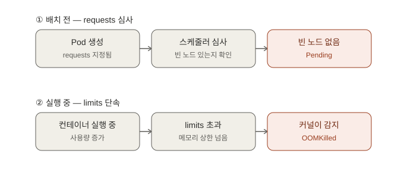

# HPA 심화와 스케줄링/자원 관리 — 면접 대비 학습 정리

> 학습 목적: 이직/면접 대비. [Day 2](day02-kubernetes-basics.md)에서 다룬 HPA와 requests/limits를
> 더 깊이 파고들어, "HPA는 왜 max까지 안 늘어나기도 하는지", "스케줄러가 실제로 무엇을 보고
> Pod 배치를 거부하는지"를 minikube에서 직접 재현하며 정리. 환경은 Day 1~2와 동일한
> minikube(Windows + Docker driver, WSL2), PowerShell.

---

## 1. HPA의 max(상한선) 테스트 — "왜 max까지 안 늘어나는가"


### 개념 — HPA의 계산 공식

HPA는 매 sync 주기(기본 15초)마다 아래 공식으로 목표 replica 수를 계산한다:

```
desiredReplicas = ceil( currentReplicas × ( currentMetricValue / desiredMetricValue ) )
```

- HPA는 **min/max 범위 밖으로는 절대 나가지 않는다.**
- 부하가 max 한도로도 감당 못 할 만큼 크면 → CPU 사용률이 목표치를 초과한 채로 유지된다.
  이건 장애가 아니라 **"설계된 상한선"**이다.
- 반대로 부하가 현재 replica 수로 충분히 감당 가능하면 → **max까지 굳이 늘리지 않는다**
  (과다 프로비저닝 방지 설계).
- 스케일다운에는 [Day 2에서 확인한](day02-kubernetes-basics.md) 기본 5분의 안정화 창
  (stabilization window)이 있어 급격한 진동(flapping)을 막는다.

### 왜 이렇게 설계됐는가

HPA는 "무조건 많이 늘리는" 컨트롤러가 아니라 **목표 사용률에 딱 맞는 지점을 찾아가는 균형
컨트롤러**로 설계됐다. max는 안전장치(비용 폭주·노드 자원 고갈 방지)일 뿐, 정상 동작 중이라면
필요 이상으로 늘리지 않는 것이 오히려 의도된 동작이다.

> **면접 답변**: "HPA가 있는데 왜 max까지 안 늘어나는 경우가 있나요?"
> "HPA는 목표 사용률에 딱 맞을 때까지만 스케일업하며, 부하가 현재 replica로 감당 가능한
> 수준이면 굳이 max까지 늘리지 않습니다. 이는 과다 프로비저닝을 막기 위한 설계입니다. 부하
> 테스트 시 '어느 정도 부하부터 max에 도달하는지'를 확인하면 서비스의 실질적인 처리 용량과
> HPA 설정의 적절성을 검증할 수 있습니다."

### 직접 확인한 실습

부하 생성기 여러 개를 동시에 띄워 hpa-demo Deployment에 무한 요청:
```powershell
kubectl run load-generator-1 --image=busybox --restart=Never -- /bin/sh -c "while true; do wget -q -O- http://hpa-demo; done"
kubectl run load-generator-2 --image=busybox --restart=Never -- /bin/sh -c "while true; do wget -q -O- http://hpa-demo; done"
kubectl run load-generator-3 --image=busybox --restart=Never -- /bin/sh -c "while true; do wget -q -O- http://hpa-demo; done"
# 부하 강화를 위해 4, 5 추가
kubectl run load-generator-4 --image=busybox --restart=Never -- /bin/sh -c "while true; do wget -q -O- http://hpa-demo; done"
kubectl run load-generator-5 --image=busybox --restart=Never -- /bin/sh -c "while true; do wget -q -O- http://hpa-demo; done"
```

부하 생성기 3개 시점 — CPU가 목표(50%)를 넘은 55%로 스케일업 압력이 있었으나:
```
PS C:\WINDOWS\System32> kubectl get hpa
NAME         REFERENCE               TARGETS        MINPODS   MAXPODS   REPLICAS   AGE
hpa-demo     Deployment/hpa-demo     cpu: 55%/50%   1         5         3          141m
my-backend   Deployment/my-backend   cpu: 0%/50%    2         6         2          23h
```

시간 경과 후 — CPU%가 목표 아래(39%)로 안정화, REPLICAS는 3에서 유지:
```
NAME         REFERENCE               TARGETS        MINPODS   MAXPODS   REPLICAS   AGE
hpa-demo     Deployment/hpa-demo     cpu: 39%/50%   1         5         3          3h25m
```

부하 생성기를 5개로 늘려 1분 간격 3회 확인 — 여전히 max(5)가 아니라 3 replica로 버팀:
```powershell
PS C:\WINDOWS\System32> 1..3 | ForEach-Object { Start-Sleep -Seconds 60; kubectl get hpa }
NAME         REFERENCE               TARGETS        MINPODS   MAXPODS   REPLICAS   AGE
hpa-demo     Deployment/hpa-demo     cpu: 43%/50%   1         5         3          3h29m
NAME         REFERENCE               TARGETS        MINPODS   MAXPODS   REPLICAS   AGE
hpa-demo     Deployment/hpa-demo     cpu: 43%/50%   1         5         3          3h30m
NAME         REFERENCE               TARGETS        MINPODS   MAXPODS   REPLICAS   AGE
hpa-demo     Deployment/hpa-demo     cpu: 41%/50%   1         5         3          3h31m
```

`kubectl top pods`로 부하 생성기 자체의 CPU 소모량 확인:
```
NAME                          CPU(cores)   MEMORY(bytes)
hpa-demo-bd56ddf75-8jgv9      38m          13Mi
hpa-demo-bd56ddf75-8prkj      38m          13Mi
hpa-demo-bd56ddf75-tk9b5      40m          13Mi
load-generator-1              168m         1Mi
load-generator-2              167m         0Mi
load-generator-3              166m         1Mi
load-generator-4              169m         1Mi
load-generator-5              167m         1Mi
```

**결과 해석**: 노드가 16코어로 넉넉했기 때문에 노드 자원 부족이 원인이 아니었고, busybox
wget 단일 루프의 요청 자체가 nginx 입장에서 가벼워 3 replica로 충분히 감당 가능한 수준이었던
것. **핵심 교훈**: max 도달 여부보다 중요한 것은 (1) HPA는 목표치 근처에서 균형을 찾는
컨트롤러라는 것, (2) 부하 테스트로 "어느 부하부터 max에 도달하는지" 확인하면 서비스의 실질
처리 용량과 HPA 설정의 적절성을 검증할 수 있다는 것.

정리:
```powershell
kubectl delete pod load-generator-1 load-generator-2 load-generator-3 load-generator-4 load-generator-5
```

---

## 2. 노드 자원 장부 — kubectl describe node의 Allocated resources

### 개념

- `kubectl describe node`의 **Allocated resources** 섹션은 스케줄러가 참조하는 "자원 장부"다.
- 스케줄러는 Pod 배치 시 노드의 **Allocatable** 용량에서 이미 배치된 Pod들의 **requests 합계**를
  뺀 여유분만 본다.
- **Limits는 배치 결정과 무관** — 런타임에 커널(cgroup)이 실제 사용량을 제한하는 용도일 뿐이다.

### 왜 이렇게 설계됐는가

**requests = 스케줄러의 장부 관리용 / limits = 커널의 실시간 단속용**으로 역할이 명확히 나뉜다.
스케줄링(배치 가능 여부 판단)과 런타임 제한(실제 자원 초과 시 조치)은 서로 다른 시점, 다른
주체(스케줄러 vs 커널)가 담당하는 별개의 문제이기 때문에 두 값을 분리했다.

> **면접 답변**: "`kubectl describe node`에서 무엇을 봐야 하나요?"
> "Allocated resources 섹션은 스케줄러가 참조하는 '자원 장부'입니다. 스케줄러는 Pod를 배치할
> 때 노드의 Allocatable 용량에서 이미 배치된 Pod들의 requests 합계를 뺀 여유분만 보고
> 판단하며, Limits는 배치 결정에 관여하지 않고 런타임에 실제 사용량을 제한하는 역할만 합니다.
> 그래서 'Pod가 왜 안 뜨지?' 할 때 가장 먼저 봐야 할 게 이 Allocated resources입니다."

### 직접 확인한 실습

```powershell
kubectl describe node minikube
```

핵심 부분 발췌:
```
Capacity:
  cpu:                16
  ephemeral-storage:  1055762868Ki
  memory:             7968960Ki
  pods:               110
Allocatable:
  cpu:                16
  ephemeral-storage:  1055762868Ki
  memory:             7968960Ki
  pods:               110

Non-terminated Pods:          (16 in total)
  Namespace                   Name                                         CPU Requests  CPU Limits  Memory Requests  Memory Limits
  default                     hpa-demo-bd56ddf75-8prkj                     100m (0%)     200m (1%)   0 (0%)           0 (0%)
  default                     my-backend-5dbf78bf48-pj2mc                  50m (0%)      100m (0%)   64Mi (0%)        128Mi (1%)
  default                     my-backend-5dbf78bf48-w7qq9                  50m (0%)      100m (0%)   64Mi (0%)        128Mi (1%)
  ingress-nginx               ingress-nginx-controller-596f8778bc-4bmfw    100m (0%)     0 (0%)      90Mi (1%)        0 (0%)
  kube-system                 coredns-7d764666f9-ntk97                     100m (0%)     0 (0%)      70Mi (0%)        170Mi (2%)
  kube-system                 etcd-minikube                                100m (0%)     0 (0%)      100Mi (1%)       0 (0%)
  kube-system                 kube-apiserver-minikube                      250m (1%)     0 (0%)      0 (0%)           0 (0%)
  kube-system                 kube-controller-manager-minikube             200m (1%)     0 (0%)      0 (0%)           0 (0%)
  kube-system                 kube-scheduler-minikube                      100m (0%)     0 (0%)      0 (0%)           0 (0%)
  kube-system                 metrics-server-9d74bb658-d6hfq               100m (0%)     0 (0%)      200Mi (2%)       0 (0%)

Allocated resources:
  (Total limits may be over 100 percent, i.e., overcommitted.)
  Resource           Requests    Limits
  --------           --------    ------
  cpu                1150m (7%)  400m (2%)
  memory             588Mi (7%)  426Mi (5%)
```

**결과 해석**:
- 노드 용량: CPU 16코어(16000m), 메모리 약 7.6Gi.
- 현재 전체 Pod requests 합계: cpu 1150m(7%), memory 588Mi(7%) → 매우 여유로운 상태.
- `Total limits may be over 100 percent (overcommitted)` 문구: **limits 합계는 노드 용량을
  초과해도 된다**는 뜻. 배치 기준은 requests뿐이기 때문에 limits는 overcommit이 허용된다.
- kube-system Pod들(apiserver, etcd, scheduler 등)도 requests를 점유하고 있어, 사용자 Pod가
  쓸 수 있는 실제 여유는 Allocatable에서 이들까지 뺀 값이라는 점도 확인.

---

## 3. 스케줄 실패(Pending) 재현

### 개념

- Pod의 **requests가 클러스터의 어떤 노드로도 감당 불가능**하면, 스케줄러는 배치를 거부하고
  Pod는 **Pending** 상태로 남는다.
- 이때 컨테이너는 **생성/시작조차 되지 않는다** (`Node: <none>`, `PodScheduled: False`).
- 스케줄러는 preemption(낮은 우선순위 Pod 축출)까지 검토하지만, 그래도 자리가 안 나오면
  "Preemption is not helpful"로 포기한다.
- 원인 확인은 `kubectl describe pod` → **Events의 FailedScheduling** 메시지로 한다.

### 왜 이렇게 설계됐는가

스케줄러가 "일단 배치하고 나중에 문제 생기면 처리"하는 대신 **사전 검증(admission 이전에
자원 요구량을 확인)** 방식을 택한 이유는, 노드에 물리적으로 들어갈 수 없는 자원 요구를
억지로 배치했다가 노드 전체가 불안정해지는 것보다, 배치 자체를 안전하게 거부하고 사용자가
requests를 조정하도록 명확한 신호(Pending + FailedScheduling)를 주는 편이 낫기 때문이다.

> **면접 답변**: "Pending과 OOMKilled의 차이를 설명해주세요."
> "둘 다 자원 부족과 관련 있지만 발생 시점이 다릅니다. Pending은 스케줄링 단계에서
> kube-scheduler가 requests 기준으로 노드 배치 가능 여부를 사전 검증하다 실패한 경우로,
> 컨테이너가 아예 생성되지 않습니다. 반면 OOMKilled는 컨테이너가 실행되던 도중 실제 메모리
> 사용량이 limits를 초과해 리눅스 커널의 cgroup OOM killer가 프로세스를 강제 종료한
> 경우입니다. 전자는 '스케줄러의 사전 검증 실패', 후자는 '커널의 런타임 강제 조치'라는 점에서
> 다른 계층의 문제입니다."

### 직접 확인한 실습

배치 불가능한 Pod 생성 (요청 자원을 노드 용량보다 훨씬 크게):
```powershell
@"
apiVersion: v1
kind: Pod
metadata:
  name: too-big-pod
spec:
  containers:
  - name: test
    image: nginx
    resources:
      requests:
        memory: "100Gi"
        cpu: "50"
"@ | kubectl apply -f -
```

확인 결과:
```
PS C:\WINDOWS\System32> kubectl describe pod too-big-pod
Name:             too-big-pod
Namespace:        default
Node:             <none>
Status:           Pending
IP:
Containers:
  test:
    Image:      nginx
    Requests:
      cpu:        50
      memory:     100Gi
Conditions:
  Type           Status
  PodScheduled   False
QoS Class:                   Burstable
Events:
  Type     Reason            Age   From               Message
  ----     ------            ----  ----               -------
  Warning  FailedScheduling  35s   default-scheduler  0/1 nodes are available: 1 Insufficient cpu, 1 Insufficient memory. no new claims to deallocate, preemption: 0/1 nodes are available: 1 Preemption is not helpful for scheduling.
```

**결과 해석**:
- `0/1 nodes are available`: 클러스터의 노드 1개(minikube)조차 이 Pod를 받아줄 수 없음.
- `Insufficient cpu, Insufficient memory`: 요청(cpu 50, memory 100Gi) > 노드 Allocatable
  (cpu 16, memory 약 7.6Gi).
- `Preemption is not helpful`: 다른 Pod를 전부 쫓아내도 50코어/100Gi는 절대 확보 불가 →
  축출 자체가 무의미하다고 스케줄러가 판단.
- `Node: <none>`, `PodScheduled: False`: 컨테이너 시작은커녕 이미지 pull조차 발생하지 않음.
  "예약"만 시도되다 실패한 상태.
- QoS Class가 `Burstable`인 이유: requests는 설정했지만 limits를 설정하지 않아 requests ≠
  limits이기 때문. (requests = limits였다면 `Guaranteed`, 둘 다 없으면 `BestEffort`.)

정리:
```powershell
kubectl delete pod too-big-pod
```

---

## 4. 핵심 개념 비교 정리 — Pending vs OOMKilled



| 구분 | **Pending** | **OOMKilled** |
|---|---|---|
| 발생 단계 | 스케줄링 단계 (실행 전) | 런타임 단계 (실행 도중) |
| 판단 주체 | kube-scheduler | kubelet + Linux 커널(cgroup OOM killer) |
| 판단 기준 | **requests** 합계 > 노드 Allocatable | 실제 메모리 사용량 > **limits** |
| 결과 | 컨테이너가 아예 생성/시작되지 않음 | 실행 중이던 컨테이너가 강제 종료됨 |
| 확인 방법 | `describe pod` → Events: `FailedScheduling` | `describe pod` → Last State: `Terminated`, Reason: `OOMKilled` |
| 비유 | 식당에 자리가 없어서 입장 자체를 못 함 | 자리에 앉아 먹다가 정해진 양 초과로 쫓겨남 |

한 줄 요약: **Pending = 약속(requests)을 잡을 수 없어 시작도 못 한 것 / OOMKilled = 시작은
했으나 실제 사용량이 한도(limits)를 넘어 처형된 것.**

> **면접 답변**: "HPA만으로 오토스케일링이 충분한가요?"
> "HPA는 Pod 레벨의 지표만 보고 replica 수를 조절하는 컨트롤러입니다. 하지만 Pod를 늘려도
> 그걸 실행할 노드의 물리 자원 여유가 없으면 스케줄링이 안 되거나(Pending) 전체 성능이 함께
> 떨어질 수 있습니다. 그래서 노드 단위 확장을 담당하는 Cluster Autoscaler, 그리고 적절한
> requests/limits 설정이 함께 필요합니다."

### 오늘의 트러블슈팅 노트

- **HPA가 max까지 안 올라간 문제**: 처음엔 노드 CPU 포화를 의심했으나, `describe node` 확인
  결과 노드는 16코어로 여유로웠음. 실제 원인은 busybox wget 부하가 nginx 3 replica로 충분히
  감당 가능한 수준이었기 때문. → **추측보다 `describe node` / `top pods`로 실측하는 습관이
  중요.**
- **PowerShell 대기 후 자동 실행 패턴**: `Start-Sleep -Seconds 180; kubectl get hpa` 또는
  `1..3 | ForEach-Object { Start-Sleep -Seconds 60; kubectl get hpa }`가 반복 확인에 유용.
- **delete 시 NotFound 에러**: "지우려는 대상이 이미 없다"는 뜻일 뿐, 정리 상태에는 문제 없음.

---

## 오늘 배운 것 전체 흐름 요약

1. HPA는 목표 사용률에 딱 맞는 지점을 찾는 균형 컨트롤러라, 부하가 감당 가능한 수준이면
   max까지 굳이 늘리지 않는다 (과다 프로비저닝 방지 설계)
2. `kubectl describe node`의 Allocated resources는 스케줄러의 "자원 장부" — requests만
   배치 판단에 쓰이고, limits는 overcommit이 허용되는 런타임 단속 값이다
3. requests가 노드 Allocatable을 초과하면 스케줄러가 배치 자체를 거부해 Pod가 Pending으로
   남는다 (preemption도 무의미하면 포기)
4. Pending(스케줄링 단계, requests 기준)과 OOMKilled(런타임 단계, limits 기준)는 서로 다른
   계층의 문제이며, 자원 관련 장애를 진단할 때 이 둘을 구분해야 한다

**다음 학습 목표**: 워크로드 타입 — PersistentVolume/PVC/StorageClass + StatefulSet +
Job/CronJob/DaemonSet, 그리고 이날부터 YAML 선언형(`kubectl apply`) 전환.
