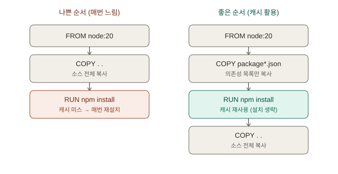
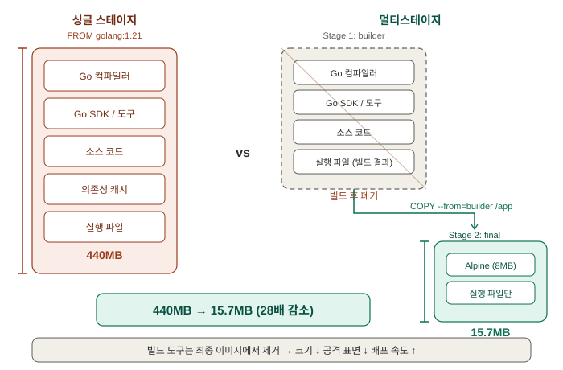
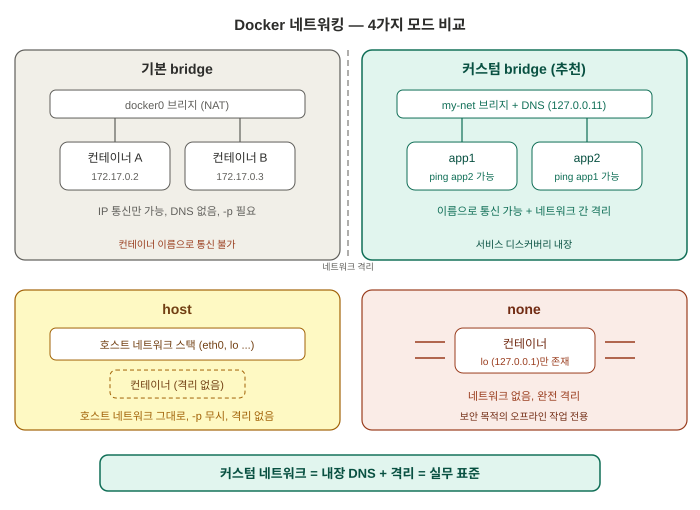

# Dockerfile과 이미지 레이어, Docker 네트워킹 — 면접 대비 학습 정리

> 학습 목적: 이직/면접 대비. [Day 5](day05-docker-basics-review.md)까지는 남이 만든
> 이미지(nginx, busybox)를 가져다 쓰기만 했다면, 오늘은 Dockerfile로 이미지를 **직접 만드는
> 쪽**으로 전환. 레이어 캐싱이 빌드 속도를 좌우하는 원리, 멀티스테이지 빌드로 이미지를
> 28배 줄이는 과정, 그리고 Docker 네트워크 3종(bridge/host/none)과 커스텀 네트워크의
> DNS/격리를 전부 직접 실행하며 확인. 환경: Windows 11 + Docker Desktop(WSL2), PowerShell.
> 실습 폴더: `C:\Users\user\docker-practice` (레포 외부).

---

## 1. Dockerfile 핵심 명령어 — 첫 이미지 빌드

### 개념

Dockerfile은 이미지를 만드는 레시피 텍스트 파일. `docker build`가 위에서부터 한 줄씩
실행하며 이미지를 만든다.

| 명령어 | 역할 |
|---|---|
| `FROM` | 베이스 이미지 지정 — 모든 Dockerfile의 시작점 |
| `WORKDIR` | 이후 명령들이 실행될 작업 디렉토리 (없으면 자동 생성) |
| `COPY` | 호스트(빌드 컨텍스트) 파일을 이미지 안으로 복사 |
| `RUN` | **빌드 시점**에 명령 실행 — 결과가 레이어로 저장됨 |
| `CMD` | **컨테이너 시작 시점**에 실행할 기본 명령 — 이미지엔 "예약"만 됨 |
| `EXPOSE` | 사용할 포트 문서화 (실제 개방은 `docker run -p`가 담당) |
| `ENV` | 환경변수 설정 (런타임에도 유지) |

가장 헷갈리는 구분 — `RUN` vs `CMD`:
- `RUN pip install flask` → 빌드할 때 **한 번** 실행, 결과(설치된 패키지)가 이미지에 굳음
- `CMD ["python", "app.py"]` → 빌드 때는 실행 안 되고, 컨테이너가 **시작될 때마다** 실행

### 왜 이렇게 설계됐는가

Day 1의 "이미지 = 읽기 전용 레이어의 스택"과 직결된다. `FROM`/`RUN`/`COPY` 각각이 레이어
하나를 만들고 차곡차곡 쌓인다. 환경 준비(빌드 시점, RUN)와 앱 실행(런타임, CMD)을 분리했기
때문에, 무거운 설치 작업은 빌드 때 미리 끝내두고 컨테이너 시작은 "이미 준비된 이미지에서
프로세스 하나 띄우기"로 수 초 만에 끝난다.

> **면접 답변**: "RUN과 CMD의 차이는?"
> "RUN은 이미지 빌드 시점에 실행되어 결과가 레이어로 저장되는 명령이고, CMD는 컨테이너가
> 시작될 때 실행할 기본 명령을 지정하는 것입니다. 무거운 준비 작업을 빌드 타임으로
> 옮겨놓기 때문에 컨테이너 시작이 프로세스 실행 수준으로 빨라집니다."

### 직접 확인한 실습

`index.html` + 2줄짜리 Dockerfile:
```dockerfile
FROM nginx:alpine
COPY index.html /usr/share/nginx/html/index.html
```

```powershell
docker build -t my-first-image .
```
```
[+] Building 7.0s (7/7) FINISHED
 => [1/2] FROM docker.io/library/nginx:alpine@sha256:54f2a904...                3.4s
 => => sha256:c75b9c33... 20.25MB / 20.25MB    (레이어 8개 다운로드/추출)
 => [2/2] COPY index.html /usr/share/nginx/html/index.html                      0.2s
 => exporting to image                                                          0.7s
 => => naming to docker.io/library/my-first-image:latest
```

```powershell
PS> docker run -d --name my-web -p 8080:80 my-first-image
PS> curl.exe http://localhost:8080
<h1>Hello from my first image!</h1>
<p>Built by me, not pulled from someone else.</p>
```

**결과 해석**: `[1/2] FROM`에서 nginx:alpine의 레이어 8개(`sha256:...` 각각)가 내려받아졌고,
`[2/2] COPY`가 우리 파일을 **새 레이어 하나**로 얹었다. `my-first-image` = nginx:alpine의
레이어들 + 우리가 만든 레이어 1개. 빌드 명령 끝의 `.`은 빌드 컨텍스트(COPY가 파일을 가져올
수 있는 범위) 지정.

---

## 2. 레이어 캐싱 — 명령어 순서가 빌드 속도를 좌우한다



### 개념

- Docker는 각 단계마다 "명령어 + 입력 파일 내용(체크섬)"을 비교해, 달라진 게 없으면 이전
  레이어를 그대로 재사용한다(`CACHED`).
- **핵심 규칙: 한 단계의 캐시가 깨지면, 그 아래 모든 단계의 캐시도 함께 깨진다.** 레이어는
  스택이라 중간이 바뀌면 그 위에 쌓인 것은 전부 다시 만들어야 하기 때문.
- 따라서 **변경 빈도가 낮은 것(베이스, 의존성 설치)을 위로, 자주 바뀌는 것(앱 소스)을
  아래로** 배치하는 것이 최적화의 기본.

### 왜 이렇게 설계됐는가

이미지가 immutable한 레이어 스택이기 때문에 가능한 설계다. 각 레이어는 입력이 같으면 출력도
같으므로(결정적), 입력 해시만 비교해서 통째로 재사용할 수 있다. CI에서 커밋마다 빌드가 도는
환경에서는 이 캐시 적중률이 빌드 시간과 비용을 직접 결정한다.

> **면접 답변**: "Dockerfile 최적화는 어떻게 하나요?"
> "가장 기본은 레이어 캐시 활용입니다. 한 단계의 캐시가 깨지면 그 아래 단계는 전부
> 재실행되므로, 변경 빈도가 낮은 것을 위쪽에, 자주 바뀌는 것을 아래쪽에 배치합니다. 대표
> 패턴이 의존성 명세 파일(requirements.txt, package.json)만 먼저 COPY해서 install한 뒤 소스
> 전체를 나중에 COPY하는 것입니다."

### 직접 확인한 실습

**(1) 변경 없이 재빌드** — 전 단계 캐시, 7.0s → 2.0s:
```
 => [1/2] FROM docker.io/library/nginx:alpine@sha256:54f2a904...   0.1s
 => CACHED [2/2] COPY index.html /usr/share/nginx/html/index.html  0.0s
```

**(2) index.html만 수정 후 재빌드** — FROM은 캐시 유지, COPY만 재실행:
```
 => CACHED [1/2] FROM docker.io/library/nginx:alpine@sha256:54f2a904...  0.1s
 => [2/2] COPY index.html /usr/share/nginx/html/index.html               0.1s
```
COPY는 복사할 파일 내용의 체크섬까지 비교하므로, 파일이 바뀌면 그 단계부터 캐시가 무효화된다.

**(3) 나쁜 순서 vs 좋은 순서** — Flask 앱으로 순서의 효과 측정.

Dockerfile.bad (소스 전체를 먼저 COPY → 소스가 바뀌면 pip install까지 재실행):
```dockerfile
FROM python:3.12-alpine
WORKDIR /app
COPY . .
RUN pip install -r requirements.txt
CMD ["python", "app.py"]
```

Dockerfile.good (requirements.txt만 먼저 → pip install 캐시 유지):
```dockerfile
FROM python:3.12-alpine
WORKDIR /app
COPY requirements.txt .
RUN pip install -r requirements.txt
COPY . .
CMD ["python", "app.py"]
```

`app.py`만 한 줄 수정하고 (requirements.txt는 그대로) 둘 다 재빌드한 결과:

```
# flask-bad — pip install까지 재실행, 총 5.5s
 => CACHED [2/4] WORKDIR /app                        0.0s
 => [3/4] COPY . .                                   0.1s
 => [4/4] RUN pip install -r requirements.txt        2.8s

# flask-good — pip install은 CACHED, 총 1.6s
 => CACHED [2/5] WORKDIR /app                        0.0s
 => CACHED [3/5] COPY requirements.txt .             0.0s
 => CACHED [4/5] RUN pip install -r requirements.txt 0.0s
 => [5/5] COPY . .                                   0.2s
```

**결과 해석**: 같은 코드 한 줄을 고쳤는데 bad는 의존성 설치(2.8s)를 다시 했고 good은 마지막
COPY(0.2s)만 다시 했다. 지금은 flask 하나라 수 초 차이지만, 실무 프로젝트의 의존성 설치는
수 분 단위이고 CI에서 커밋마다 빌드가 돈다는 점을 감안하면 이 순서 하나가 빌드마다 수 분을
절약한다.

---

## 3. 멀티스테이지 빌드 — 440MB → 15.7MB



### 개념

하나의 Dockerfile 안에 `FROM`을 여러 번 써서, 앞 스테이지(빌더)에서 컴파일하고 뒷
스테이지에는 `COPY --from=<스테이지명>`으로 **결과물만** 가져오는 기법. 최종 이미지는
**마지막 FROM 기준**으로만 만들어지므로 컴파일러/SDK는 포함되지 않는다.

### 왜 이렇게 설계됐는가

빌드에 필요한 것(컴파일러, SDK)과 실행에 필요한 것(결과물)은 다르다. 이미지가 크면 pull이
느려져 스케일아웃/배포 속도가 떨어지고, 컴파일러·셸·패키지 매니저가 프로덕션 이미지에
들어있으면 공격 표면도 커진다. 예전에는 빌드용/실행용 Dockerfile을 따로 관리했지만
멀티스테이지가 이를 Dockerfile 하나로 해결했다.

> **면접 답변**: "멀티스테이지 빌드란?"
> "하나의 Dockerfile에서 FROM을 여러 번 사용해, 빌드 스테이지에서 컴파일하고 최종
> 스테이지에는 결과물만 COPY --from으로 가져오는 기법입니다. 컴파일러나 SDK가 최종
> 이미지에서 빠지므로 이미지 크기가 크게 줄고(실습에서 440MB→16MB), 공격 표면도 줄어듭니다.
> 빌드가 컨테이너 안에서 일어나므로 호스트에 빌드 도구를 설치할 필요가 없어 CI 환경 통일에도
> 유리합니다."

### 직접 확인한 실습

Go 프로그램 하나를 싱글/멀티 두 방식으로 빌드 (호스트에 Go 미설치 — 빌드가 컨테이너 안에서
일어나므로 문제 없음. 이것 자체가 "빌드 환경 통일" 효과의 증거):

```dockerfile
# Dockerfile.single — 빌드 도구까지 통째로
FROM golang:1.24-alpine
WORKDIR /src
COPY main.go .
RUN go build -o /app main.go
CMD ["/app"]
```
```dockerfile
# Dockerfile.multi — 결과물만
FROM golang:1.24-alpine AS builder
WORKDIR /src
COPY main.go .
RUN go build -o /app main.go

FROM alpine:3.21
COPY --from=builder /app /app
CMD ["/app"]
```

```
PS> docker images go-single
IMAGE              ID             DISK USAGE   CONTENT SIZE
go-single:latest   f7022ce3e1ce        440MB           92MB

PS> docker images go-multi
IMAGE             ID             DISK USAGE   CONTENT SIZE
go-multi:latest   81bf13cf256d       15.7MB            5MB

PS> docker run --rm go-multi
Hello from a tiny image!
```

**결과 해석**: 실행 결과는 완전히 동일한데 크기는 **28배 차이**(440MB vs 15.7MB). single에는
프로덕션에서 쓸 일 없는 Go 컴파일러 전체가 들어있고, multi는 alpine(약 8MB) + 실행 파일
하나뿐이다.

### 참고 — 태그의 `alpine`은 nginx 기능이 아니라 배포판 이름

`nginx:alpine`, `python:3.12-alpine`의 `alpine`은 **Alpine Linux라는 초경량 배포판**(약
5~8MB)을 베이스로 만든 이미지 변형(variant)을 뜻하는 태그 관례다. 거의 모든 공식 이미지가
제공한다. 크기가 수 배 작아 pull/배포가 빠르지만, glibc 대신 musl을 쓰기 때문에 드물게
호환성 이슈가 있다 — Day 4에서 겪은 busybox `nslookup`의 search domain 문제가 그 예. 실무는
"작은 게 필요하면 alpine, 호환성이 걱정되면 debian-slim"으로 선택한다.

---

## 4. Docker 네트워킹 — bridge / host / none, 커스텀 네트워크



### 개념 — 기본 3종

| 네트워크 | 동작 | 용도 |
|---|---|---|
| **bridge** (기본값) | 컨테이너에 사설 IP 부여, NAT로 외부 통신. 호스트에서 접근하려면 `-p` 필요 | 일반적인 컨테이너 실행 |
| **host** | 호스트의 네트워크를 그대로 사용 (자기 IP 없음, `-p` 무시) | 성능 극대화, 격리 포기 |
| **none** | 네트워크 없음 (루프백만) | 완전 격리된 배치/보안 작업 |

host 모드는 원래 Linux 전용이며, Docker Desktop에서는 **4.34(2024-08)부터 설정(Settings →
Resources → Network)에서 opt-in으로 켜야 동작**한다 (Docker 공식 문서, 2026-07 확인. L4
TCP/UDP만 지원 등 제약 있음).

### 컨테이너의 포트는 격리, 호스트의 포트는 선착순

각 컨테이너는 자기만의 네트워크 네임스페이스(자기 IP, 자기 포트 공간)를 가진다 — Day 5의
namespace 격리가 이것. 그래서 MySQL 컨테이너 2개가 각자 3306을 리슨해도 충돌하지 않는다
(각자의 IP에서 각자의 3306). 충돌은 호스트 포트 매핑에서만 발생: `-p 3306:3306`을 두 번 쓸
수 없다(호스트의 3306은 하나뿐). 해결은 `-p 3307:3306`처럼 호스트 쪽만 바꾸면 된다.

### 왜 이렇게 설계됐는가 — 커스텀 네트워크의 존재 이유

기본 bridge는 하위 호환용 레거시에 가깝고, 이름 기반 통신(DNS)이 없어 IP를 하드코딩해야
한다. 컨테이너 IP는 재시작하면 바뀔 수 있으므로 실무에서 못 쓴다. 사용자 정의(custom)
네트워크는 **내장 DNS + 네트워크 간 격리**를 제공해 이 문제를 푼다. Docker Compose가
프로젝트마다 `<프로젝트>_default` 네트워크를 자동 생성하는 이유(서비스끼리 이름으로 통신 +
프로젝트 간 격리), K8s가 CoreDNS로 Service 이름을 해석해주는 것 모두 같은 계보의 해법이다.

> **면접 답변**: "Docker 네트워크에서 컨테이너끼리 어떻게 통신하나요?"
> "기본 bridge 네트워크는 IP 통신만 가능하고 컨테이너 이름 해석이 안 됩니다. `docker
> network create`로 만든 사용자 정의 네트워크는 내장 DNS(127.0.0.11)가 붙어 같은 네트워크의
> 컨테이너끼리 이름으로 통신할 수 있고, 다른 네트워크와는 격리됩니다. Docker Compose가
> 프로젝트마다 전용 네트워크를 만들어주는 것이 이 원리이고, 쿠버네티스의 CoreDNS 기반 Service
> 디스커버리도 같은 문제를 푸는 해법입니다."

### 직접 확인한 실습

**(1) 네트워크 목록** — 기본 3종 + minikube + Compose 흔적:
```
PS> docker network ls
NETWORK ID     NAME                   DRIVER    SCOPE
95ab35ab34ae   bridge                 bridge    local
3698ab596d8f   host                   host      local
3a08595fc3bf   minikube               bridge    local
b3b3fe28db5a   none                   null      local
b95e8533668d   project1_default       bridge    local
...
```
`minikube`가 커스텀 bridge 네트워크로 보인다 — minikube 클러스터가 사실 이 네트워크 위의
컨테이너 하나라는 증거 (`docker ps -a`에서도 `gcr.io/k8s-minikube/kicbase` 컨테이너로 확인).
`*_default`들은 과거 Docker Compose 프로젝트가 자동 생성한 전용 네트워크들.

**(2) 기본 bridge: 이름 불가, IP 가능**:
```
PS> docker exec web2 ping -c 2 web1
ping: bad address 'web1'

PS> docker exec web2 ping -c 2 172.17.0.2
PING 172.17.0.2 (172.17.0.2): 56 data bytes
64 bytes from 172.17.0.2: seq=0 ttl=64 time=0.238 ms
2 packets transmitted, 2 packets received, 0% packet loss
```
`bad address` = 네트워크 불통이 아니라 **이름→IP 변환(DNS) 단계부터 실패**. 기본 bridge에는
내장 DNS가 없다.

**(3) 커스텀 네트워크: 이름으로 즉시 통신**:
```
PS> docker network create my-net
PS> docker run -d --name app1 --network my-net nginx:alpine
PS> docker run -d --name app2 --network my-net nginx:alpine
PS> docker exec app2 ping -c 2 app1
PING app1 (172.22.0.2): 56 data bytes
64 bytes from 172.22.0.2: seq=0 ttl=64 time=0.056 ms
2 packets transmitted, 2 packets received, 0% packet loss
```
첫 줄 `PING app1 (172.22.0.2)` — 이름이 IP로 자동 해석됐다. 커스텀 네트워크에는 Docker가
내장 DNS 서버(컨테이너 안 `/etc/resolv.conf`의 `127.0.0.11`)를 붙여주기 때문.

**(4) 네트워크 간 격리** — 기본 bridge의 web2 → my-net의 app1:
```
PS> docker exec web2 ping -c 2 -W 2 172.22.0.2
2 packets transmitted, 0 packets received, 100% packet loss
```

**(5) 서브넷 확인** — 네트워크마다 다른 IP 구역:
```
PS> docker network inspect bridge --format "{{range .IPAM.Config}}{{.Subnet}}{{end}}"
172.17.0.0/16
```
서브넷 = 하나의 큰 네트워크를 잘라놓은 IP 주소 구역 (`/16` = 앞 16비트가 구역 주소). 같은
서브넷 안은 직접 통신, 다른 서브넷은 게이트웨이를 거쳐야 하며 거기서 차단이 가능하다 —
(4)의 100% 손실이 그것. K8s의 Pod 서브넷(10.244.0.x), Service 서브넷(10.96.0.x)도 같은 개념.

### 오늘의 트러블슈팅 노트

- **`docker inspect --format "{{.NetworkSettings.IPAddress}}"` 템플릿 에러**: 컨테이너가 여러
  네트워크에 붙을 수 있게 되면서 IP가 `NetworkSettings.Networks.<네트워크명>.IPAddress` 맵
  안으로 이동. `{{range .NetworkSettings.Networks}}{{.IPAddress}}{{end}}`로 순회해야 한다.
- **PowerShell에서 `<placeholder>` 그대로 실행 금지**: `<`를 리디렉션 연산자로 해석해
  ParserError 발생. 자리표시자는 실제 값으로 바꿔 실행할 것.
- **PowerShell 5.1 + `2>&1`**: 네이티브 명령(docker 등)의 stderr 줄이 NativeCommandError로
  감싸져 빨갛게 보이지만 명령 자체는 정상 — docker build의 진행 로그가 stderr로 나오기 때문.
- **재부팅 후 `npipe ... dockerDesktopLinuxEngine: file not found`**: Docker Desktop 자체가
  꺼진 상태라는 뜻. Docker Desktop 실행 → (K8s 실습 시에만) `minikube start` 순서. Docker
  단독 실습에는 minikube 불필요. 빌드 캐시는 Docker Desktop을 재시작해도 유지된다.

---

## 오늘 배운 것 전체 흐름 요약

1. Dockerfile의 각 명령(`FROM`/`RUN`/`COPY`)이 레이어 하나씩을 만들며, RUN(빌드 시점)과
   CMD(시작 시점)의 분리 덕에 컨테이너 시작이 프로세스 실행 수준으로 빠르다
2. 한 단계의 캐시가 깨지면 아래 단계 전부가 재실행되므로, "잘 안 바뀌는 것 위로, 자주 바뀌는
   것 아래로"가 최적화의 기본 — 의존성 먼저/소스 나중 패턴으로 빌드가 5.5s → 1.6s
3. 멀티스테이지 빌드는 빌드 도구를 최종 이미지에서 제거해 크기(440MB → 15.7MB)와 공격 표면을
   줄이고, 빌드 환경 통일까지 해결한다
4. 기본 bridge는 IP 통신만 가능(DNS 없음), 커스텀 네트워크는 내장 DNS(127.0.0.11)로 이름 기반
   통신 + 네트워크 간 격리를 제공한다 — Compose의 프로젝트별 네트워크와 K8s CoreDNS가 같은
   계보의 해법
5. 컨테이너 포트는 네임스페이스로 격리되어 충돌하지 않고, 호스트 포트 매핑(`-p`)만 선착순이다

**다음 학습 목표**: Day 7 이후 로드맵 재확정 — 우선 후보는 liveness/readiness/startup probe +
배포 전략(rolling update 파라미터, rollback, blue-green/canary) + QoS 클래스.
