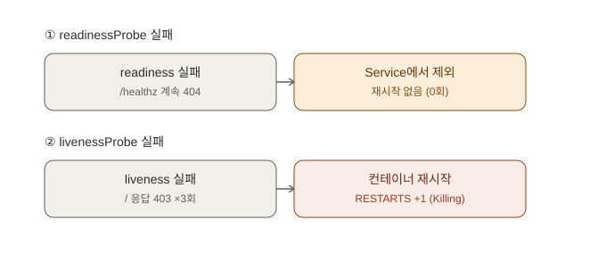
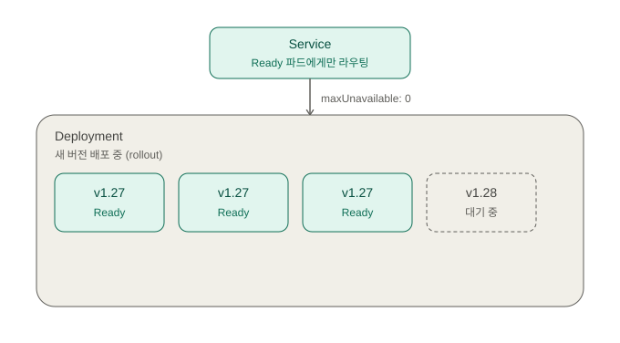
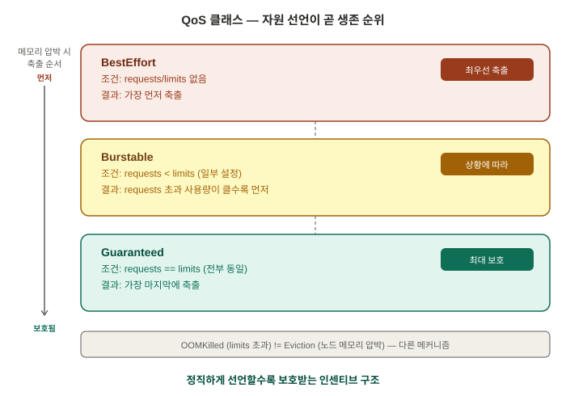

# Docker→K8s 브리지 — 이미지 유통 경로와 ImagePullBackOff — 면접 대비 학습 정리

> 학습 목적: 이직/면접 대비. [Day 6](day06-dockerfile-networking.md)까지 Docker(빌드)와
> Day 1~4의 K8s(실행)를 각각 배웠다면, 오늘은 그 둘을 **연결**하는 날. 직접 빌드한 이미지를
> minikube에 배포하면서 "내 PC에서 빌드한 이미지를 쿠버네티스는 어떻게 아는가"라는 질문에
> 부딪히고, ImagePullBackOff를 일부러 체험한 뒤 고쳤다. ENTRYPOINT vs CMD와 K8s
> command/args의 대응 관계도 정리. 환경: Windows 11 + Docker Desktop(WSL2) +
> minikube v1.38.1 (Kubernetes v1.35.1, Docker 29.2.1 런타임), PowerShell.
> 실습 폴더: `C:\Users\user\docker-practice` (레포 외부).

---

## 1. ENTRYPOINT vs CMD — 그리고 K8s의 command/args

### 개념

둘 다 "컨테이너 시작 시 실행할 명령"을 정하지만 역할이 다르다.

- **ENTRYPOINT** = 고정된 실행 본체 (컨테이너의 "정체성"). `docker run <이미지> <인자>`로
  넘긴 인자가 **뒤에 붙는다**.
- **CMD** = 기본값. ENTRYPOINT가 있으면 "기본 인자"가 되고, `docker run`에서 인자를 주면
  **통째로 교체**된다.

| 실행 방법 | ENTRYPOINT | CMD |
|---|---|---|
| `docker run 이미지` | 실행됨 | 기본 인자로 붙음 |
| `docker run 이미지 <인자>` | 실행됨 | `<인자>`로 교체됨 |
| `docker run --entrypoint <명령> 이미지` | `<명령>`으로 교체됨 | 무시됨 |

### 왜 이렇게 설계됐는가

"이 컨테이너는 무엇을 하는 컨테이너인가"(ENTRYPOINT)와 "기본 설정은 무엇인가"(CMD)를
분리하기 위해서다. 예를 들어 ENTRYPOINT를 `["redis-server"]`로 고정하고 CMD로 기본 설정
파일만 지정해두면, 사용자는 `docker run redis /custom.conf`처럼 **인자만 바꿔서** 같은
컨테이너를 다르게 실행할 수 있다. 본체까지 바꾸려면 `--entrypoint`라는 명시적 스위치를
써야 하므로 "실수로 정체성을 바꾸는" 사고를 막는다.

**K8s와의 대응 관계** (면접 단골 함정):

| Docker | K8s Pod 스펙 | 이름이 헷갈리는 이유 |
|---|---|---|
| ENTRYPOINT | `command:` | K8s의 command는 Docker의 CMD가 **아니라** ENTRYPOINT를 덮어쓴다 |
| CMD | `args:` | Docker의 CMD를 덮어쓰는 건 K8s의 args |

> **면접 답변**: "ENTRYPOINT와 CMD의 차이는?"
> "ENTRYPOINT는 컨테이너의 고정 실행 본체이고 CMD는 그 기본 인자입니다. docker run에서
> 인자를 넘기면 CMD만 교체되고 ENTRYPOINT는 유지되며, 본체를 바꾸려면 --entrypoint
> 플래그를 명시해야 합니다. 쿠버네티스에서는 command 필드가 ENTRYPOINT를, args 필드가
> CMD를 덮어쓰는데, 이름 때문에 command가 CMD를 덮어쓴다고 착각하기 쉬운 부분입니다."

### 직접 확인한 실습

3줄짜리 `Dockerfile.ep`로 빌드:
```dockerfile
FROM alpine:3.20
ENTRYPOINT ["echo", "hello"]
CMD ["world"]
```

```
PS> docker run --rm ep-test
hello world
PS> docker run --rm ep-test kubernetes
hello kubernetes
PS> docker run --rm --entrypoint hostname ep-test
e6fc57d64bb5
```

**결과 해석**: ①은 ENTRYPOINT(`echo hello`) + CMD(`world`)가 합쳐져 `hello world`.
②는 인자 `kubernetes`가 CMD만 교체해서 `hello kubernetes` — ENTRYPOINT는 그대로.
③은 `--entrypoint hostname`으로 본체를 갈아끼우자 CMD까지 무시되고 컨테이너
호스트명만 출력됐다.

---

## 2. 이미지 유통 경로 — ImagePullBackOff 일부러 체험하고 고치기

### 개념: 이미지 저장소는 3군데로 나뉘어 있다

```
[내 PC의 Docker 데몬]          [레지스트리 (Docker Hub 등)]        [minikube 노드]
 docker build 결과가             docker push로 올리는 곳           kubelet이 이미지를
 저장되는 곳                     (공유 창고)                        pull해서 저장하는 곳
```

- `docker build`는 **내 PC의 Docker 데몬 저장소**에만 이미지를 남긴다.
- minikube는 같은 PC 위에서 돌지만 사실상 **별개의 서버(노드)** — 자기만의 컨테이너
  런타임과 이미지 저장소를 가진다.
- K8s 노드는 이미지가 필요하면 ① 자기 저장소를 먼저 보고 ② 없으면 **레지스트리에서
  pull**한다. 노드가 "옆에 있는 내 PC의 Docker 데몬"을 뒤지는 일은 절대 없다.

그래서 로컬에서 빌드만 하고 배포하면: kubelet이 레지스트리에서
`docker.io/library/hello-k8s:v1`을 pull 시도 → 그런 저장소는 없음 → `ErrImagePull` →
재시도 간격을 늘리며 대기 → `ImagePullBackOff`.

실무 경로는 `빌드 → 레지스트리 push → K8s가 pull`(CI/CD가 하는 일이 바로 이것)이고,
로컬 학습 환경에서는 레지스트리를 생략하는 지름길로 `minikube image load`(내 PC 저장소 →
노드 저장소로 직접 복사)를 쓴다.

### 왜 이렇게 설계됐는가

K8s는 "노드 수십~수천 대" 규모를 전제한다. 어떤 노드에 Pod가 배치될지 모르므로, 모든
노드가 **공통으로 접근 가능한 중앙 창고(레지스트리)**에서 이미지를 받아오는 것이 유일하게
확장 가능한 구조다. 특정 개발자 PC의 로컬 저장소에 의존하는 순간 그 구조가 깨진다.
ErrImagePull과 ImagePullBackOff가 나뉘어 있는 것도 같은 맥락 — 레지스트리 장애나 네트워크
문제는 일시적일 수 있으므로 바로 포기하지 않고 **지수 백오프**(재시도 간격을 10초 →
20초 → 40초… 최대 5분으로 늘림)로 재시도하되, 무한 재시도로 레지스트리를 두들기지 않게
설계됐다.

> **면접 답변**: "ImagePullBackOff가 뜨면 어떻게 대응하나요?"
> "kubectl describe pod로 Events를 먼저 봅니다. pull access denied나 not found 메시지라면
> ①이미지 이름/태그 오타 ②레지스트리에 push가 안 됨 ③private 저장소인데 imagePullSecret이
> 없음, 이 세 가지를 순서대로 의심합니다. ErrImagePull은 pull이 방금 실패한 상태,
> ImagePullBackOff는 실패가 반복되어 지수 백오프로 재시도 대기 중인 상태로, 별개 에러가
> 아니라 같은 실패의 두 국면입니다."

### 직접 확인한 실습

**(1) 이미지 없이 배포 → 실패 관찰.** `hello-k8s:v1`을 빌드하지 않은 상태(내 PC에도 없고,
레지스트리에도 없고, 노드에도 없음)로 배포했다:
```
PS> kubectl create deployment hello --image=hello-k8s:v1
deployment.apps/hello created
PS> kubectl get pods
NAME                    READY   STATUS              RESTARTS   AGE
hello-94f6c6458-9qm9s   0/1     ContainerCreating   0          3s
```

시간이 지나자 `ImagePullBackOff`로 전환:
```
PS> kubectl get pods
NAME                    READY   STATUS             RESTARTS   AGE
hello-94f6c6458-9qm9s   0/1     ImagePullBackOff   0          17m
```

**(2) `kubectl describe pod -l app=hello`로 원인 확인.** describe는 스펙 + 현재 상태 +
사건 기록(Events)을 합친 진단 리포트다. 결정적 단서들:

```
Containers:
  hello-k8s:
    Container ID:                        ← 비어 있음 = 컨테이너 생성조차 안 됨
    State:          Waiting
      Reason:       ImagePullBackOff
...
QoS Class:                   BestEffort  ← requests/limits를 안 줘서 받은 등급 (오늘 후반 주제)
Events:
  Type     Reason     Age                   From               Message
  ----     ------     ----                  ----               -------
  Normal   Scheduled  17m                   default-scheduler  Successfully assigned default/hello-94f6c6458-9qm9s to minikube
  Normal   Pulling    14m (x5 over 17m)     kubelet            Pulling image "hello-k8s:v1"
  Warning  Failed     14m (x5 over 17m)     kubelet            Failed to pull image "hello-k8s:v1": Error response from daemon: pull access denied for hello-k8s, repository does not exist or may require 'docker login': denied: requested access to the resource is denied
  Warning  Failed     14m (x5 over 17m)     kubelet            Error: ErrImagePull
  Normal   BackOff    2m41s (x64 over 17m)  kubelet            Back-off pulling image "hello-k8s:v1"
  Warning  Failed     2m41s (x64 over 17m)  kubelet            Error: ImagePullBackOff
```

**Events 읽기 포인트**:
- `pull access denied ... repository does not exist or may require 'docker login'` —
  Docker Hub는 "없는 건지, 비공개라 권한이 없는 건지"를 구분해서 알려주지 않는다(존재
  여부 자체가 정보라서). 그래서 이 메시지 하나로 오타/미push/인증누락 세 경우를 모두
  의심해야 한다.
- `Pulling (x5)` vs `BackOff (x64)` — pull 시도는 17분간 5번뿐인데 백오프 대기 이벤트는
  64번. 지수 백오프가 동작 중이라는 흔적.
- `Scheduled`는 Normal — 스케줄링은 성공했고, 실패는 그 다음 단계(kubelet의 이미지
  확보)에서 났다는 것까지 Events가 단계별로 알려준다.

**(3) 해결: 빌드 → 노드로 복사 → Pod 재생성.**
```
PS> docker build -t hello-k8s:v1 -f Dockerfile.web .
 => naming to docker.io/library/hello-k8s:v1
PS> docker images hello-k8s
IMAGE          ID             DISK USAGE   CONTENT SIZE
hello-k8s:v1   89ac7266e544       73.6MB           21MB
PS> minikube image load hello-k8s:v1
PS> kubectl delete pod -l app=hello
pod "hello-94f6c6458-9l4ls" deleted from default namespace
PS> kubectl get pods
NAME                    READY   STATUS    RESTARTS   AGE
hello-94f6c6458-ntv7b   1/1     Running   0          3s
```

`kubectl delete pod`는 백오프 타이머(최대 5분)를 기다리지 않고 즉시 재시도시키는 트릭 —
Deployment/ReplicaSet이 `replicas: 1`을 유지하려고 곧바로 새 Pod를 만들고(자기치유),
새 Pod는 노드에 이미지가 이미 있으니 pull 없이 시작된다. 17분 실패하던 Pod가 3초 만에 떴다.

**(4) 진짜 내 이미지인지 확인.** Dockerfile에서 바꿔둔 nginx 초기 페이지가 나오면 증명 완료:
```
PS> kubectl port-forward deployment/hello 8080:80
Forwarding from 127.0.0.1:8080 -> 80
# (다른 창에서)
PS> curl.exe http://localhost:8080
hello from my own image v1
```

---

## 3. imagePullPolicy — image load를 해도 계속 실패하는 함정

### 개념

kubelet이 이미지를 구할 때 따르는 정책. `imagePullPolicy`를 생략하면 **태그에 따라
기본값이 달라진다** (Kubernetes 공식 문서 v1.35 기준, 2026-07 확인):

| 이미지 지정 방식 | 기본 imagePullPolicy | 의미 |
|---|---|---|
| `:latest` 또는 태그 생략 | `Always` | 매번 레지스트리에 확인 |
| 구체적 태그 (`:v1` 등) | `IfNotPresent` | 노드에 있으면 pull 안 함 |
| digest(`@sha256:...`) 지정 | `IfNotPresent` | 내용이 고정이므로 재확인 불필요 |

(`Never`도 있다 — 레지스트리를 아예 안 보고, 노드에 없으면 그냥 실패.)

### 왜 이렇게 설계됐는가

`:latest`는 **가리키는 내용이 계속 바뀌는 태그**라서, 노드에 캐시된 옛 latest를 쓰면
노드마다 다른 버전이 도는 사고가 난다. 그래서 latest만 `Always`로 강제 확인. 반대로
`:v1` 같은 고정 태그는 내용이 안 바뀐다는 약속이므로 캐시를 신뢰(`IfNotPresent`)해서
레지스트리 트래픽과 시작 시간을 아낀다. 이 설계 때문에 생기는 유명한 함정:
**`minikube image load`로 이미지를 노드에 넣어도 `:latest` 태그면 여전히 Always 정책이
레지스트리 pull을 시도하다 ImagePullBackOff가 난다.** 학습/로컬 환경에서 항상 버전 태그를
붙이는 이유. 오늘 실습이 성공한 것도 `:v1` 태그 → `IfNotPresent` → 노드에 복사해둔
이미지를 발견하고 pull을 생략했기 때문이다.

> **면접 답변**: "로컬 이미지를 minikube에 load했는데도 ImagePullBackOff가 계속 나면?"
> "imagePullPolicy를 의심합니다. 태그가 latest거나 생략되면 기본 정책이 Always라서 노드에
> 이미지가 있어도 매번 레지스트리 pull을 시도하다 실패합니다. v1 같은 구체적 태그를 쓰면
> 기본값이 IfNotPresent가 되어 노드의 로컬 이미지를 사용합니다. 그래서 로컬 개발 환경에서는
> 항상 버전 태그를 붙이고, 프로덕션에서는 반대로 불변 배포를 위해 digest 고정이나 CI가
> 찍는 고유 태그를 씁니다."

---

## 4. Liveness / Readiness / Startup Probe — Running과 Ready는 다르다



### 개념

프로세스가 떠 있다고 해서 정상인 게 아니다. 데드락에 걸려 응답을 못 하는 상태,
아직 초기화(DB 연결 등)가 안 끝난 상태 — 둘 다 겉으로는 "Running"으로 보인다.
그래서 K8s는 프로브를 역할별로 3개로 분리했다:

| 프로브 | 질문 | 실패하면 |
|---|---|---|
| **livenessProbe** | 살아는 있나? | 컨테이너를 **재시작** (파드 재생성 아님 — IP/이름 유지, RESTARTS +1) |
| **readinessProbe** | 트래픽 받을 준비 됐나? | Service 엔드포인트에서 **제외** (재시작 안 함) |
| **startupProbe** | 기동이 끝났나? | 성공할 때까지 liveness/readiness 검사를 **보류** |

검사 방식은 공통: `httpGet`(200~399 성공), `tcpSocket`(포트 열리면 성공), `exec`(exit 0 성공), `grpc`.
주요 파라미터: `periodSeconds`(주기, 기본 10s), `failureThreshold`(연속 실패 허용, 기본 3),
`timeoutSeconds`(기본 1s), `initialDelaySeconds`(첫 검사 지연).

### 왜 이렇게 설계됐는가

- **liveness와 readiness를 분리한 이유**: 실패 시 처방이 정반대라서. 데드락은 재시작하면
  낫지만, "DB가 잠깐 느려서 준비 안 됨"을 재시작으로 처방하면 멀쩡한 파드를 계속 죽이는
  재시작 폭풍이 된다. readiness 실패는 "잠깐 빼줘", liveness 실패는 "죽여서 다시 살려줘".
- **startupProbe가 나중에 추가된 이유**: 기동이 느린 앱은 liveness의 `initialDelaySeconds`를
  크게 잡는 수밖에 없었는데, 그러면 기동 후 장애 감지도 그만큼 느려진다. startupProbe는
  "기동 중"과 "운영 중"의 검사 기준을 분리해, 기동엔 5분을 허용하면서 운영 중 장애는
  10여 초 만에 잡게 한다.
- **kubelet이 노드 로컬에서 검사하는 이유**: 컨트롤플레인이 모든 파드를 원격 검사하면
  규모가 커질수록 병목. 각 노드의 kubelet이 자기 파드만 검사하고 결과만 올리는 구조가
  확장성 있다.

> **면접 답변**: "liveness는 컨테이너가 살아있는지 검사해서 실패하면 재시작하고, readiness는
> 트래픽을 받을 준비가 됐는지 검사해서 실패하면 Service 엔드포인트에서만 빼고 재시작은 하지
> 않습니다. 둘을 분리한 이유는 처방이 다르기 때문입니다 — 데드락은 재시작이 답이지만 일시적
> 과부하는 재시작하면 오히려 장애가 커집니다. 기동이 오래 걸리는 앱은 startupProbe로 기동
> 구간을 따로 보호해서, 기동 여유는 길게 주면서 운영 중 장애 감지는 빠르게 유지합니다."

### 직접 확인한 실습 ① — readiness 실패: Running인데 트래픽에서 빠진다

nginx 2대를 띄우되 readiness가 존재하지 않는 `/healthz`를 검사하게 해서 일부러 실패시켰다
(`readinessProbe: httpGet /healthz, period=3s, failureThreshold=2` / `livenessProbe: httpGet /, period=5s`).

```powershell
PS> kubectl get pods -l app=probe-demo
NAME                          READY   STATUS    RESTARTS   AGE
probe-demo-654d4d6569-lzrsj   0/1     Running   0          85s
probe-demo-654d4d6569-vsssk   0/1     Running   0          85s
```

**Status는 Running인데 READY는 0/1** — Running(프로세스 실행 중)과 Ready(트래픽 수신 가능)는
별개 개념. `kubectl describe pod`의 Conditions에도 `Ready: False`, `ContainersReady: False`로 나타났다.

파드 하나에만 `/healthz` 파일을 만들어 readiness를 통과시키자:

```powershell
PS> kubectl exec probe-demo-654d4d6569-lzrsj -- sh -c "echo ok > /usr/share/nginx/html/healthz"
PS> kubectl get pods -l app=probe-demo
NAME                          READY   STATUS    RESTARTS   AGE
probe-demo-654d4d6569-lzrsj   1/1     Running   0          6m11s
probe-demo-654d4d6569-vsssk   0/1     Running   0          6m11s
```

EndpointSlice에서 해당 파드 주소만 `ready: true`로 바뀐 것을 확인:

```yaml
  endpoints:
  - addresses: [10.244.0.70]        # vsssk — 여전히 제외
    conditions: { ready: false, serving: false }
  - addresses: [10.244.0.69]        # lzrsj — healthz 생성 후 트래픽 수신
    conditions: { ready: true, serving: true }
```

이후 describe의 Events에 `Readiness probe failed: HTTP probe failed with statuscode: 404
(x126 over 15m)` — **126번 실패하는 동안 RESTARTS는 0**. readiness는 절대 재시작을 유발하지 않는다.

### 직접 확인한 실습 ② — liveness 실패: 재시작이 일어난다

liveness가 검사하는 `/`(index.html)를 지웠다. nginx는 index가 없으면 403을 반환하고,
httpGet 프로브는 400 이상이면 실패 판정. `failureThreshold=3 × period=5s` ≈ 15초 후 재시작됐다:

```powershell
PS> kubectl exec probe-demo-654d4d6569-lzrsj -- rm /usr/share/nginx/html/index.html
PS> kubectl get pods -l app=probe-demo -w
NAME                          READY   STATUS    RESTARTS   AGE
probe-demo-654d4d6569-lzrsj   1/1     Running   0            14m
probe-demo-654d4d6569-lzrsj   0/1     Running   1 (1s ago)   15m
```

Events에 전 과정이 기록됐다:

```
Warning  Unhealthy  Liveness probe failed: HTTP probe failed with statuscode: 403
Normal   Killing    Container web failed liveness probe, will be restarted
Normal   Created    Container created (x2 over 15m)
Normal   Started    Container started (x2 over 15m)
```

관찰 포인트:
- 재시작 후 READY가 **0/1로 돌아왔다** (예측 적중): 아까 `kubectl exec`로 만든 `/healthz`는
  컨테이너 파일시스템에 쓴 것이라, 컨테이너가 이미지에서 새로 만들어지면서 사라졌다.
  → 실행 중 컨테이너에 exec로 넣은 변경은 재시작하면 증발한다.
- `Last State: Terminated, Reason: Completed, Exit Code: 0`: kubelet이 죽일 때 먼저 정상 종료
  시그널을 보내고 nginx가 우아하게 종료해서 exit 0. 강제 kill이면 137(128+SIGKILL 9)이 나온다.

### 덤 — Endpoints는 v1.33+에서 deprecated

`kubectl get endpoints` 실행 시 경고가 떴다 (이 클러스터에서 직접 확인, 2026-07):

```
Warning: v1 Endpoints is deprecated in v1.33+; use discovery.k8s.io/v1 EndpointSlice
```

Endpoints는 서비스당 오브젝트 1개에 모든 파드 IP를 담는 구조라, 대규모 서비스에서 IP 하나만
바뀌어도 전체를 다시 전파해야 하는 확장성 문제가 있었다. EndpointSlice는 여러 조각으로 쪼개
변경분만 전파한다. 조회는 `kubectl get endpointslice -l kubernetes.io/service-name=<svc>`.
단, `kubectl get endpointslice`의 ENDPOINTS 열은 ready 여부와 무관하게 주소를 다 보여주므로,
실제 트래픽 수신 여부는 `-o yaml`로 각 주소의 `conditions.ready`를 봐야 한다.

---

## 5. 배포 전략 — Rolling Update 파라미터, 롤백, blue-green/canary



### 개념

Deployment의 기본 전략은 `RollingUpdate`: 새 ReplicaSet을 만들어 새 파드를 늘리면서
옛 파드를 줄인다. 속도와 안전은 두 파라미터로 조절:

- **`maxSurge`** — 교체 중 replicas를 **초과**해서 띄울 수 있는 여유분 (기본 25%)
- **`maxUnavailable`** — 교체 중 replicas에서 **모자라도** 되는 허용치 (기본 25%)

핵심 연결고리: **새 파드가 "교체 완료"로 인정되는 기준이 readiness probe다.**
새 파드가 Ready가 안 되면 롤아웃이 그 자리에서 멈추고 옛 파드는 계속 트래픽을 받는다.
readiness가 없으면 "떴다 = 준비됐다"로 간주되어 고장난 버전으로 전부 교체돼버린다.

### 왜 이렇게 설계됐는가

- Deployment가 파드를 직접 관리하지 않고 **리비전마다 ReplicaSet을 하나씩** 만드는 이유:
  옛 ReplicaSet을 0개로 줄인 채 남겨두면 그게 곧 "각 리비전의 파드 템플릿 보관소"가 된다.
  롤백은 특별한 기능이 아니라 옛 ReplicaSet을 다시 키우는 것일 뿐.
- `rollout undo`가 "리비전 2로 되돌아가기"가 아니라 **옛 템플릿으로 새 리비전을 만드는**
  이유: 히스토리를 선형으로 유지하기 위해. 시간을 거슬러가는 게 아니라 "예전 내용으로
  새 배포"를 하는 것이므로, 이후의 undo/기록 관리가 단순해진다.
- blue-green/canary가 Deployment 기본 기능이 아닌 이유: 롤링 업데이트는 "파드 교체"만
  다루고, blue-green(전체 전환)과 canary(비율 조절)는 **트래픽 라우팅**이 본질이라서
  Service/Ingress/서비스메시 계층에서 해결한다.
  - **blue-green**: 새 버전(green)을 전체 수량으로 미리 띄워두고 Service의 selector를
    한 번에 전환. 즉시 전환/즉시 롤백이 장점, 자원 2배가 단점.
  - **canary**: "탄광의 카나리아"에서 따온 이름 — 위험을 소수(일부 트래픽)에게만 먼저
    노출시켜, 전체가 다치기 전에 이상 징후를 감지하는 전략. 새 버전을 극소수(예: 5~10%)
    트래픽에만 흘려보내 에러율·지연시간을 지켜보다가, 문제없으면 점진적으로 비율을
    늘리고 문제가 있으면 즉시 0%로 되돌린다. 구현 방식은 정교함 순으로 3단계:
    1. **파드 개수 비율만으로** (도구 불필요): 같은 label의 Deployment 두 개(안정
       9개 + canary 1개)를 한 Service 뒤에 두면, Service가 파드 목록에서 무작위 분배하니
       자연스럽게 ~10%가 canary로 감. 세밀한 비율 조정이나 "특정 사용자만" 같은 요청
       단위 제어는 불가능.
    2. **Ingress 가중치 라우팅**: nginx-ingress의 canary annotation
       (`nginx.ingress.kubernetes.io/canary-weight` 등)으로 퍼센트를 직접 지정.
    3. **서비스 메시**(Istio 등): 퍼센트뿐 아니라 특정 헤더·쿠키를 가진 요청만 canary로
       보내는 것까지 가능 — 내부 QA 팀만 먼저 태워보는 식의 정교한 제어.

**롤링 업데이트와 canary, 뭐가 다른가** — 둘 다 신구 버전이 잠시 섞인다는 점은 같지만, 푸는
문제가 다르다.
- **롤링 업데이트**는 "파드가 Ready한가"만 보고 **자동으로, 멈추지 않고** 100% 신버전까지
  행진한다. 섞이는 건 교체 과정의 부산물일 뿐, 비율을 사람이 의도적으로 조절하거나 오래
  유지하지 않는다.
- **canary**는 "이 비율의 트래픽에서 문제가 없는가"를 **의도적으로, 원하는 만큼 오래**
  관찰하려는 것이다. 비율은 파드 readiness가 아니라 사람(또는 자동화된 지표 판단)이
  직접 정하고 조절한다.
- 한 줄로: 롤링 업데이트는 "안전하게 교체하는 절차", canary는 "교체하기 전에 위험을
  측정하는 절차". 실무에서는 canary로 안전을 확인한 뒤 롤링 업데이트(또는 blue-green)로
  전체 전환하는 식으로 **함께 쓰인다.**

> **면접 답변**: "롤링 업데이트는 maxSurge와 maxUnavailable로 속도와 안전을 조절합니다.
> 무중단이 중요하면 maxUnavailable을 0으로 두고 maxSurge로만 교체합니다. 이때 새 파드의
> 준비 여부를 판단하는 기준이 readiness probe라서, probe가 없으면 고장난 버전이 그대로
> 전부 배포될 수 있습니다. 롤백은 Deployment가 리비전마다 ReplicaSet을 0개로 줄여 보관하기
> 때문에 가능하고, undo는 옛 템플릿으로 새 리비전을 만드는 방식입니다. blue-green이나
> canary는 트래픽 라우팅 문제라서 Deployment 단독이 아니라 Service selector 전환이나
> Ingress 가중치로 구현합니다."

### 직접 확인한 실습 — 정상 교체 → 고장 배포(무중단 유지) → 롤백

`replicas: 3, maxSurge: 1, maxUnavailable: 0`, readiness는 `httpGet /` (nginx:1.26 → 1.27).

**① 정상 교체** — `kubectl set image deployment/rollout-demo web=nginx:1.27` 후 `-w`로 관찰:

```
NAME                           READY   STATUS              RESTARTS   AGE
rollout-demo-f567d9cf6-59859   1/1     Running             0          8m13s   ← 옛 RS (1.26)
rollout-demo-f567d9cf6-fcpql   1/1     Running             0          8m13s
rollout-demo-f755dc575-44n22   1/1     Running             0          3s      ← 새 RS (1.27)
rollout-demo-f755dc575-qzlqv   0/1     ContainerCreating   0          1s
rollout-demo-f755dc575-qzlqv   1/1     Running             0          2s      ← Ready 확인 후
rollout-demo-f567d9cf6-fcpql   1/1     Terminating         0          8m14s   ← 옛 파드 제거
rollout-demo-f755dc575-fpl7k   0/1     Pending             0          0s      ← 다음 1개 시작
...
```

새 파드 1개 생성 → Ready 확인 → 옛 파드 1개 종료의 반복. **항상 3개 Ready 유지.**
교체 후 옛 ReplicaSet은 0개로 남는다:

```
NAME                     DESIRED   CURRENT   READY   AGE
rollout-demo-f567d9cf6   0         0         0       8m41s   ← 1.26 (보관됨)
rollout-demo-f755dc575   3         3         3       31s     ← 1.27
```

**② 고장 배포** — `kubectl set image ... web=nginx:brokenversion`:

```
NAME                            READY   STATUS             RESTARTS   AGE
rollout-demo-5bccf67b78-ltmxc   0/1     ImagePullBackOff   0          14m   ← 새 파드만 실패
rollout-demo-f755dc575-44n22    1/1     Running            0          15m   ← 1.27은 전부 생존
rollout-demo-f755dc575-fpl7k    1/1     Running            0          15m
rollout-demo-f755dc575-qzlqv    1/1     Running            0          15m
```

`rollout status`는 "1 out of 3 new replicas have been updated..."에서 멈춘 채 타임아웃.
`maxUnavailable: 0`이라 새 파드가 Ready 되기 전엔 옛 파드를 안 죽이므로 **14분 동안 서비스 무중단**.

### 직접 확인한 실습 — Blue-Green과 Canary

매니페스트: `manifests/day07/bluegreen-demo.yaml`, `manifests/day07/canary-demo.yaml`.
각 버전을 ConfigMap으로 서로 다른 `index.html`을 nginx에 물려서, 실제로 어느 버전이
응답하는지 눈으로 구분되게 만들었다 (BLUE/GREEN, STABLE/CANARY).

**Blue-Green — Service selector 전환**:

```powershell
kubectl run curltest --image=busybox --rm -it --restart=Never -- wget -qO- bluegreen-svc
<h1>BLUE (v1.26)</h1>

kubectl patch service bluegreen-svc --patch-file=lab/patch-green.json
kubectl run curltest2 --image=busybox --rm -it --restart=Never -- wget -qO- bluegreen-svc
<h1>GREEN (v1.27)</h1>

kubectl patch service bluegreen-svc --patch-file=lab/patch-blue.json
kubectl run curltest3 --image=busybox --rm -it --restart=Never -- wget -qO- bluegreen-svc
<h1>BLUE (v1.26)</h1>
```

**app-blue/app-green 파드는 한 번도 재시작되지 않았다** — Service의 selector만 바꿔서
트래픽 전체가 BLUE→GREEN→BLUE로 즉시 전환됐다. blue-green의 "즉시 전환/즉시 롤백"이
실제로 이렇게(파드 교체가 아니라 Service 재배선) 구현된다는 걸 확인.

**Canary — 파드 개수 비율**:

```powershell
kubectl get endpoints canary-svc
canary-svc   10.244.0.126:80,10.244.0.127:80,10.244.0.128:80 + 2 more...   27s
```
(총 5개 엔드포인트 = stable 4 + canary 1, 표시된 3개 + "2 more")

```powershell
kubectl run canary-test --image=busybox --rm -it --restart=Never -- sh -c 'for i in $(seq 1 20); do wget -qO- canary-svc; echo; done | sort | uniq -c'
      5 <h1>CANARY (v1.27)</h1>
     15 <h1>STABLE (v1.26)</h1>
```

20번 요청 중 STABLE 15 / CANARY 5 — 이론상 4:1(80:20)에 가깝지만 정확히는 75:25로 나왔다.
**표본이 20개뿐이라 이론값에서 벗어난 것**이고, 동시에 "파드 개수 비율" 방식은 애초에
정밀한 비율을 보장하는 장치가 아니라는 것도 실측으로 드러난 셈이다 — Service는 그냥
엔드포인트 목록에서 무작위로 고를 뿐이다. 정밀한 비율 제어나 대량 트래픽에서의 안정적인
퍼센트가 필요하면 Ingress 가중치나 서비스 메시가 필요한 이유가 여기서 드러난다.

**③ 롤백** — `kubectl rollout undo deployment/rollout-demo`:

```
PS> kubectl rollout history deployment/rollout-demo
REVISION  CHANGE-CAUSE
1         <none>          ← 1.26
3         <none>          ← brokenversion (흑역사로 보존)
4         <none>          ← 1.27 (리비전 2가 undo로 4가 됨)

PS> kubectl get rs -l app=rollout-demo
NAME                      DESIRED   CURRENT   READY   AGE
rollout-demo-5bccf67b78   0         0         0       14m    ← broken
rollout-demo-f567d9cf6    0         0         0       23m    ← 1.26
rollout-demo-f755dc575    3         3         3       15m    ← 1.27 (다시 활성)
```

리비전 2가 사라지고 4가 생겼다 — undo는 시간 여행이 아니라 "옛 템플릿으로 새 리비전 배포".
1.27 파드 3개는 애초에 죽은 적이 없어서 롤백은 broken 파드 1개 제거로 즉시 끝났다.

참고: undo 시 `resource deployments/rollout-demo was previously managed with 'kubectl apply'.
Rolling back will not update the kubectl.kubernetes.io/last-applied-configuration annotation`
경고가 떴다 — undo는 라이브 오브젝트만 바꾸고 apply가 기억하는 "마지막 적용 설정"은 안 바꾸므로,
선언형(apply)으로 관리 중이라면 롤백도 YAML을 고쳐서 apply하는 게 정석이라는 뜻.

---

## 6. QoS 클래스 — 자원 선언이 곧 생존 순위다



### 개념

QoS(Quality of Service) 클래스는 **노드 메모리가 부족해질 때 누구부터 쫓아낼지(evict)의
우선순위 등급**. 직접 지정하는 게 아니라 `resources.requests`/`limits` 설정에서 자동 판정된다:

| 클래스 | 조건 | 메모리 압박 시 |
|---|---|---|
| **Guaranteed** | 모든 컨테이너에 CPU·메모리 모두 requests == limits | 가장 마지막에 축출 |
| **Burstable** | requests/limits가 하나라도 있음 (Guaranteed 조건 미달) | 중간 (requests 초과 사용량이 클수록 먼저) |
| **BestEffort** | requests/limits 전혀 없음 | **가장 먼저 축출** |

Day 3 내용과 구분: `limits` 초과는 **OOMKilled**(해당 컨테이너 즉살 후 그 자리에서 재시작),
노드 전체 메모리 압박은 **Eviction**(파드를 노드에서 내보내고 재스케줄) — 다른 메커니즘이다.

### 축출이 실제로 일어나는 방식 — 신호·임계치·선정 순서

**트리거 조건**: kubelet은 `memory.available`, `nodefs.available`(디스크), `pid.available` 같은
노드 압박 신호를 주기적으로 감시한다. 각 신호에 **hard threshold**(예: `memory.available<100Mi`,
유예 없이 즉시 축출)와 **soft threshold**(예: `<300Mi`, 설정된 유예 시간 동안 지켜보다가 안
풀리면 축출)가 있다. 조건에 걸리면 노드에 `MemoryPressure` Condition이 붙고, 그 노드엔 새
BestEffort/Burstable 파드가 스케줄되지 않도록 taint가 자동으로 붙는다.

**축출 대상 선정 순서** (공식 문서 기준):
1. **QoS 클래스** — BestEffort → Burstable → Guaranteed 순으로 먼저 검토.
2. **같은 클래스 내에서는 requests 대비 실제 사용량 초과율**이 큰 쪽 먼저 (예: Burstable 파드가
   requests의 3배를 쓰고 있으면, 1.1배만 쓰는 다른 Burstable 파드보다 먼저 축출).
3. **Pod Priority**(`priorityClass`)가 동점 상황의 tie-breaker로 개입.

즉 "선언한 만큼만 정직하게 쓰는 파드"는 해당 자원에서 초과분이 없으니 이 순위 계산에서
자연히 후순위로 밀린다 — QoS 등급 자체가 보호해주는 게 아니라, **초과 사용량이 없다는 사실**이
보호해주는 것이다.

### 왜 이렇게 설계됐는가

"정직하게 자원을 선언한 만큼 보호받는다"는 인센티브 구조다. requests==limits로 정확히
선언한 파드는 노드 자원 장부(Day 3)상 약속된 만큼만 쓰므로 끝까지 보호하고, 아무것도
선언하지 않은 파드는 남는 자원을 얻어 쓰는 처지라 먼저 희생된다. 이 등급을 수동 지정이
아니라 자동 판정으로 만든 덕에, "프로덕션 워크로드에 requests/limits를 반드시 설정하라"는
운영 원칙이 강제력을 갖는다 — 안 쓰면 그 파드가 첫 번째 축출 대상이 되기 때문이다.

> **면접 답변**: "QoS 클래스는 requests와 limits 설정으로부터 자동 계산되며, 노드 메모리
> 압박 시 축출 우선순위를 결정합니다. requests와 limits가 완전히 같으면 Guaranteed,
> 일부만 있으면 Burstable, 아예 없으면 BestEffort가 되고, 축출은 BestEffort부터 시작됩니다.
> limits 초과로 인한 OOMKilled는 컨테이너 단위 즉시 종료, eviction은 노드 압박 시 파드
> 단위 퇴거라는 점에서 다릅니다. 중요한 워크로드에 requests/limits를 반드시 설정해야 하는
> 이유가 바로 이 축출 순위 때문입니다."

### 직접 확인한 실습

requests==limits인 파드와 requests<limits인 파드를 만들어 자동 판정을 확인:

```powershell
PS> kubectl get pod qos-guaranteed -o jsonpath='{.status.qosClass}'
Guaranteed
PS> kubectl get pod qos-burstable -o jsonpath='{.status.qosClass}'
Burstable
```

- `qos-guaranteed`: cpu 100m/memory 64Mi를 requests와 limits에 동일하게 → **Guaranteed**
- `qos-burstable`: requests(100m/64Mi) < limits(200m/128Mi) → **Burstable**
- BestEffort는 앞의 probe 실습에서 이미 확인 — requests/limits를 안 쓴 probe-demo 파드의
  describe에 `QoS Class: BestEffort`가 자동으로 붙어 있었다.

---

## 7. Docker Compose — web+db를 파일 하나로, 이름으로 통신

### 개념

Compose는 여러 컨테이너로 이뤄진 앱을 `compose.yaml` 하나에 선언하고
`docker compose up/down`으로 한 번에 관리하는 도구. `docker run` 옵션의 나열
(네트워크 생성, --network 연결, -p, -e, 실행 순서...)을 선언형 파일로 바꾼 것으로,
K8s YAML 선언형 전환(Day 4)의 Docker 단일 호스트 버전이라 볼 수 있다.

```yaml
services:
  web:
    image: nginx:1.27
    ports:
      - "8080:80"
    depends_on:
      - db
  db:
    image: postgres:16
    environment:
      POSTGRES_PASSWORD: ${POSTGRES_PASSWORD}
```
마찬가지로 비밀번호는 `.env.example`을 복사한 `.env`(gitignore 처리)에서 읽어온다.

### 왜 이렇게 설계됐는가

- **프로젝트 전용 네트워크 자동 생성**: Day 6에서 배운 대로 기본 bridge 네트워크는
  이름 통신(DNS)이 안 되고 격리도 없다. Compose는 `up` 때 `<프로젝트명>_default` 커스텀
  브리지 네트워크를 만들어 모든 서비스를 붙이므로, 이름 통신과 프로젝트 간 격리가 공짜로
  따라온다.
- **서비스 이름 = DNS 이름**: 컨테이너 실제 이름은 `compose-demo-db-1`이지만 Compose가
  서비스 이름 `db`를 네트워크 별칭(alias)으로 등록한다. IP 할당은 네트워크의 IPAM이,
  이름→IP 해석은 도커 데몬의 내장 DNS 서버(컨테이너 안에서 `127.0.0.11`)가 담당하고,
  컨테이너가 죽고 새로 떠서 IP가 바뀌어도 데몬이 매핑을 갱신한다. K8s의 CoreDNS + Service와
  같은 철학 — "이름으로 찾고, IP는 바뀌어도 된다."
- **라벨로 리소스 추적**: `network inspect`에서 본 `com.docker.compose.project: compose-demo`
  라벨이 Compose의 장부다. `down` 때 이 라벨이 붙은 컨테이너/네트워크만 정확히 걷어간다.

### 함정 ① — `depends_on`은 시작 순서만 보장한다

기본 `depends_on`은 "db 컨테이너를 먼저 start한다"까지만 보장하고, postgres가 초기화를
끝내고 접속을 받는 상태인지는 안 본다. **"컨테이너가 시작됐다(Running)"와 "일할 준비가
됐다(Ready)"는 다르다** — 오늘 probe에서 배운 그 구분이 Compose에도 그대로 있다.
K8s가 readiness probe로 푼 문제를 Compose는 healthcheck + 조건부 depends_on으로 푼다:

```yaml
  web:
    depends_on:
      db:
        condition: service_healthy   # 기본값 service_started가 아니라 healthy까지 대기
  db:
    healthcheck:
      test: ["CMD-SHELL", "pg_isready -U postgres"]
      interval: 3s
      retries: 10
```

다만 실무의 근본 해법은 앱 쪽 재시도 로직이다 — 기동 순서를 맞춰도 운영 중 DB가 잠깐
재시작될 수 있기 때문.

### 함정 ② — down 하면 postgres 데이터는? (익명 볼륨의 반전)

데이터는 이미지(읽기 전용)가 아니라 컨테이너 쓰기 레이어에 쓰이는데, postgres 이미지는
Dockerfile에 `VOLUME /var/lib/postgresql/data`가 선언돼 있어 볼륨을 안 붙여도 도커가
**익명 볼륨을 자동 생성**해 마운트한다. 즉 데이터는 이미 컨테이너 밖에 있다. 그런데도
데이터를 잃는 이유: 다음 `up` 때 새 컨테이너가 **새 익명 볼륨을 또 만들어** 붙고, 옛
볼륨은 이름 없는 고아(dangling)로 남아 다시 연결되지 않는다. 그래서 유지하려면 다음
`up`이 같은 볼륨을 찾아올 수 있도록 **이름 있는(named) 볼륨**이 필요하다:

```yaml
  db:
    volumes:
      - dbdata:/var/lib/postgresql/data
volumes:
  dbdata:
```

이러면 `down`/`up` 반복에도 데이터가 유지되고, 지울 때는 명시적으로 `docker compose down -v`.
연결되는 흐름: liveness 재시작 때 `/healthz` 증발(컨테이너 레이어) → Docker named volume →
K8s PV/PVC(Day 4). **컨테이너는 언제든 죽고 새로 만들어진다 — 살아남아야 하는 데이터는
컨테이너 밖에 둔다.**

> **면접 답변**: "Compose는 멀티 컨테이너 앱을 선언형 파일 하나로 관리하는 도구입니다.
> up 때 프로젝트 전용 커스텀 네트워크를 만들어 서비스 이름으로 DNS 통신이 되게 해줍니다.
> 주의할 점은 depends_on이 기본적으로 시작 순서만 보장한다는 것으로, 준비 상태까지
> 기다리려면 healthcheck에 condition: service_healthy를 걸어야 합니다. 데이터는 named
> volume을 명시해야 유지됩니다 — postgres처럼 이미지가 익명 볼륨을 만들더라도 down 후
> 다음 up은 새 익명 볼륨을 붙이기 때문입니다."

### 직접 확인한 실습

```powershell
PS> docker compose up -d
[+] up 30/30
 ✔ Image postgres:16            Pulled     28.5s
 ✔ Image nginx:1.27             Pulled     22.1s
 ✔ Network compose-demo_default Created     0.2s
 ✔ Container compose-demo-db-1  Started     3.6s
 ✔ Container compose-demo-web-1 Started     1.4s

PS> docker compose ps
NAME                 IMAGE         SERVICE   STATUS          PORTS
compose-demo-db-1    postgres:16   db        Up 59 seconds   5432/tcp
compose-demo-web-1   nginx:1.27    web       Up 59 seconds   0.0.0.0:8080->80/tcp
```

`up` 한 번에 이미지 pull → 네트워크 생성 → 컨테이너 기동. 컨테이너 이름은
`<프로젝트(폴더명)>-<서비스>-<번호>` 규칙.

**서비스 이름으로 DNS 해석 확인** — web 컨테이너 안에서 `db`를 조회하면:

```powershell
PS> docker compose exec web sh -c "getent hosts db"
172.18.0.2      db
```

`docker network inspect compose-demo_default`에서 db 컨테이너의 실제 IP와 일치함을 확인:

```
"IPAM": { "Config": [ { "Subnet": "172.18.0.0/16", "Gateway": "172.18.0.1" } ] },
"Labels": { "com.docker.compose.project": "compose-demo", ... },
"Containers": {
    "...": { "Name": "compose-demo-web-1", "IPv4Address": "172.18.0.3/16" },
    "...": { "Name": "compose-demo-db-1",  "IPv4Address": "172.18.0.2/16" }   ← getent 결과와 일치
}
```

정리도 한 방:

```powershell
PS> docker compose down
[+] down 3/3
 ✔ Container compose-demo-web-1 Removed
 ✔ Container compose-demo-db-1  Removed
 ✔ Network compose-demo_default Removed
```

`docker network ls`에서 `compose-demo_default`가 사라진 것까지 확인 — Compose는 자기가
만든 것을 라벨로 추적해 정확히 되돌린다. (첫 시도 때 `network inspect`가 "not found"였던
이유도 같은 원리 — 네트워크는 미리 존재하는 게 아니라 `up` 시점에 생기고 `down`이면 없다.)

---

## 오늘의 트러블슈팅 노트

- **`kubectl create deplyment` 오타 → `error: unknown flag: --image`**: 에러가 오타
  자체가 아니라 플래그를 가리켜서 헷갈렸다. `deployment` 서브커맨드를 인식 못 하니
  `--image` 플래그도 모르는 것 — kubectl 에러는 "어느 단계에서 파싱이 깨졌는지"부터 봐야 한다.
- **`dial tcp 127.0.0.1:64314: connectex ... refused`**: minikube가 꺼진 상태
  (재부팅 후 단골 패턴). Docker는 살아 있어도(빌드 잘 됨) minikube는 별도로 `minikube start`
  해야 한다. kubectl이 접속하는 `127.0.0.1:<포트>`는 minikube가 kubeconfig에 등록해둔
  API 서버 주소.
- **`minikube image load` → `The image 'hello-k8s:v1' was not found`**: minikube 문제가
  아니라 **복사할 원본이 내 PC Docker 데몬에 없다**는 뜻. 빌드 단계를 건너뛴 게 원인이었다.
  이미지 관련 에러는 "지금 이 이미지가 세 저장소 중 어디에 있어야 하는가"부터 따지면 빠르다.
- **`kubectl port-forward`는 포그라운드 유지가 정상**: 터널을 유지하는 프로세스라 프롬프트가
  안 돌아온다. 다른 창에서 접속 테스트하고 Ctrl+C로 종료.
- **관리자 PowerShell에서 `Out-File` → 액세스 거부**: 기본 시작 위치가 `C:\WINDOWS\system32`
  (쓰기 금지 시스템 폴더)라서. 파일 만들기 전에 작업 폴더로 `cd`부터.
- **`kubectl get endpoints` → deprecated 경고**: v1.33+부터 Endpoints 대신 EndpointSlice가
  표준. `kubectl get endpointslice -l kubernetes.io/service-name=<svc>`로 조회하되, ENDPOINTS
  열은 ready 여부와 무관하게 주소를 다 보여주므로 실제 트래픽 수신 여부는 `-o yaml`의
  `conditions.ready`로 판단.
- **`docker network inspect compose-demo_default` → not found**: 고장이 아니라 아직
  `docker compose up`을 안 한 상태였다. Compose 네트워크는 미리 존재하는 게 아니라 `up`
  시점에 생성되고 `down`이면 삭제된다.
- **`kubectl patch ... -p '{"spec":...}'` → `invalid character 's' looking for beginning
  of object key string`**: 명령어 오타가 아니라 **Windows PowerShell이 네이티브 실행파일에
  인용부호 포함 문자열을 넘길 때 따옴표를 깨뜨리는 문제**였다. JSON을 인라인으로 넘기지 말고
  파일로 저장해서 `kubectl patch ... --patch-file=경로.json`으로 넘기면 확실하게 해결된다 —
  PowerShell에서 kubectl에 JSON을 줄 땐 인라인보다 파일 방식이 기본값이어야 할 정도.

---

## 오늘 배운 것 전체 흐름 요약

1. **ENTRYPOINT vs CMD**: ENTRYPOINT는 고정 실행부, CMD는 덮어쓸 수 있는 기본 인자.
   K8s에서는 각각 `command`/`args`로 오버라이드된다.
2. **이미지 유통 경로**: 내 PC Docker ↔ 레지스트리 ↔ 노드(minikube) 세 저장소를 구분해야
   ImagePullBackOff를 논리적으로 추적할 수 있다. `minikube image load`는 PC→노드 직접 복사.
3. **imagePullPolicy**: `:latest`/태그 생략은 Always, 구체 태그는 IfNotPresent. 로컬 실습에서
   image load가 무력화되는 함정의 정체.
4. **Probe**: Running(프로세스 실행 중)과 Ready(트래픽 수신 가능)는 다르다. readiness 실패는
   엔드포인트 제외만(126회 실패에도 재시작 0), liveness 실패는 컨테이너 재시작(403 × 3회 →
   Killing). 처방이 정반대라 프로브가 분리돼 있다. 기동이 느린 앱은 startupProbe로 기동
   구간을 따로 보호.
5. **배포 전략**: 롤링 업데이트는 maxSurge/maxUnavailable로 속도·안전 조절, 새 파드의 합격
   기준은 readiness probe. 고장난 버전을 배포해도 옛 파드가 무중단으로 버텨줬고,
   `rollout undo`는 0개로 보관된 옛 ReplicaSet 템플릿으로 새 리비전을 만드는 것. Blue-green은
   Service selector 전환만으로(파드 재시작 0회) BLUE→GREEN→BLUE가 즉시 전환되는 걸 직접
   확인했고, canary는 파드 개수 비율(4:1)로 트래픽을 나눠봤더니 실측값이 75:25로 나와
   이론값(80:20)과 갈렸다 — "파드 개수 비율" 방식은 대략적일 뿐 정밀 제어가 아님을 숫자로
   확인, 정밀 제어엔 Ingress 가중치나 서비스 메시가 필요한 이유.
6. **QoS 클래스**: requests/limits 설정에서 자동 판정(Guaranteed/Burstable/BestEffort),
   노드 메모리 압박 시 축출 순위. 자원을 정직하게 선언한 만큼 보호받는다.
7. **Docker Compose**: 멀티 컨테이너를 선언형 파일 하나로. 서비스 이름 = DNS 이름(내장 DNS,
   127.0.0.11), depends_on은 시작 순서만 보장(준비 상태는 healthcheck + service_healthy),
   데이터 유지는 named volume — Running≠Ready, 컨테이너 밖의 데이터라는 오늘의 두 주제가
   Docker 세계에도 똑같이 있다.

**다음 학습 목표**: 스케줄링 — nodeSelector/affinity/taint/toleration + `minikube start
--nodes 2` 멀티노드 실습 + init 컨테이너/사이드카 패턴 (Day 8)
