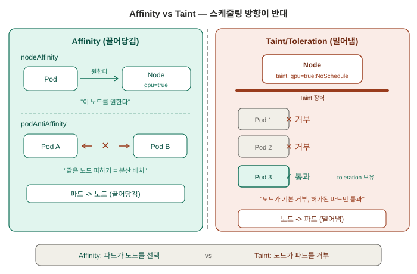
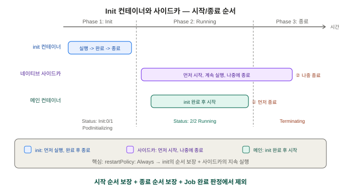

# 스케줄링 제어와 파드 라이프사이클 — 면접 대비 학습 정리

> 학습 목적: 이직/면접 대비. Day 7까지는 "파드가 어디든 하나로 취급"됐다면, 오늘은 "이 파드는
> 반드시(또는 되도록) 이 노드로/이 노드는 안 됨"을 제어하는 법과, 파드 안에서 컨테이너 시작
> 순서를 제어하는 법을 배운다. 환경: Windows 11 + Docker Desktop(WSL2) + minikube v1.38.1
> (Kubernetes v1.35.1, Docker 29.2.1 런타임), PowerShell. 매니페스트는 `manifests/day08/`에
> 커밋; 스크래치 작업은 레포 안 `lab/`(`.gitignore` 처리, 커밋 안 됨) 사용.

---

## 쉬운 설명 — 비유로 먼저 이해하기

기술적인 설명(아래 0~4번)에 들어가기 전에, 오늘 배운 다섯 가지를 비유로 먼저 정리한다.
복습할 때는 이 비유부터 떠올린 뒤 기술적 설명으로 넘어가면 기억이 잘 난다.

서버(노드)가 여러 대일 때 "어떤 프로그램을 어느 서버에 놓을지" 정하는 방법은 딱 두 방향뿐이다:

**① 프로그램이 "나는 이 서버가 좋아"라고 말하는 것 — nodeSelector**
`kubectl label node minikube-m02 disktype=ssd`는 **m02 서버에 "SSD 서버"라는 스티커를
붙인 것**이다. 그 다음 파드가 `nodeSelector: disktype=ssd`로 "나는 그 스티커 붙은 곳에만
갈래"라고 말하면, 정확히 그 스티커 붙은 서버로 간다. **스티커 붙이기 + 그 스티커 요구하기.**

**② 서버가 "나는 아무나 안 받아"라고 말하는 것 — taint/toleration**
`kubectl taint node minikube-m02 dedicated=special:NoSchedule`은 **m02 서버 문 앞에
"허가증 없으면 출입 금지" 팻말을 세운 것**이다. 허가증(toleration) 없는 평범한 파드는
전부 다른 서버로 밀려나고, 허가증을 가진 파드만 들어갈 수 있다. **① 이 "끌어당김"이라면
② 는 "밀어냄 + 예외 허용"**이라는 반대 방향.

**③ 순서를 지키는 준비 담당 — init 컨테이너**
요리사가 요리(메인 컨테이너)를 시작하기 전에 **먼저 재료 손질을 끝내야** 한다. 손질이
안 끝나면 요리를 시작할 수 없고, 손질이 끝나면 그 담당은 **퇴장**한다. 오늘 본
`Init:0/1` → `PodInitializing` → `Running`이 정확히 이 순서 — 준비가 안 끝나면 진짜
앱(nginx)은 시작도 안 된다.

**④ 계속 옆에 붙어있는 도우미 — 사이드카**
③과 달리, **손님(메인 앱) 옆에서 끝까지 같이 있는 도우미**다. `restartPolicy: Always`
한 줄만 추가했더니 `READY 2/2`가 나왔다 — 준비만 하고 퇴장하는 게 아니라, 메인 앱과
동등하게 "둘 다 살아있음"으로 계속 카운트된다는 뜻.

**⑤ 서버끼리 연결할 "도로"가 없었던 문제 — CNI**
건물(서버)이 1채일 땐 도로가 필요 없다. 그런데 옆에 건물을 하나 더 지었더니(`minikube
node add`), 두 건물을 잇는 도로를 애초에 안 만들어놔서 새 건물이 고립됐다(`NotReady`).
"전원을 껐다 켜면(재시작) 도로가 생기지 않을까" 시도했지만 안 통했다 — **도로는 건물을
지을 때 설계도에 미리 넣어야 생기는 것**이지, 나중에 재시작으로 까는 게 아니기 때문.
그래서 두 건물을 다 부수고 처음부터 "도로 포함"으로 다시 지어야 했다.

**한 줄 요약**: ① 스티커/끌어당김, ② 팻말/밀어냄, ③ 준비 담당(끝나면 퇴장),
④ 도우미(끝까지 같이), ⑤ 도로는 처음 지을 때만 깔 수 있음.

### 실무 적용 예 (쉬운 버전)

전문 용어(서비스 메시, Vault 등) 없이, 실제로 왜 쓰는지만 쉬운 말로.

- **① nodeSelector**: 인공지능 학습 프로그램은 그래픽카드(GPU) 달린 서버에서만 돌아야
  빠르다. 그래서 "GPU 있음" 스티커 붙은 서버에만 그 프로그램을 배치한다.
- **② Anti-affinity**: 쇼핑몰 웹서버 3대를 배포하는데, 3대가 전부 같은 서버에 있으면
  그 서버 하나가 고장 났을 때 쇼핑몰 전체가 다운된다. anti-affinity로 3대를 서로 다른
  서버에 흩어두면, 서버 하나가 죽어도 나머지가 계속 서비스한다 — 오늘 한 `spread-demo`가
  정확히 이것.
- **③ Taint/Toleration**: 서버 한 대를 점검(청소)해야 할 때, K8s가 자동으로 그 서버
  앞에 "출입금지" 팻말(taint)을 세우고, 이미 그 서버에 있던 프로그램들을 다른 서버로
  옮겨준다(`kubectl drain`). 우리가 수동으로 taint를 건 걸, 유지보수 때는 K8s가 알아서
  해주는 것.
- **④ Init 컨테이너**: 앱을 켜기 전에 "데이터베이스가 이미 켜져 있는지" 먼저 확인하고,
  안 켜져 있으면 켜질 때까지 기다렸다가 그제야 앱을 시작한다 — DB 연결 실패로 앱이
  계속 죽었다 켜졌다 하는 걸 막아준다.
- **⑤ 사이드카**: 메인 앱은 자기 일만 하면서 기록(로그)을 파일에 계속 남기고, 옆에
  붙은 도우미가 그 파일을 대신 읽어서 회사의 로그 저장소로 실시간으로 보내주는 역할을
  한다 — 메인 앱은 "보내는 일"은 신경 안 써도 된다.

### 하나의 이야기로 이어보기 — 성장하는 쇼핑몰

주제별로 따로 보면 다섯 개가 별개처럼 느껴지지만, 실제로는 회사가 커가면서 **순서대로**
필요해지는 것들이다. 하나의 이야기로 이어보면 왜 이 순서인지 저절로 납득된다.

> **1장. 서버가 하나 더 필요해졌다**
> 당신은 스타트업의 유일한 백엔드 개발자다. 서버 1대로 쇼핑몰을 운영하다가, 손님이
> 몰려서 서버를 한 대 더 들였다. 그런데 새 서버가 아무것도 못 한다 — 기존 서버와
> **연결이 안 돼 있었던** 것이다. (§0 CNI — "도로"가 없었던 문제)
>
> **2장. 어떤 서버에 뭘 놓을 것인가**
> 두 서버가 연결되고 나니, 하나는 그래픽카드가 달려 있어서 "추천 상품 AI"를 거기 놓고
> 싶다. 프로그램에게 "너는 그래픽카드 있는 서버로 가"라고 말하는 법이 필요해졌다.
> (§1 nodeSelector)
>
> **3장. 다 몰리면 위험하다**
> 웹서버를 3대로 늘렸는데, 문득 걱정이 된다 — 이 3대가 전부 같은 서버에 있다면? 그
> 서버 하나가 죽으면 쇼핑몰 전체가 다운된다. 3대를 일부러 흩어놔야 한다.
> (§2 pod anti-affinity)
>
> **4장. VIP 고객 전용 서버**
> 큰 고객 하나가 "우리만 쓰는 전용 서버"를 요청한다. 그 서버엔 다른 트래픽이 절대
> 못 들어오게, 허가받은 프로그램만 들어오게 막아야 한다. (§3 taint/toleration)
>
> **5장. 준비 안 된 채로 시작하면 안 된다**
> 앱을 새로 배포했더니 자꾸 죽는다. DB가 아직 안 켜졌는데 앱이 먼저 켜져서 연결에
> 실패한 것이다. "DB 켜질 때까지 기다렸다가 시작"하는 규칙이 필요해졌다. (§4 init 컨테이너)
>
> **6장. 로그는 누가 치우나**
> 앱 코드 안에 "로그를 어디로 보낼지" 로직을 넣기 싫다. 앱 옆에 조용히 따라다니며
> 로그만 대신 처리해주는 도우미를 붙인다. (§4 네이티브 사이드카)

**이 노트를 참고서로 쓸 때**: 지금 이 이야기는 처음 배울 때 흐름을 잡는 용도고, "taint가
정확히 뭐였지?" 같은 걸 나중에 찾아볼 땐 아래 §0~4의 기술적 설명(개념/왜/실제 명령어와
결과)으로 바로 넘어가면 된다.

---

## 0. 멀티노드 클러스터 구성 — CNI 문제와 해결

### 개념

스케줄링 제어(taint/affinity)는 노드가 여러 개일 때 체감이 확실하다. 기존 단일 노드
minikube에 `minikube node add`로 워커 노드를 추가하려 했으나, 실제로는 문제가 발생해
**클러스터를 지우고 처음부터 2노드로 재생성**하는 것으로 해결했다. 이 과정 자체가 실무에서도
흔한 CNI 트러블슈팅 사례라 별도로 기록한다.

### 실제 겪은 문제와 해결 과정

**1) `minikube node add`로 워커 추가 시도** — 경고와 함께 노드가 `NotReady`:
```
* 노드 m02 를 클러스터 minikube 에 [worker] 로 추가합니다
! CNI 없이 클러스터가 생성되었으므로, 클러스터에 노드를 추가하면 네트워킹이 중단될 수 있습니다.
...
NAME           STATUS     ROLES           ...
minikube-m02   NotReady   <none>          ...
```

**2) 원인 진단** — `kubectl describe node minikube-m02`:
```
Ready   False   ...   KubeletNotReady   container runtime network not ready: NetworkReady=false
reason:NetworkPluginNotReady message:docker: network plugin is not ready: cni config uninitialized
```
기존 단일 노드 클러스터가 애초에 **CNI 없이** 만들어졌던 것 — 단일 노드에선 문제가 안
드러나다가, 두 번째 노드를 추가하는 순간 노드 간 파드 네트워킹이 필요해지며 드러났다.

**3) 첫 번째 시도(실패) — 재시작으로 CNI 추가**:
```powershell
minikube stop
minikube start --cni=kindnet
```
완료됐다고 나왔지만 `kubectl get pods -n kube-system`에 kindnet 파드가 전혀 없었고,
m02는 여전히 같은 에러로 `NotReady`. **CNI 같은 클러스터 "모양" 설정은 최초 생성 시점에만
반영되고, 이미 존재하는 프로필에는 재시작으로 적용되지 않는다**는 걸 확인 (실측 증거:
kindnet 파드 부재). 관련 이슈: [minikube #19665](https://github.com/kubernetes/minikube/issues/19665).

**4) 해결 — 삭제 후 CNI를 지정해서 재생성**:
```powershell
minikube delete
minikube start --nodes=2 --cni=kindnet
kubectl get nodes -o wide
```
```
NAME           STATUS   ROLES           AGE     VERSION
minikube       Ready    control-plane   7m19s   v1.35.1
minikube-m02   Ready    <none>          118s    v1.35.1
```
두 노드 다 `Ready`로 확인.

### 왜 이렇게 설계됐는가

CNI는 파드 네트워크(각 노드의 파드 서브넷을 클러스터 전체에서 라우팅 가능하게 만드는 것)를
담당하는데, 이건 클러스터의 **네트워크 토폴로지 자체**를 결정하는 근본 설정이라 나중에
끼워넣기가 어렵다. 단일 노드에서는 노드 간 라우팅이 필요 없어 CNI 없이도 동작하는 것처럼
보이지만(같은 노드 안에서는 docker의 기본 브리지만으로 충분), 노드가 2개 이상이 되는 순간
"어느 노드의 파드가 다른 노드의 파드와 어떻게 통신하는가"라는 문제가 생기고, 이건 클러스터
생성 시점에 CNI 플러그인이 초기 설정을 심어둬야 풀리는 문제다.

> **면접 답변**: "CNI 없이 만든 클러스터에 나중에 노드를 추가하면 네트워크 초기화가
> 안 돼 NotReady가 됩니다. CNI는 클러스터의 네트워크 토폴로지를 결정하는 근본 설정이라
> 재시작으로 나중에 끼워넣을 수 없고, 처음부터 지정해서 만들어야 합니다."

---

## 1. nodeSelector — 가장 단순한 스케줄링 제약

### 개념

Pod spec에 `nodeSelector: {key: value}`를 지정하면 스케줄러는 **그 라벨을 가진 노드에만**
배치한다. 조건 하나만(AND만) 걸 수 있고 OR/NOT 표현은 불가능한, 가장 투박하지만 가장
이해하기 쉬운 형태. 실무 예: GPU 있는 노드에만 ML 워크로드, SSD 있는 노드에만 DB.

### 왜 이렇게 설계됐는가

모든 노드가 동일한 하드웨어/역할이 아닐 수 있다(GPU, SSD, 특정 가용 영역). 기본 스케줄러는
자원 여유(Day 3의 "장부")만 보고 아무 노드나 고르는데, 특정 요구사항이 있는 워크로드는
"이 조건을 만족하는 노드만" 골라야 한다 — 그 가장 단순한 표현이 라벨 매칭이다.

> **면접 답변**: "nodeSelector는 파드가 특정 라벨을 가진 노드에만 배치되도록 강제하는
> 가장 단순한 스케줄링 제약입니다. 라벨이 일치하는 노드가 하나도 없으면 다른 조건이
> 충족돼도 Pending 상태로 남습니다 — requests 초과로 인한 Pending과는 다른 원인입니다."

### 직접 확인한 실습

노드에 라벨을 달고, 그 라벨을 요구하는 파드가 실제로 그 노드로 가는지 확인:

```powershell
kubectl label node minikube-m02 disktype=ssd
kubectl run ssd-pod --image=nginx --overrides='{"spec":{"nodeSelector":{"disktype":"ssd"}}}'
kubectl get pod ssd-pod -o wide
```
```
NAME      READY   STATUS              RESTARTS   AGE   IP       NODE           NOMINATED NODE   READINESS GATES
ssd-pod   0/1     ContainerCreating   0          4s    <none>   minikube-m02   <none>           <none>
```
정확히 `minikube-m02`로 배치됨.

반대로, **매칭되는 노드가 없는 라벨**을 요구하면:
```powershell
kubectl run hdd-pod --image=nginx --overrides='{"spec":{"nodeSelector":{"disktype":"hdd"}}}'
kubectl get pod hdd-pod
```
```
NAME      READY   STATUS    RESTARTS   AGE
hdd-pod   0/1     Pending   0          7s
```
`kubectl describe pod hdd-pod`의 Events:
```
Warning  FailedScheduling  45s   default-scheduler  0/2 nodes are available: 2 node(s) didn't
match Pod's node affinity/selector. no new claims to deallocate, preemption: 0/2 nodes are
available: 2 Preemption is not helpful for scheduling.
```
requests 부족이 아니라 **라벨 불일치**로 인한 Pending이 정확히 확인됨 (Day 3의 Pending
개념이 새로운 원인으로 재현된 것).

---

## 2. Affinity / Anti-affinity — nodeSelector가 못 하는 것



### 개념

nodeSelector는 정확히 하나의 key=value만 요구할 수 있고(AND만), **다른 파드의 위치를
참조할 수도 없다.** Affinity는 이 두 한계를 푼다:
- **node affinity**: `In`/`NotIn` 연산자로 OR 조건 표현 가능, `preferred`(소프트: 안
  맞아도 일단 배치)와 `required`(하드: nodeSelector와 동일한 강제력)를 구분 가능.
- **pod anti-affinity**: 노드 라벨이 아니라 **"다른 파드가 이미 어디 있는지"**를 기준으로
  배치를 제약한다. 실무에서 가장 흔한 용도는 **같은 앱의 복제본들을 서로 다른 노드에
  흩어놓기**(한 노드가 죽어도 전멸하지 않도록).

### 왜 이렇게 설계됐는가

가용성(availability)을 위해서는 "복제본이 몇 개인가"보다 "그 복제본들이 물리적으로
분산돼 있는가"가 더 중요할 때가 있다 — 복제본 3개가 전부 한 노드에 몰려 있으면, 그
노드 하나가 죽는 순간 3개 다 같이 죽는다. 이건 노드의 정적 라벨로는 표현할 수 없고
"현재 다른 파드가 어디 있는가"라는 동적 조건이 필요하므로, affinity는 podAffinity/
podAntiAffinity로 파드 간 관계를 스케줄링 조건에 포함시킬 수 있게 설계됐다.

> **면접 답변**: "nodeSelector는 정적인 노드 라벨 하나만 정확히 매칭해야 하는 반면,
> affinity는 In/NotIn 같은 연산자로 더 유연한 조건을 걸 수 있고, preferred로 소프트
> 조건도 표현할 수 있습니다. 특히 pod anti-affinity는 노드가 아니라 다른 파드의 위치를
> 기준으로 삼기 때문에, 같은 앱의 복제본을 서로 다른 노드에 분산시켜 가용성을 높이는
> 용도로 씁니다."

### 직접 확인한 실습

정확히 노드 2개인 환경에서, replica 2개를 `podAntiAffinity`로 분산:

```yaml
apiVersion: apps/v1
kind: Deployment
metadata:
  name: spread-demo
spec:
  replicas: 2
  selector:
    matchLabels:
      app: spread-demo
  template:
    metadata:
      labels:
        app: spread-demo
    spec:
      affinity:
        podAntiAffinity:
          requiredDuringSchedulingIgnoredDuringExecution:
            - labelSelector:
                matchLabels:
                  app: spread-demo
              topologyKey: kubernetes.io/hostname
      containers:
        - name: web
          image: nginx
```

```powershell
kubectl apply -f manifests/day08/spread-demo.yaml
kubectl get pods -l app=spread-demo -o wide
```
```
NAME                           READY   STATUS              RESTARTS   AGE   NODE
spread-demo-6974cd9495-h8lk8   0/1     ContainerCreating   0          3s    minikube-m02
spread-demo-6974cd9495-qpppm   0/1     ContainerCreating   0          3s    minikube
```
정확히 노드 하나씩 나뉨 — anti-affinity가 두 복제본이 같은 노드에 몰리는 걸 강제로 막았다.

---

## 3. Taint / Toleration — 방향이 반대인 제어

### 개념

nodeSelector/affinity는 **파드가 "이 노드를 원한다"**고 말하는 것(끌어당김)이라면,
taint/toleration은 **노드가 "나는 파드를 밀어낸다, 허락받은 파드만 예외"**라고 말하는
것(밀어냄)이다. 실무 예: GPU 전용 노드에 아무 파드나 못 들어오게 막고, GPU가 필요하다고
명시한(toleration을 가진) 파드만 예외적으로 허용.

### 왜 이렇게 설계됐는가

nodeSelector/affinity만 있으면 "특정 노드를 원하는 파드"는 표현할 수 있어도, "이 노드는
기본적으로 아무도 오면 안 된다"는 **기본값을 반전**시키는 표현은 안 된다 (모든 일반
파드에 일일이 "이 노드는 피해라"는 조건을 걸어야 하는데 비현실적). taint는 노드 쪽에서
선제적으로 방어벽을 치고, toleration을 가진 파드만 그 벽을 통과하게 하는 **화이트리스트
방식**이라 훨씬 실용적이다.

> **면접 답변**: "nodeSelector/affinity가 파드 쪽에서 원하는 노드를 지정하는 끌어당김
> 방식이라면, taint/toleration은 노드 쪽에서 기본적으로 모든 파드를 밀어내고
> toleration을 가진 파드만 예외적으로 허용하는 밀어냄 방식입니다. 전용 노드를 만들 때
> 모든 일반 파드에 회피 조건을 거는 대신, 노드 하나에 taint 하나만 걸면 되므로 훨씬
> 실용적입니다."

### 직접 확인한 실습

노드에 taint를 걸고, toleration 없는 일반 파드가 밀려나는지 확인:

```powershell
kubectl taint node minikube-m02 dedicated=special:NoSchedule
kubectl create deployment taint-test --image=nginx --replicas=4
kubectl get pods -l app=taint-test -o wide
```
```
NAME                          READY   STATUS              RESTARTS   AGE   NODE
taint-test-7945ff45d4-2kz8j   0/1     ContainerCreating   0          2s    minikube
taint-test-7945ff45d4-cwcxl   0/1     ContainerCreating   0          2s    minikube
taint-test-7945ff45d4-dwv67   0/1     ContainerCreating   0          2s    minikube
taint-test-7945ff45d4-zgx97   0/1     ContainerCreating   0          2s    minikube
```
taint 없는 `minikube`에만 4개 다 몰림 — `minikube-m02`는 하나도 못 받음.

반대로, **toleration을 가진 파드**는 taint에도 불구하고 들어갈 수 있는지 (nodeSelector로
m02를 강제 지정해 결과를 명확하게 함):

```yaml
apiVersion: v1
kind: Pod
metadata:
  name: toleration-pod
spec:
  nodeSelector:
    kubernetes.io/hostname: minikube-m02
  tolerations:
    - key: "dedicated"
      operator: "Equal"
      value: "special"
      effect: "NoSchedule"
  containers:
    - name: web
      image: nginx
```
```powershell
kubectl apply -f manifests/day08/toleration-pod.yaml
kubectl get pod toleration-pod -o wide
```
```
NAME             READY   STATUS    RESTARTS   AGE   IP           NODE
toleration-pod   1/1     Running   0          8s    10.244.1.4   minikube-m02
```
taint 걸린 `minikube-m02`에서 정상 `Running` — toleration이 taint를 뚫고 들어감이 확인됨.

---

## 4. Init 컨테이너와 사이드카 — 컨테이너 시작 순서 제어



### 개념

- **init 컨테이너**: 메인 컨테이너가 시작되기 **전에 먼저 끝까지 실행되고 종료**돼야
  하는 컨테이너. "DB 연결 확인될 때까지 대기", "설정 파일 미리 받아두기" 같은 준비
  작업에 쓴다.
- **네이티브 사이드카**(`initContainers`에 `restartPolicy: Always` 추가): init
  컨테이너의 "먼저 시작" 순서 보장은 그대로 가져가면서, **끝나지 않고 메인 컨테이너와
  나란히 계속 실행**된다. 서비스 메시 프록시, 로그 수집기 등에 쓴다.

### 왜 이렇게 설계됐는가

`restartPolicy: Always`가 생기기 전엔 "먼저 뜨고 계속 사는 보조 컨테이너"를 만들 방법이
없어서, 그냥 `containers:`에 두 번째 컨테이너로 넣는 게 유일한 방법이었다. 이게 실무에서
세 가지 문제를 일으켰다:
1. **시작 순서 문제**: 같은 파드의 일반 컨테이너들은 동시에 뜨므로, 프록시가 메인 앱보다
   먼저 준비돼야 하는 경우를 표현할 방법이 없었다.
2. **종료 순서 문제**: 파드 종료 시 모든 컨테이너가 거의 동시에 SIGTERM을 받는데, 프록시가
   메인 앱보다 먼저 죽으면 마지막 요청/응답이 유실될 수 있었다.
3. **Job 완료 인식 문제**: Job은 "모든 컨테이너 종료"가 완료 조건인데, 무한루프 사이드카가
   있으면 Job이 영원히 완료 처리되지 않았다.

네이티브 사이드카는 init 컨테이너의 순서 보장 메커니즘에 `restartPolicy: Always`만
추가해서, 세 문제를 한 번에 해결했다 (먼저 시작 + 나중에 종료 + Job 완료 판정 시 제외).

> **면접 답변**: "init 컨테이너는 메인 컨테이너 시작 전에 끝까지 실행되고 종료돼야
> 하는 준비 작업용입니다. 서비스 메시 프록시처럼 메인 앱과 나란히 계속 떠 있어야
> 하는 보조 컨테이너는 initContainers에 restartPolicy: Always를 추가한 네이티브
> 사이드카로 만듭니다 — 시작 순서 보장, 종료 시 가장 나중에 꺼짐, Job 완료 판정에서
> 제외라는 세 가지를 동시에 얻습니다."

### 직접 확인한 실습

**init 컨테이너 — 메인 컨테이너 시작을 지연시키는지 확인**:
```yaml
apiVersion: v1
kind: Pod
metadata:
  name: init-demo
spec:
  initContainers:
    - name: wait-for-setup
      image: busybox
      command: ["sh", "-c", "echo 초기화 작업 중...; sleep 5; echo 초기화 완료"]
  containers:
    - name: main-app
      image: nginx
```
```powershell
kubectl apply -f manifests/day08/init-demo.yaml
kubectl get pod init-demo -w
```
```
NAME        READY   STATUS            RESTARTS   AGE
init-demo   0/1     Init:0/1          0          2s
init-demo   0/1     Init:0/1          0          11s
init-demo   0/1     PodInitializing   0          15s
init-demo   1/1     Running           0          18s
```
```powershell
kubectl logs init-demo -c wait-for-setup
```
```
초기화 작업 중...
초기화 완료
```
`Init:0/1` → `PodInitializing` → `Running` 순서가 그대로 관찰됨. 로그도 init 컨테이너가
끝까지 실행된 뒤 메인 컨테이너가 시작됐다는 걸 뒷받침.

**네이티브 사이드카 — `READY` 카운트에 포함되는지가 핵심**:
```yaml
apiVersion: v1
kind: Pod
metadata:
  name: sidecar-demo
spec:
  initContainers:
    - name: log-shipper
      image: busybox
      restartPolicy: Always
      command: ["sh", "-c", "while true; do echo 사이드카가 로그 수집 중; sleep 10; done"]
  containers:
    - name: main-app
      image: nginx
```
```powershell
kubectl apply -f manifests/day08/sidecar-demo.yaml
kubectl get pod sidecar-demo
```
```
NAME           READY   STATUS    RESTARTS   AGE
sidecar-demo   2/2     Running   0          12m
```
`restartPolicy: Always`가 없었다면 무한루프인 init 컨테이너가 절대 안 끝나서 파드가
영원히 `Init:0/1`에 멈췄을 것 — 대신 `2/2 Running`으로 정상 진행돼, 사이드카가 메인
컨테이너와 동등하게 READY 카운트에 포함되고 계속 실행됨을 확인.

---

## 오늘의 트러블슈팅 노트

- **`minikube node add` → 새 노드 `NotReady`, `cni config uninitialized`**: 단일
  노드로 만들 때 CNI 없이 생성됐던 게 원인. 단일 노드에선 안 드러나다가 노드 추가 시
  드러남.
- **`minikube stop` → `minikube start --cni=kindnet` 재시도해도 안 고쳐짐**: CNI 같은
  클러스터 "모양" 설정은 최초 생성 시점에만 반영되고, 이미 존재하는 프로필에는 재시작
  으로 안 먹힌다. kube-system에 kindnet 파드가 아예 안 생긴 걸로 확인. 해결은
  `minikube delete` 후 `minikube start --nodes=2 --cni=kindnet`으로 재생성.
- **PowerShell here-string으로 멀티 YAML 파일 계속 재사용**: `lab/` 폴더(`.gitignore`
  처리)에 만들어서 재현 가능하게 유지, 실습 끝나면 정리.

---

## 오늘 배운 것 전체 흐름 요약

1. **멀티노드 CNI 문제**: CNI는 클러스터 생성 시점에만 반영되는 근본 설정이라, 나중에
   재시작으로 끼워넣을 수 없다 — 노드 추가 전에 미리 지정해서 만들어야 한다.
2. **nodeSelector**: 파드가 정확히 하나의 노드 라벨을 요구하는 가장 단순한 스케줄링
   제약. 매칭 노드가 없으면 requests 부족과는 다른 원인으로 Pending.
3. **Affinity/Anti-affinity**: nodeSelector보다 유연한 조건(In/NotIn, preferred/
   required)과, 다른 파드의 위치를 참조하는 pod anti-affinity로 복제본을 노드에
   분산시켜 가용성을 높인다.
4. **Taint/Toleration**: 노드가 파드를 기본적으로 밀어내고, toleration을 가진 파드만
   예외적으로 허용하는 화이트리스트 방식 — nodeSelector/affinity의 끌어당김과 반대
   방향.
5. **Init 컨테이너/사이드카**: init 컨테이너는 끝나야 메인이 시작되는 순서 보장용,
   `restartPolicy: Always`를 추가한 네이티브 사이드카는 그 순서 보장을 유지하면서도
   끝나지 않고 메인과 나란히 실행되며 READY 카운트에도 포함된다.

**다음 학습 목표**: Namespace, RBAC(역할 기반 접근 제어), ServiceAccount +
ResourceQuota/LimitRange + SecurityContext (Day 9)
