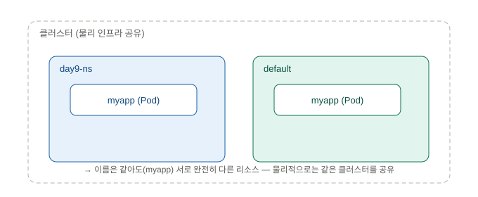
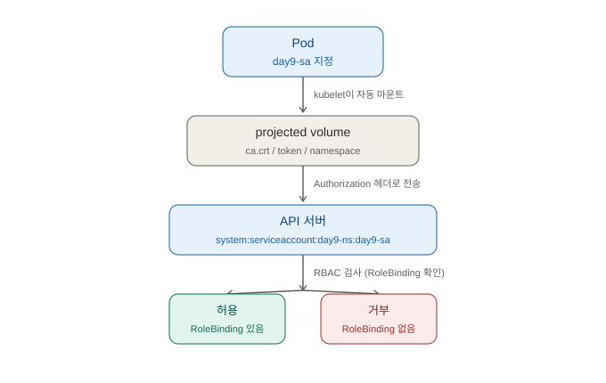
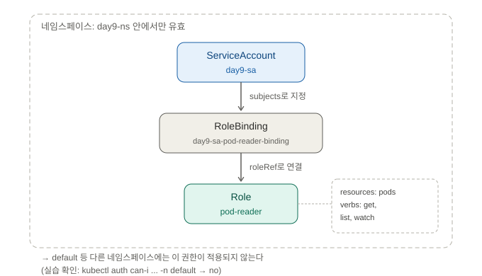
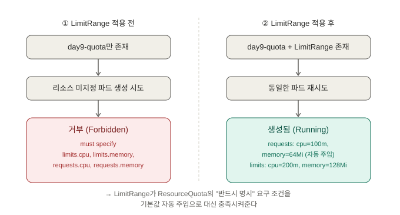
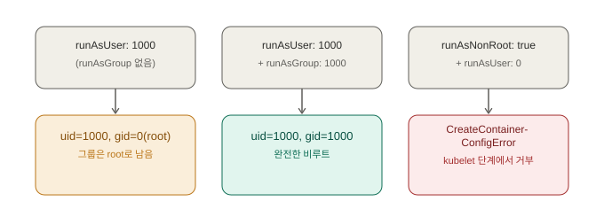

# Namespace, RBAC, ServiceAccount, ResourceQuota/LimitRange, SecurityContext — 면접 대비 학습 정리

> 학습 목적: 이직/면접 대비. Day 8까지는 "어디에(어느 노드에) 배치할지"를 다뤘다면, 오늘은
> "누가(어떤 신원으로) 무엇을 할 수 있는지"와 "얼마나 쓸 수 있는지/어떤 권한으로 실행되는지"를
> 제어하는 법을 배운다. 환경: Windows 11 + Docker Desktop(WSL2) + minikube v1.38.1
> (Kubernetes v1.35.1, `docker` 드라이버, Docker 29.2.1 런타임), PowerShell. 매니페스트는
> `manifests/day09/`에 커밋.

---

## 1. Namespace — 클러스터를 나누지 않고 논리적으로만 구획하기



### 개념

Namespace는 클러스터를 물리적으로 여러 개로 쪼개는 게 아니라, **하나의 클러스터 안에서
자원 이름을 논리적으로 구획**하는 것이다. 같은 클러스터 위에서 `-n <namespace>`로 조회
범위가 명확히 갈리고, 이름 충돌(같은 이름의 리소스를 서로 다른 팀이 쓰는 것) 없이 공존할
수 있다.

### 왜 이렇게 설계됐는가

여러 팀/환경(dev, staging, prod)이 클러스터 하나를 공유해야 할 때, 클러스터를 팀마다
따로 만들면 인프라 비용과 운영 부담이 커진다. Namespace는 물리적 인프라(노드, 컨트롤
플레인)는 공유하되, 이름 공간·리소스 쿼터·RBAC 권한 같은 **정책의 적용 범위**를 논리적으로
나눌 수 있게 해서 이 문제를 푼다. 뒤에 나올 RBAC의 Role, ResourceQuota, LimitRange가
전부 "네임스페이스 단위"로 적용되는 것도 이 설계의 연장선이다.

> **면접 답변**: "Namespace는 클러스터를 물리적으로 분리하는 게 아니라, 이름 공간과 정책
> 적용 범위를 논리적으로 나누는 것입니다. 같은 이름의 리소스를 서로 다른 네임스페이스에
> 둘 수 있고, RBAC Role이나 ResourceQuota처럼 네임스페이스 단위로 스코핑되는 정책들의
> 경계로도 쓰입니다."

### 직접 확인한 실습

```powershell
kubectl create namespace day9-ns
kubectl get namespaces
```
```
namespace/day9-ns created

NAME              STATUS   AGE
day9-ns           Active   2s
default           Active   22h
kube-node-lease   Active   22h
kube-public       Active   22h
kube-system       Active   22h
```

격리 확인 — 아무것도 없는 두 네임스페이스를 각각 조회:
```powershell
kubectl get pods -n day9-ns
kubectl get pods
```
```
No resources found in day9-ns namespace.
No resources found in default namespace.
```

컨텍스트의 기본 네임스페이스 전환(매번 `-n`을 안 쳐도 되게)과 원복:
```powershell
kubectl config set-context --current --namespace=day9-ns
kubectl config view --minify | Select-String namespace
kubectl config set-context --current --namespace=default
```
```
Context "minikube" modified.

    namespace: day9-ns

Context "minikube" modified.
```

---

## 2. ServiceAccount — 파드가 API 서버에 자신을 증명하는 신원



### 개념

ServiceAccount는 **사람이 아니라 파드(워크로드)를 위한 인증 신원**이다. 네임스페이스를
만들면 `default`라는 ServiceAccount가 자동으로 함께 생성되고, 파드가 `serviceAccountName`을
따로 지정하지 않으면 이 `default`를 쓴다. 파드는 실행되는 순간 이 신원에 대응하는 토큰을
`/var/run/secrets/kubernetes.io/serviceaccount/` 경로에 자동으로 마운트받는다.

### 왜 이렇게 설계됐는가

쿠버네티스 API를 호출하는 주체는 사람(User)만이 아니다 — 파드 안에서 도는 애플리케이션이
"내 앞의 다른 서비스가 몇 개 떠 있나" 같은 걸 API 서버에 직접 물어봐야 하는 경우가 흔하다.
이때 사람 계정을 파드 안에 넣어 쓸 수는 없으므로(계정 공유, 권한 과다, 로테이션 불가 등
문제), **워크로드 전용 신원 체계**가 별도로 필요했다. ServiceAccount + RBAC을 조합하면
"이 파드는 정확히 이 권한만 가진다"를 세밀하게 통제할 수 있다.

쿠버네티스 공식 문서 기준(2026-07 확인) — 이 토큰이 마운트되는 방식도 시간이 지나며
바뀌었다: v1.22부터는 `TokenRequest` API로 발급한 **짧은 수명의 자동 회전 토큰**을
projected volume으로 마운트하는 방식이 기본이 됐고, v1.24부터는 ServiceAccount를 만들
때 장기 토큰 Secret을 자동으로 함께 생성하던 예전 동작이 기본 비활성화됐다(관련 feature
gate `LegacyServiceAccountTokenNoAutoGeneration`는 v1.27에서 제거되어 GA). 그래서 아래
실습에서 `describe sa`에 `Tokens:` 항목이 안 뜨는 것이 정상이다.

> **면접 답변**: "ServiceAccount는 사람이 아니라 파드를 위한 인증 신원입니다. 네임스페이스를
> 만들면 default SA가 자동 생성되고, 파드는 시작될 때 이 신원의 토큰을 자동으로 마운트받아
> API 서버 호출에 씁니다. v1.24부터는 SA 생성 시 장기 토큰 Secret이 자동으로 안 만들어지고,
> 대신 파드가 뜰 때 TokenRequest API로 짧은 수명의 토큰을 즉석 발급받는 방식으로 바뀌었습니다
> — 정적 자격증명이 오래 떠도는 위험을 줄이기 위해서입니다."

### 직접 확인한 실습

```powershell
kubectl create serviceaccount day9-sa -n day9-ns
kubectl get serviceaccount -n day9-ns
kubectl describe sa day9-sa -n day9-ns
```
```
serviceaccount/day9-sa created

NAME      AGE
day9-sa   51s
default   5m40s

Name:                day9-sa
Namespace:           day9-ns
Labels:              <none>
Annotations:         <none>
Image pull secrets:  <none>
Events:              <none>
```
`default`는 네임스페이스 생성 시 자동으로 딸려온 것이고, `Tokens:` 항목이 안 보이는 게
앞서 설명한 v1.24+ 동작과 일치한다.

이 ServiceAccount를 쓰는 파드 배포(`manifests/day09/sa-pod.yaml`, `serviceAccountName: day9-sa`
지정) 후 토큰 마운트 실증:
```powershell
kubectl apply -f manifests/day09/sa-pod.yaml
kubectl exec sa-demo-pod -n day9-ns -- ls /var/run/secrets/kubernetes.io/serviceaccount
kubectl exec sa-demo-pod -n day9-ns -- cat /var/run/secrets/kubernetes.io/serviceaccount/namespace
```
```
pod/sa-demo-pod created

ca.crt
namespace
token

day9-ns
```
파드 안에 `ca.crt`(API 서버 인증서), `token`(신원 증명 토큰), `namespace`(자신이 속한
네임스페이스) 세 파일이 자동으로 마운트돼 있고, `namespace` 파일 내용이 정확히 `day9-ns`로
찍혀 이 파드의 신원이 해당 네임스페이스에 묶여 있음이 확인됐다.

---

## 3. RBAC — Role과 RoleBinding으로 최소 권한 부여하기



### 개념

- **Role**: "무엇을(resources) 어떻게(verbs) 할 수 있는가"를 정의하는 규칙 묶음.
  **네임스페이스 범위**로만 적용된다 (클러스터 전체 범위는 `ClusterRole`).
- **RoleBinding**: Role을 특정 Subject(User/Group/ServiceAccount)에 **연결**하는 것.
  Role 자체는 아무에게도 적용 안 된 "정의"일 뿐이고, RoleBinding이 있어야 실제 권한이
  발생한다.

### 왜 이렇게 설계됐는가

RBAC은 **최소 권한 원칙**을 구현한다 — 기본적으로 ServiceAccount는 아무 권한도 없고,
필요한 만큼만 명시적으로 부여한다. Role(권한의 정의)과 RoleBinding(누구에게 줄지)을
분리한 이유는 **재사용성**이다: 같은 `pod-reader` Role을 여러 ServiceAccount/User에
RoleBinding만 추가해서 재사용할 수 있고, 권한 정의와 부여 대상을 독립적으로 관리할 수
있다.

> **면접 답변**: "Role은 권한의 정의, RoleBinding은 그 권한을 누구에게 줄지 연결하는
> 역할로 분리돼 있습니다. Role만 만들면 아무 효과가 없고 RoleBinding까지 있어야 실제
> 권한이 생깁니다. Role은 네임스페이스 범위라, 클러스터 전체에 적용하려면 ClusterRole/
> ClusterRoleBinding을 써야 합니다. 기본적으로 ServiceAccount는 권한이 하나도 없는
> 상태로 시작하는 최소 권한 원칙이 RBAC의 핵심입니다."

### 직접 확인한 실습

권한 부여 전 — 아무 권한도 없음을 `kubectl auth can-i`로 확인 (실제 요청을 보내지 않고
권한 여부만 시뮬레이션):
```powershell
kubectl auth can-i list pods --as=system:serviceaccount:day9-ns:day9-sa -n day9-ns
```
```
no
```

Role + RoleBinding 적용 후 재확인:
```powershell
kubectl apply -f manifests/day09/role-pod-reader.yaml
kubectl apply -f manifests/day09/rolebinding-day9-sa.yaml
kubectl auth can-i list pods --as=system:serviceaccount:day9-ns:day9-sa -n day9-ns
```
```
role.rbac.authorization.k8s.io/pod-reader created
rolebinding.rbac.authorization.k8s.io/day9-sa-pod-reader-binding created
yes
```

**최소 권한 원칙** — 부여 안 한 동작(`delete`)은 여전히 거부되는지:
```powershell
kubectl auth can-i delete pods --as=system:serviceaccount:day9-ns:day9-sa -n day9-ns
```
```
no
```

**Role은 네임스페이스 범위** — 다른 네임스페이스(`default`)에서는 안 통하는지:
```powershell
kubectl auth can-i list pods --as=system:serviceaccount:day9-ns:day9-sa -n default
```
```
no
```
권한 부여 전 `no` → 부여 후 `list`는 `yes`이지만 부여 안 한 `delete`는 여전히 `no`,
다른 네임스페이스에서도 `no` — Role의 범위와 최소 권한 원칙이 정확히 실증됐다.

---

## 4. ResourceQuota와 LimitRange — 네임스페이스 자원 총량과 컨테이너 기본값



### 개념

- **ResourceQuota**: 네임스페이스 **전체**가 쓸 수 있는 자원 총량(파드 개수, CPU/메모리
  requests·limits 합)의 상한.
- **LimitRange**: 네임스페이스 안 **개별 컨테이너**에 적용되는 기본값(`default`,
  `defaultRequest`)과 최소/최대(`min`, `max`) 제약.

### 왜 이렇게 설계됐는가

ResourceQuota가 `requests.cpu`/`requests.memory` 같은 컴퓨트 자원 항목을 걸어두면,
**그 네임스페이스에 새로 만들어지는 모든 파드는 반드시 명시적으로 resources를 지정해야
한다** — 그래야 얼마나 총량에서 빼야 할지 계산할 수 있기 때문이다. 하지만 개발자가 매번
모든 파드에 CPU/메모리 값을 직접 채우는 건 비현실적이고 실수하기 쉽다. LimitRange는 이
빈틈을 메운다 — 컨테이너에 resources가 없으면 LimitRange의 기본값을 **자동으로 주입**해서
ResourceQuota의 "반드시 명시" 요구를 대신 충족시켜준다. 두 리소스가 실무에서 항상 같이
쓰이는 이유가 바로 이것이다.

> **면접 답변**: "ResourceQuota는 네임스페이스 전체의 자원 총량 상한이고, LimitRange는
> 컨테이너 단위 기본값·최소·최대입니다. 이 둘이 같이 쓰이는 이유는, ResourceQuota가
> compute 자원 항목을 걸면 그 네임스페이스의 모든 파드가 resources를 명시해야 하는데,
> LimitRange가 없으면 명시 안 한 파드는 전부 거부됩니다. LimitRange가 기본값을 자동
> 주입해서 이 요구를 채워주기 때문에, 개발자가 매번 값을 안 넣어도 파드가 정상적으로
> 생성됩니다."

### 직접 확인한 실습

**① ResourceQuota만 있을 때** — 리소스 미지정 파드는 거부됨:
```powershell
kubectl apply -f manifests/day09/resourcequota.yaml
kubectl apply -f manifests/day09/quota-demo-pod.yaml
```
```
resourcequota/day9-quota created

Error from server (Forbidden): error when creating "manifests/day09/quota-demo-pod.yaml":
pods "quota-demo-pod" is forbidden: failed quota: day9-quota: must specify limits.cpu for: web;
limits.memory for: web; requests.cpu for: web; requests.memory for: web
```

**② LimitRange 적용 후** — 같은 파드가 통과하고, 실제로 기본값이 주입됨:
```powershell
kubectl apply -f manifests/day09/limitrange.yaml
kubectl apply -f manifests/day09/quota-demo-pod.yaml
kubectl get pod quota-demo-pod -n day9-ns -o jsonpath="{.spec.containers[0].resources}"
```
```
limitrange/day9-limitrange created
pod/quota-demo-pod created
{"limits":{"cpu":"200m","memory":"128Mi"},"requests":{"cpu":"100m","memory":"64Mi"}}
```
주입된 값이 LimitRange의 `default`(200m/128Mi)·`defaultRequest`(100m/64Mi)와 정확히
일치한다.

**③ pods 개수 초과** — quota `pods: "2"` 한도를 넘기면 거부:
```powershell
kubectl apply -f manifests/day09/quota-demo-pod-2.yaml
kubectl apply -f manifests/day09/quota-demo-pod-3.yaml
```
```
pod/quota-demo-pod-2 created

Error from server (Forbidden): error when creating "manifests/day09/quota-demo-pod-3.yaml":
pods "quota-demo-pod-3" is forbidden: exceeded quota: day9-quota, requested: pods=1, used: pods=2,
limited: pods=2
```

최종 사용량:
```powershell
kubectl describe resourcequota day9-quota -n day9-ns
```
```
Resource         Used   Hard
--------         ----   ----
limits.cpu       400m   600m
limits.memory    256Mi  384Mi
pods             2      2
requests.cpu     200m   300m
requests.memory  128Mi  192Mi
```
2개 파드 × LimitRange 기본값(200m/128Mi 등)이 정확히 `Used` 열과 일치한다.

---

## 5. SecurityContext — 컨테이너가 실행되는 권한 제어



### 개념

SecurityContext는 컨테이너(또는 파드 전체)가 **어떤 사용자/그룹으로, 어떤 파일시스템
권한으로** 실행될지를 제어한다. 주요 필드:
- `runAsNonRoot`: root(uid 0)로 실행되면 거부
- `runAsUser` / `runAsGroup`: 강제할 UID / GID
- `readOnlyRootFilesystem`: 컨테이너의 루트 파일시스템을 읽기 전용으로 마운트

### 왜 이렇게 설계됐는가

많은 컨테이너 이미지가 별다른 설정 없이는 **기본적으로 root로 실행**된다. 컨테이너가
호스트와 커널을 공유하는 구조상, 컨테이너 안에서 코드 실행 취약점이 뚫리면 root 권한이
그대로 공격자에게 넘어갈 위험이 있다. SecurityContext는 RBAC이 "API 서버에 대한 권한"을
최소화하는 것처럼, **컨테이너 프로세스 자체의 권한**(OS 레벨)을 최소화해서 공격 표면을
줄인다.

> **면접 답변**: "SecurityContext는 컨테이너가 실행되는 OS 레벨 권한을 제어합니다.
> runAsNonRoot와 runAsUser로 root 실행을 막고, readOnlyRootFilesystem으로 파일시스템
> 변조를 막습니다. 다만 runAsUser만 지정하면 UID만 바뀌고 GID는 그대로 root(0)로 남을
> 수 있어서, 그룹 권한까지 낮추려면 runAsGroup을 따로 지정해야 합니다."

### 직접 확인한 실습

`runAsNonRoot: true` + `runAsUser: 1000` + `readOnlyRootFilesystem: true`를 지정한
파드 배포 후, 실제로 비루트로 뜨는지 확인:
```powershell
kubectl apply -f manifests/day09/secctx-pod.yaml
kubectl exec secctx-pod -n day9-ns -- id
```
```
pod/secctx-pod created
uid=1000 gid=0(root) groups=0(root)
```
UID는 1000으로 강제됐지만, **GID는 여전히 root(0)**다. `runAsUser`만으로는 그룹까지
바뀌지 않는다는 뜻밖의(그러나 중요한) 결과 — busybox 이미지의 `/etc/passwd`에 uid 1000에
대응하는 사용자 항목이 없어서, 런타임이 그룹을 못 찾고 기본값인 root 그룹으로 남긴 것.

읽기전용 파일시스템이 실제로 쓰기를 막는지:
```powershell
kubectl exec secctx-pod -n day9-ns -- touch /test.txt
```
```
touch: /test.txt: Read-only file system
command terminated with exit code 1
```

**뒤이은 확인 — `runAsGroup: 1000`을 추가하면 gid도 바뀌는지**:
```powershell
kubectl apply -f manifests/day09/secctx-group-pod.yaml
kubectl exec secctx-group-pod -n day9-ns -- id
```
```
pod/secctx-group-pod created
uid=1000 gid=1000 groups=1000
```
`runAsGroup`을 명시하니 그룹까지 완전히 비루트로 바뀌었다.

**모순된 설정 시 무슨 일이 일어나는가** — `runAsNonRoot: true`인데 `runAsUser: 0`(root)을
같이 지정하면:
```powershell
kubectl apply -f manifests/day09/secctx-conflict-pod.yaml
kubectl get pod secctx-conflict-pod -n day9-ns
```
```
pod/secctx-conflict-pod created

NAME                  READY   STATUS                       RESTARTS   AGE
secctx-conflict-pod   0/1     CreateContainerConfigError    0          28s
```
`describe pod`의 Events:
```
Normal   Scheduled  33s  default-scheduler  Successfully assigned day9-ns/secctx-conflict-pod to minikube-m02
Normal   Pulled     30s  kubelet            spec.containers{box}: Successfully pulled image "busybox" ...
Warning  Failed     12s  kubelet            spec.containers{box}: Error: container's runAsUser breaks non-root policy (pod: "secctx-conflict-pod_day9-ns(...)", container: box)
```
중요한 점: **스케줄링과 이미지 Pull은 정상적으로 성공**했다 — 이 모순은 API 서버가 파드를
받아들이는 시점(admission)이 아니라, **kubelet이 실제로 컨테이너를 시작하려는 시점**에
감지된다. RBAC/ResourceQuota가 API 서버 단계에서 막히는 것과는 다른 층(layer)의 거부라는
게 대비 포인트.

---

## 오늘의 트러블슈팅 노트

- **`403 Forbidden`이 항상 RBAC 문제는 아니다**: ResourceQuota 초과, LimitRange 위반도
  전부 `Forbidden`으로 응답한다. 겉의 상태코드가 아니라 메시지 본문을 읽고 `exceeded quota`
  (ResourceQuota), `is forbidden: User ... cannot`(RBAC), `maximum ... usage per Container`
  (LimitRange) 중 어느 admission 단계에서 막혔는지 구분해야 한다. 실습 중 quota로 자원이
  꽉 찬 상태에서 새 파드를 만들려다 겪은 실제 상황.
- **`CreateContainerConfigError`는 RBAC/Quota와 다른 층에서 발생**: `runAsNonRoot`
  모순은 API 서버 admission이 아니라 kubelet이 컨테이너를 실제로 띄우는 시점에 감지된다.
  스케줄링과 이미지 Pull은 성공하고 그 다음 단계에서만 걸린다.
- **`kubectl exec POD -- CMD`에서 `--`를 빠뜨리면** kubectl이 명령어를 파드 이름으로
  오인해 `pods "id" not found` 같은 엉뚱한 에러가 난다.
- **minikube의 `docker` 드라이버에서 노드는 실제로 Docker 컨테이너**다
  (`docker ps`로 `minikube`, `minikube-m02` 컨테이너가 `gcr.io/k8s-minikube/kicbase`
  이미지로 떠 있는 걸 확인). 노드 간 파드 배치는 nodeSelector 등을 지정하지 않으면
  스케줄러가 결정하며, `kubectl get pods -o wide`의 `NODE` 컬럼으로 실제 배치를 확인할
  수 있다 — 이 클러스터에서도 Control Plane(`minikube`)에는 안 붙고 Worker(`minikube-m02`)
  에만 배치됐다.

---

## 오늘 배운 것 전체 흐름 요약

1. **Namespace**: 클러스터를 물리적으로 나누는 게 아니라 이름 공간과 정책 적용 범위를
   논리적으로 구획한다. RBAC/ResourceQuota 같은 뒤의 개념들이 전부 이 경계 위에서 동작한다.
2. **ServiceAccount**: 파드를 위한 인증 신원. v1.24+ 기준 장기 토큰 Secret 자동 생성 없이,
   파드가 뜰 때 TokenRequest API로 짧은 수명 토큰을 즉석 발급받아 projected volume으로
   마운트한다.
3. **RBAC**: Role(권한 정의)과 RoleBinding(권한 부여)의 분리로 재사용성을 얻고, 기본
   권한 없음에서 시작하는 최소 권한 원칙을 구현한다. Role은 네임스페이스 범위.
4. **ResourceQuota/LimitRange**: ResourceQuota가 요구하는 "리소스 명시 필수"를 LimitRange의
   기본값 자동 주입이 채워준다 — 두 리소스가 항상 짝으로 쓰이는 이유.
5. **SecurityContext**: `runAsUser`만으로는 그룹까지 비루트가 되지 않으므로 `runAsGroup`을
   함께 지정해야 한다. 모순된 설정은 API 서버가 아니라 kubelet 단계에서 `CreateContainerConfigError`
   로 거부된다.

**다음 학습 목표**: NetworkPolicy + Gateway API (Ingress와 비교) (Day 10)
