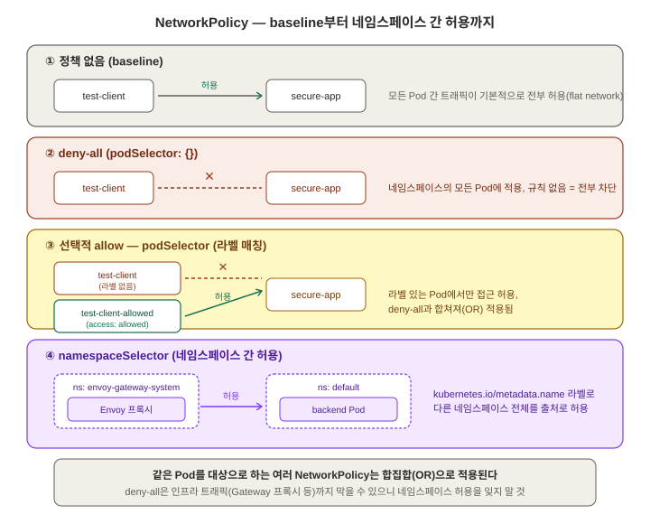
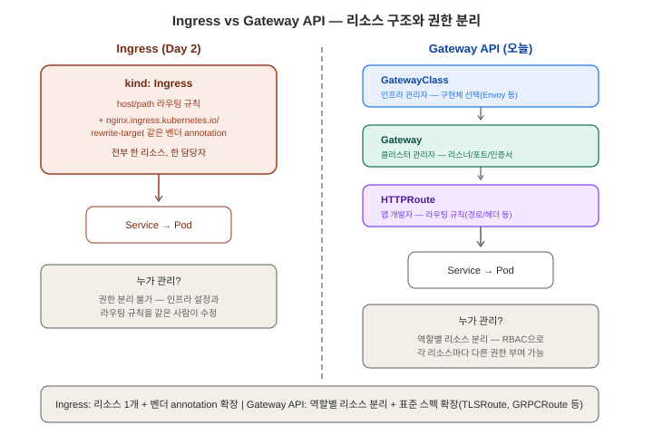

# NetworkPolicy와 Gateway API — 면접 대비 학습 정리

> 학습 목적: 이직/면접 대비. Day 9까지는 "누가(어떤 신원으로) 무엇을 할 수 있는지"(RBAC)를
> 다뤘다면, Day 10은 "어떤 트래픽이 오갈 수 있는지"를 다룬다. Day 2의 Service/Ingress는
> 트래픽을 어디로 라우팅할지를 다뤘지만 트래픽을 막는 방법은 다루지 않았다 — NetworkPolicy가
> 그 역할이다. 이어서 Ingress의 후속 표준인 Gateway API를 실습하며 Ingress와 무엇이 다른지
> 비교한다. 환경: Windows 11 + Docker Desktop(WSL2) + minikube v1.38.1(Kubernetes v1.35.1,
> `docker` 드라이버, Docker 29.2.1 런타임), PowerShell. 매니페스트는 `manifests/day10/`에 커밋.

---

## 1. NetworkPolicy — 기본은 전부 허용, 정책으로만 제한



### 개념

기본적으로 쿠버네티스는 **모든 Pod가 모든 Pod와 자유롭게 통신 가능**하도록 설계됐다(flat
network 모델). NetworkPolicy는 이 기본값 위에 "이 라벨을 가진 Pod는 이런 트래픽만 받아라/
보내라"는 화이트리스트 규칙을 얹는 리소스다. `podSelector`로 정책을 적용할 대상 Pod를 고르고,
`policyTypes`(Ingress/Egress)와 `from`/`to` 규칙으로 허용할 트래픽을 지정한다.

### 왜 이렇게 설계됐는가

Pod IP 기반 네트워크는 VM 환경의 서브넷 분리보다 훨씬 평평(flat)하다 — 같은 클러스터 안
모든 Pod가 사실상 같은 네트워크에 있는 것과 같다. 이게 개발 편의성(Day 2에서 본 Service
디스커버리 등)을 높이지만, 보안 관점에서는 "프론트엔드 Pod가 컴프라미즈되면 DB Pod에도
바로 접근 가능"한 위험한 기본값이기도 하다. NetworkPolicy는 이 기본값을 유지하면서도
필요한 곳에만 화이트리스트 방식으로 트래픽을 제한할 수 있게 해서, 마이크로서비스 간 최소
권한(least privilege) 네트워크 접근을 구현하는 표준 도구가 됐다.

> **면접 답변**: "쿠버네티스는 기본적으로 모든 Pod 간 통신을 허용하는 flat network
> 모델입니다. NetworkPolicy는 podSelector로 대상을 지정하고 Ingress/Egress 규칙으로 허용할
> 트래픽만 화이트리스트로 규정하는 리소스로, 이 개방적 기본값 위에서 마이크로서비스 간
> 최소 권한 네트워크 접근을 구현하는 표준적인 방법입니다."

### 실습 — CNI가 NetworkPolicy 지원 여부를 결정한다 (중요한 함정)

Day 8에서 멀티노드 구성에 썼던 **`kindnet` CNI는 설계상 NetworkPolicy를 지원하지 않는다**
(minikube 공식 문서, 2026-07-30 확인). NetworkPolicy를 적용해도 에러 없이 조용히 무시되기
때문에, 실습 전 지원 CNI로 클러스터를 다시 구성해야 한다. minikube는 **Calico**를 지원
CNI로 제공하며, 기존 클러스터에 나중에 얹는 것보다 **처음부터 `--cni=calico`로 새로 만드는
쪽이 훨씬 간단**하다고 공식 문서가 명시한다.

```powershell
PS C:\WINDOWS\System32> minikube delete
* docker 의 "minikube" 를 삭제하는 중 ...
* "minikube" 클러스터 관련 정보가 모두 삭제되었습니다

PS C:\WINDOWS\System32> minikube start --cni=calico
* Microsoft Windows 11 Home 25H2 의 minikube v1.38.1
* Docker Desktop 드라이버를 루트 권한으로 사용 중
* "minikube" 클러스터의 "minikube" primary control-plane 노드를 시작하는 중
* docker container (CPUs=2, 메모리=4000MB) 를 생성하는 중 ...
* 쿠버네티스 v1.35.1 을 Docker 29.2.1 런타임으로 설치하는 중
* Calico (Container Networking Interface) 를 구성하는 중 ...
* 애드온 활성화 : default-storageclass, storage-provisioner
* 끝났습니다!

PS C:\WINDOWS\System32> kubectl get pods -n kube-system
NAME                                       READY   STATUS    RESTARTS   AGE
calico-kube-controllers-565c89d6df-zlz8j   1/1     Running   0          3m10s
calico-node-fxg5l                          1/1     Running   0          3m10s
coredns-7d764666f9-tndc9                   1/1     Running   0          3m15s
etcd-minikube                              1/1     Running   0          3m26s
kube-apiserver-minikube                    1/1     Running   0          3m26s
kube-controller-manager-minikube           1/1     Running   0          3m26s
kube-proxy-9hhkq                           1/1     Running   0          3m15s
kube-scheduler-minikube                    1/1     Running   0          3m26s
storage-provisioner                        1/1     Running   0          3m6s
```
`calico-node`, `calico-kube-controllers`가 `Running`으로 뜬 것을 확인 — 이 둘이 실제로
NetworkPolicy 규칙을 노드에 심고 강제하는 주체다 (Day 2의 kube-proxy가 Service 라우팅
규칙을 심는 것과 같은 역할 분담 구조).

> 이번엔 멀티노드가 아닌 **단일 노드**로 재구성했다. NetworkPolicy 테스트 자체는 노드 수와
> 무관하고(라벨 기반 Pod-to-Pod 정책이라 같은 노드든 다른 노드든 동일하게 동작), Windows +
> Docker driver 환경에서 멀티노드+Calico 조합의 검증된 정보가 없어 리스크를 줄이는 선택.

### 실습 — 정책이 없을 때 기본 동작(baseline) 확인

```powershell
PS C:\WINDOWS\System32> kubectl create deployment secure-app --image=nginx
deployment.apps/secure-app created

PS C:\WINDOWS\System32> kubectl expose deployment secure-app --port=80
service/secure-app exposed

PS C:\WINDOWS\System32> kubectl run test-client --image=busybox --restart=Never -- sleep 3600
pod/test-client created

PS C:\WINDOWS\System32> kubectl wait --for=condition=Ready pod/test-client --timeout=60s
pod/test-client condition met

PS C:\WINDOWS\System32> kubectl exec test-client -- wget -qO- --timeout=3 secure-app
<!DOCTYPE html>
<html>
<head>
<title>Welcome to nginx!</title>
...
<h1>Welcome to nginx!</h1>
...
</html>
```
`test-client`에는 `secure-app`을 향한 어떤 허가도 준 적이 없는데, nginx 웰컴 페이지가
그대로 응답됐다 — **NetworkPolicy가 하나도 없으면 모든 Pod 간 트래픽이 기본적으로
전부 허용**된다는 것을 직접 확인. 이 상태에서 "deny-all" 정책을 걸었을 때 이 curl이
막히는지가 다음 실습의 핵심 대조 포인트.

### 실습 — deny-all 정책으로 실제 차단 확인

```yaml
# manifests/day10/deny-all.yaml
apiVersion: networking.k8s.io/v1
kind: NetworkPolicy
metadata:
  name: deny-all
spec:
  podSelector: {}
  policyTypes:
    - Ingress
```
`podSelector: {}`는 네임스페이스의 **모든** Pod를 대상으로 하고, `ingress` 규칙을 아예
적지 않으면 "이 Pod들로 들어오는 트래픽은 명시적으로 허용된 것 외엔 전부 차단"이 된다.

```powershell
PS C:\WINDOWS\System32> kubectl apply -f C:\Users\prist\docker-kubernetes-learn\manifests\day10\deny-all.yaml
networkpolicy.networking.k8s.io/deny-all created

PS C:\WINDOWS\System32> kubectl get networkpolicy
NAME       POD-SELECTOR   AGE
deny-all   <none>         14s

PS C:\WINDOWS\System32> kubectl exec test-client -- wget -qO- --timeout=3 secure-app
wget: download timed out
command terminated with exit code 1
```
baseline에서는 nginx 페이지가 그대로 응답됐던 동일한 명령이, `deny-all` 적용 후에는
**타임아웃**으로 실패한다 — Calico가 정책을 실제로 강제하고 있다는 직접 증거. (참고:
중간에 `test-client`가 `sleep 3600`을 다 채우고 `Succeeded` 상태가 되어 `exec`가 안 되는
해프닝이 있었다 — `restartPolicy: Never`인 Pod는 프로세스가 종료되면 재시작 없이 완료
상태로 멈추고, 완료된 Pod의 컨테이너에는 `exec`할 수 없다. Pod를 삭제 후 재생성해서
해결했다.)

### 실습 — 라벨 기반 선택적 허용 (deny-all과 정책이 합쳐지는 방식)

```yaml
# manifests/day10/allow-from-labeled.yaml
apiVersion: networking.k8s.io/v1
kind: NetworkPolicy
metadata:
  name: allow-from-labeled
spec:
  podSelector:
    matchLabels:
      app: secure-app
  policyTypes:
    - Ingress
  ingress:
    - from:
        - podSelector:
            matchLabels:
              access: allowed
```
같은 Pod를 대상으로 하는 여러 NetworkPolicy는 **합집합(OR)**으로 적용된다. `deny-all`은
`app: secure-app` Pod에도 적용되지만 규칙이 비어 있어 실질적으로 아무것도 허용하지 않고,
`allow-from-labeled`가 "`access: allowed` 라벨을 가진 Pod로부터의 트래픽"이라는 구체적인
구멍을 뚫어준다. 결과적으로 `secure-app`은 이 라벨을 가진 Pod에서만 접근 가능해진다.

```powershell
PS C:\WINDOWS\System32> kubectl apply -f C:\Users\prist\docker-kubernetes-learn\manifests\day10\allow-from-labeled.yaml
networkpolicy.networking.k8s.io/allow-from-labeled created

PS C:\WINDOWS\System32> kubectl run test-client-allowed --image=busybox --restart=Never --labels="access=allowed" -- sleep 3600
pod/test-client-allowed created

PS C:\WINDOWS\System32> kubectl wait --for=condition=Ready pod/test-client-allowed --timeout=60s
pod/test-client-allowed condition met

PS C:\WINDOWS\System32> kubectl exec test-client -- wget -qO- --timeout=3 secure-app
wget: download timed out
command terminated with exit code 1

PS C:\WINDOWS\System32> kubectl exec test-client-allowed -- wget -qO- --timeout=3 secure-app
<!DOCTYPE html>
<html>
<head>
<title>Welcome to nginx!</title>
...
<h1>Welcome to nginx!</h1>
...
</html>
```

| Pod | 라벨 | 결과 |
|---|---|---|
| `test-client` | 없음 | 타임아웃 (차단) |
| `test-client-allowed` | `access: allowed` | nginx 응답 (허용) |

라벨 하나 차이로 통과/차단이 정확히 갈렸다 — NetworkPolicy가 IP가 아니라 **라벨 셀렉터**로
동작한다는 것을 직접 증명(Day 2에서 본 Service의 label selector와 같은 설계 철학).

### 참고 — Egress는 어떻게 다른가 (개념만)

지금까지는 `policyTypes: [Ingress]`만 다뤘다 — "이 Pod로 **들어오는**" 트래픽 제어. 같은
문법으로 `policyTypes: [Egress]`를 쓰면 "이 Pod에서 **나가는**" 트래픽도 화이트리스트로
제한할 수 있다(예: DB Pod가 외부 인터넷으로 나가는 트래픽을 막아 데이터 유출 경로 차단).
`from`이 `to`로 바뀌는 것 외엔 문법이 대칭적이다. 실무에서는 Ingress만 쓰는 경우가
많은데, Egress까지 걸면 CoreDNS(kube-dns)로 나가는 트래픽까지 막혀버려 DNS 조회 자체가
깨지는 실수가 흔하다 — Egress 정책을 걸 때는 `kube-system`의 DNS로 나가는 경로를 반드시
같이 허용해야 한다.

---

## 2. Gateway API — Ingress의 후속 표준



### 개념

Day 2에서 다룬 Ingress는 L7 라우팅을 위한 최초의 표준 리소스였지만, 실무에서 쓰다 보니
구조적 한계가 드러났다. Gateway API는 이를 대체하기 위해 설계된 차세대 표준으로, 2023년
v1.0 GA를 시작으로 계속 기능이 Stable 채널로 승격되고 있다(2026-02-27 출시 v1.5에서
TLSRoute·ReferenceGrant가 Standard로 승격 — Kubernetes 공식 블로그, 2026-07-30 확인).

**Ingress의 한계**:
- 리소스 하나(`kind: Ingress`)에 모든 게 뭉쳐 있어, 인프라 관리자(로드밸런서 설정)와
  앱 개발자(라우팅 규칙)의 권한을 분리할 수 없다.
- 표준 스펙이 host/path 라우팅 정도로 얕아서, 벤더별 세부 기능(rewrite, 헤더 조작 등)은
  전부 `nginx.ingress.kubernetes.io/...` 같은 **비표준 annotation**으로 구현된다 — 다른
  컨트롤러로 바꾸면 annotation을 전부 다시 써야 한다(Day 2 실습에서 쓴
  `nginx.ingress.kubernetes.io/rewrite-target`이 그 예).
- HTTP 외 프로토콜(TCP, gRPC, TLS passthrough)을 표준 방식으로 표현할 방법이 없다.

**Gateway API의 해법 — 역할별 리소스 분리**:
- `GatewayClass`: 어떤 컨트롤러 구현체를 쓸지 정의 (인프라 관리자)
- `Gateway`: 실제 진입점(리스너, 포트, 인증서) 정의 (클러스터 관리자)
- `HTTPRoute`/`TCPRoute`/`GRPCRoute`: 프로토콜별 라우팅 규칙 (앱 개발자) — **CRD 확장이
  아니라 표준 스펙 자체가 프로토콜별로 나뉘어 있다**

### 왜 이렇게 설계됐는가

Ingress가 하나의 리소스에 모든 관심사를 뭉쳐놓은 건, 여러 팀이 하나의 클러스터를 공유하는
실무 환경(Day 9의 Namespace/RBAC과 같은 맥락)에서 "인프라 담당자만 인증서/리스너를
건드리고, 앱 개발자는 라우팅 규칙만 건드리게" 권한을 분리할 방법이 없다는 뜻이었다.
Gateway API는 리소스를 역할별로 쪼개서 RBAC으로 각자 다른 권한을 줄 수 있게 하고, 동시에
HTTP 외 프로토콜까지 표준 스펙에 포함시켜 nginx 전용 annotation 같은 벤더 종속을 줄였다.

> **면접 답변**: "Ingress는 라우팅 규칙과 인프라 설정이 하나의 리소스에 뭉쳐 있고, 세부
> 기능은 벤더별 annotation에 의존해 이식성이 떨어집니다. Gateway API는 GatewayClass(구현체
> 선택)·Gateway(진입점)·HTTPRoute(라우팅 규칙)로 역할을 분리해 인프라 관리자와 앱
> 개발자의 권한을 나눌 수 있게 했고, HTTPRoute 외에 TCPRoute·GRPCRoute 등 프로토콜별
> 표준 스펙을 제공해 벤더 종속도 줄였습니다. 2026년 기준 GatewayClass·Gateway·HTTPRoute·
> TLSRoute가 모두 GA 상태입니다."

### 실습 — Envoy Gateway 설치 (Gateway API 구현체)

minikube엔 Ingress addon 같은 내장 기능이 없어서, 별도 컨트롤러 구현체가 필요하다. Helm이
없어 먼저 설치:

```powershell
PS C:\WINDOWS\System32> winget install Helm.Helm
# (새 창에서 PATH 반영 후)
PS C:\WINDOWS\System32> helm version
version.BuildInfo{Version:"v4.2.3", ...}
```

Gateway API CRD와 컨트롤러를 Helm 차트 하나로 함께 설치(Envoy Gateway v1.8.3):

```powershell
PS C:\Users\prist> helm install eg oci://docker.io/envoyproxy/gateway-helm --version v1.8.3 -n envoy-gateway-system --create-namespace
...
STATUS: deployed

PS C:\Users\prist> kubectl wait --timeout=5m -n envoy-gateway-system deployment/envoy-gateway --for=condition=Available
deployment.apps/envoy-gateway condition met

PS C:\Users\prist> kubectl apply -f https://github.com/envoyproxy/gateway/releases/download/v1.8.3/quickstart.yaml -n default
gatewayclass.gateway.networking.k8s.io/eg created
gateway.gateway.networking.k8s.io/eg created
serviceaccount/backend created
service/backend created
deployment.apps/backend created
httproute.gateway.networking.k8s.io/backend created
```
한 번의 apply로 `GatewayClass`(구현체 지정) → `Gateway`(진입점) → `HTTPRoute`(라우팅 규칙) →
샘플 백엔드까지 전부 생성됐다 — Day 2의 Ingress 실습(컨트롤러 addon 활성화 → Ingress
리소스 작성을 따로 했던 것)과 달리, 오늘은 역할별 리소스 3개가 한 번에 만들어지는 걸
확인했다.

### 실습 — 접속 테스트, 그리고 NetworkPolicy와의 충돌 (예상 밖의 발견)

minikube는 LoadBalancer의 외부 IP를 실제로 할당하지 못하므로(`EXTERNAL-IP: <pending>`),
Envoy가 만든 Service를 포트포워딩해서 접근했다:

```powershell
PS C:\Users\prist> kubectl get svc -n envoy-gateway-system
NAME                        TYPE           CLUSTER-IP       EXTERNAL-IP   PORT(S)        AGE
envoy-default-eg-e41e7b31   LoadBalancer   10.104.204.170   <pending>     80:32438/TCP   3m14s

PS C:\Users\prist> kubectl -n envoy-gateway-system port-forward service/envoy-default-eg-e41e7b31 8888:80
Forwarding from 127.0.0.1:8888 -> 10080
```
> 처음엔 공식 문서의 라벨 셀렉터(`gateway.envoyproxy.io/owning-gateway-name=eg` 등)로 서비스
> 이름을 환경변수에 담아 쓰려 했으나 `kubectl port-forward`가 `arguments in resource/name
> form must have a single resource and name` 에러를 냈다. PowerShell 환경변수 치환 과정의
> 문제로 보고, `kubectl get svc`로 이름을 직접 확인해 하드코딩하는 방식으로 우회했다.

포트포워딩은 됐지만, 첫 curl은 실패했다:
```powershell
PS C:\Users\prist> curl.exe -H "Host: www.example.com" http://localhost:8888/get
upstream connect error or disconnect/reset before headers. reset reason: connection timeout
```
Envoy(프록시)까지는 연결됐지만 그 뒤 **백엔드로 가는 연결이 타임아웃**됐다는 뜻. 원인
확인:
```powershell
PS C:\Users\prist> kubectl get pods
NAME                          READY   STATUS      RESTARTS   AGE
backend-7878cc679d-cvhsg      1/1     Running     0          5m29s
...
PS C:\Users\prist> kubectl get networkpolicy
NAME                 POD-SELECTOR     AGE
allow-from-labeled   app=secure-app   62m
deny-all             <none>           150m
```
`backend` Pod는 `Running`/`Ready`로 멀쩡했다. 범인은 **1번 섹션에서 건 `deny-all`
정책**이었다 — `podSelector: {}`라 default 네임스페이스의 **모든** Pod에 적용되고,
`backend`는 어떤 allow 규칙의 대상도 아니었다. Envoy 프록시는 `envoy-gateway-system`
네임스페이스에 있으므로, 그 네임스페이스에서 오는 트래픽을 명시적으로 허용해야 했다:

```yaml
# manifests/day10/allow-envoy-to-backend.yaml
apiVersion: networking.k8s.io/v1
kind: NetworkPolicy
metadata:
  name: allow-envoy-to-backend
spec:
  podSelector:
    matchLabels:
      app: backend
  policyTypes:
    - Ingress
  ingress:
    - from:
        - namespaceSelector:
            matchLabels:
              kubernetes.io/metadata.name: envoy-gateway-system
```
`namespaceSelector`는 **다른 네임스페이스 전체**를 출처로 허용할 때 쓰는 매칭 방식이다.
`kubernetes.io/metadata.name`은 쿠버네티스가 모든 네임스페이스에 자동으로 붙여주는
라벨(v1.21+)이라 별도 라벨링 없이 바로 쓸 수 있었다.

```powershell
PS C:\Users\prist> kubectl apply -f C:\Users\prist\docker-kubernetes-learn\manifests\day10\allow-envoy-to-backend.yaml
networkpolicy.networking.k8s.io/allow-envoy-to-backend created

PS C:\Users\prist> curl.exe -H "Host: www.example.com" http://localhost:8888/get
{
 "path": "/get",
 "host": "www.example.com",
 "method": "GET",
 "headers": { "User-Agent": ["curl/8.21.0"], ... },
 "httpPort": "3000",
 "namespace": "default",
 "pod": "backend-7878cc679d-cvhsg"
}
```
`client → 포트포워딩 → Envoy 프록시 → HTTPRoute → backend Service → backend Pod`까지
전체 경로가 성공했다. 응답 JSON에 실제로 요청을 받은 Pod 이름(`backend-7878cc679d-cvhsg`)과
네임스페이스가 그대로 찍혀 있어, 어느 Pod까지 도달했는지 명확히 확인된다.

> **면접 답변(부수 발견)**: "NetworkPolicy의 `podSelector: {}`(deny-all)는 같은 네임스페이스의
> 모든 Pod에 적용되기 때문에, 사용자 워크로드뿐 아니라 Ingress 컨트롤러나 Gateway 프록시처럼
> **클러스터 인프라가 보내는 트래픽까지 막을 수 있습니다.** 이번 실습에서 Gateway API의
> Envoy 프록시가 backend Pod에 연결하지 못한 원인도 deny-all이었고, `namespaceSelector`로
> 프록시가 있는 네임스페이스를 명시적으로 허용하고서야 해결됐습니다. 실무에서 default-deny
> 정책을 도입할 때 인그레스/게이트웨이 컨트롤러의 네임스페이스를 빠뜨리는 게 흔한 실수입니다."

### Ingress vs Gateway API — 실습 기반 비교

| | Ingress (Day 2) | Gateway API (오늘) |
|---|---|---|
| 리소스 구조 | `Ingress` 단일 리소스 | `GatewayClass`+`Gateway`+`HTTPRoute` 역할별 분리 |
| 컨트롤러 설치 | `minikube addons enable ingress` (내장 addon) | Helm으로 별도 설치 (minikube 내장 addon 없음) |
| 세부 기능 확장 | 벤더 annotation(`nginx.ingress.kubernetes.io/...`) | 표준 스펙 자체에 포함(TLSRoute, GRPCRoute 등) |
| 프로토콜 | 사실상 HTTP(S) 전용 | HTTP/TCP/TLS/gRPC 등 프로토콜별 리소스 |
| GA 시점 | v1.19(2020-09) `networking.k8s.io/v1` GA (오래된 표준, Google Open Source Blog 확인) | 2023년 v1.0 GA, 2026-02 v1.5로 기능 확장 중 |
| 권한 분리 | 어려움 (리소스 하나에 다 뭉침) | GatewayClass/Gateway/HTTPRoute를 RBAC으로 따로 제어 가능 |

---

## 오늘 배운 것 전체 흐름 요약

1. 쿠버네티스는 기본적으로 모든 Pod 간 통신을 허용하는 flat network 모델이고,
   NetworkPolicy는 그 위에 화이트리스트 방식으로 트래픽을 제한하는 리소스다.
2. **CNI가 NetworkPolicy 지원 여부를 결정한다** — Day 8에서 쓴 `kindnet`은 지원하지 않아,
   `--cni=calico`로 클러스터를 재구성한 뒤에야 정책이 실제로 강제됨을 확인할 수 있었다.
3. `podSelector: {}` + 빈 `ingress` 규칙(`deny-all`)으로 기본값을 "전부 차단"으로 뒤집고,
   `podSelector`로 특정 라벨을 가진 Pod에서 오는 트래픽만 선택적으로 허용할 수 있다 — 같은
   Pod를 대상으로 하는 여러 정책은 합집합(OR)으로 적용된다.
4. Gateway API는 Ingress의 후속 표준으로, 리소스를 GatewayClass/Gateway/HTTPRoute로
   역할별 분리해 권한 분리와 프로토콜 확장성을 확보했다. minikube엔 내장 addon이 없어
   Envoy Gateway를 Helm으로 별도 설치해야 했다.
5. **가장 값진 발견**: `deny-all` NetworkPolicy는 같은 네임스페이스의 모든 Pod에 적용되므로
   사용자 워크로드뿐 아니라 Gateway 프록시 같은 클러스터 인프라의 트래픽도 막을 수 있다.
   `namespaceSelector`로 프록시가 있는 네임스페이스를 명시적으로 허용해야 했다 — Day 10의
   두 주제(NetworkPolicy, Gateway API)가 실습 중 실제로 충돌하며 연결된 경험이었다.

**다음 학습 목표**: Day 11 — 트러블슈팅 집중. CrashLoopBackOff, ImagePullBackOff 등 장애
상황을 의도적으로 재현하고 `kubectl describe/logs/events` 워크플로로 원인을 추적하는
연습 (CKA 최대 비중 도메인, 30%).
