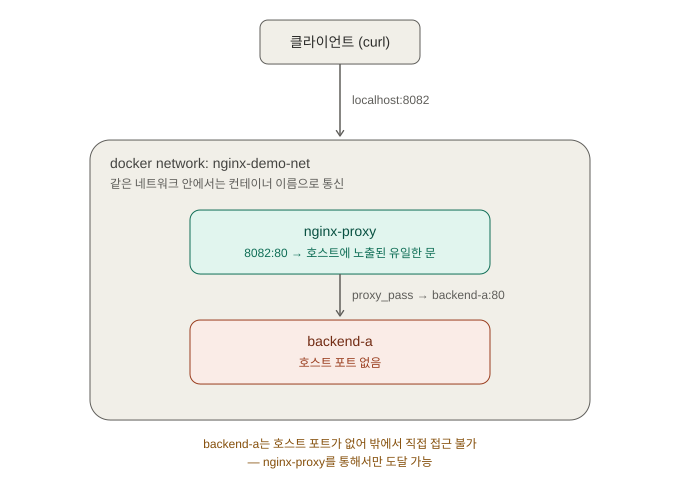

# 리버스 프록시와 nginx — 보충 학습 정리

> 목적: [load-balancing-overview.md](load-balancing-overview.md)에서 "L7 로드밸런서"로만
> 짧게 언급했던 리버스 프록시를, nginx.conf를 직접 써보며 구체적으로 이해한다. K8s 없이
> 순수 Docker로 진행해서, "K8s Service가 하는 일"과 "nginx 자체가 하는 일"을 분리해서 본다.
> 실습 설정 파일: [`nginx/`](../nginx/) 폴더.

## 리버스 프록시 = "리셉션 데스크"

여러 부서(백엔드 서버)가 있는 건물에서, 방문객(클라이언트)은 어디로 가야 할지 모른다.
그래서 입구에 **리셉션 데스크**를 두고, 방문객은 항상 거기에만 말을 건다 — 리셉션이
알아서 적절한 부서로 안내한다. 방문객은 실제로 어느 부서가 처리했는지 몰라도 된다.

**리버스 프록시**가 정확히 이 역할이다: 클라이언트는 프록시 하나의 주소로만 접속하고,
프록시가 어느 백엔드로 보낼지 대신 정한다. 그 과정에서 로드밸런싱, 경로별 라우팅, SSL
처리를 부수적으로 떠맡는다.

**주의할 점**: 리버스 프록시는 백엔드 서버를 관리(생명주기·스케일링)하지 않는다. 그건
K8s(Deployment/HPA)의 일이고, 리버스 프록시는 **트래픽만** 관리한다 — Day 2에서 배운
"Service는 파드를 관리하지 않고 트래픽만 관리한다"는 것과 정확히 같은 구조.

이미 아는 것과 연결하면:
- **K8s Ingress** = 클러스터 **바깥**에서 이 리셉션 역할
- **Service/kube-proxy** = 클러스터 **안**에서 파드들 앞의 리셉션 역할
- **nginx** = 이 리셉션 데스크를 실제로 구현하는 소프트웨어 중 가장 유명한 것
  (`ingress-nginx`가 바로 Ingress를 nginx로 구현한 것)

## nginx.conf 기본 구조

```nginx
http {
    server {
        listen 80;
        server_name example.com;

        location / {
            root /usr/share/nginx/html;
        }
    }
}
```

- **`http { }`** — 웹서버 운영 규칙집 전체를 담는 가장 바깥 상자. 여러 `server`를 담을 수 있다.
- **`server { }`** — 리셉션 데스크 하나. `listen 80`은 몇 번 문으로 들어오는 손님을 받을지,
  `server_name`은 어떤 도메인으로 온 손님만 받을지.
- **`location / { }`** — 경로별 안내 규칙. `location /api/ { ... }`처럼 경로마다 다르게 둘 수 있다.
- **`events {}`** — 최상단에 항상 있어야 하는 필수 블록(연결 처리 관련 설정). 지금 수준에선
  빈 채로 둬도 된다.

## 실습 ① 정적 파일 서빙 (`root`)

```nginx
events {}

http {
    server {
        listen 80;

        location / {
            root /usr/share/nginx/html;
        }
    }
}
```

```powershell
docker run -d --name nginx-static -p 8081:80 `
  -v ${PWD}/nginx/static-demo/nginx.conf:/etc/nginx/nginx.conf:ro `
  -v ${PWD}/nginx/static-demo/html:/usr/share/nginx/html:ro `
  nginx:1.27

curl.exe http://localhost:8081
```
```
<h1>커스텀 root 테스트 성공</h1>
```
직접 만든 `nginx.conf`의 `root` 지시어가 마운트한 폴더에서 파일을 찾아 서빙한 것을 확인.

## 실습 ② 리버스 프록시 (`proxy_pass`)

백엔드 하나(`backend-a`)는 **호스트에 포트를 안 열고**, 프록시(`nginx-proxy`)만 8082를
연다 — "손님은 리셉션만 상대한다"를 그대로 증명하는 구성.

```nginx
events {}

http {
    server {
        listen 80;

        location / {
            proxy_pass http://backend-a:80;
        }
    }
}
```

```powershell
docker network create nginx-demo-net

docker run -d --name backend-a --network nginx-demo-net `
  -v ${PWD}/nginx/reverse-proxy-demo/backend-a:/usr/share/nginx/html:ro `
  nginx:1.27

docker run -d --name nginx-proxy --network nginx-demo-net -p 8082:80 `
  -v ${PWD}/nginx/reverse-proxy-demo/proxy/nginx.conf:/etc/nginx/nginx.conf:ro `
  nginx:1.27

curl.exe http://localhost:8082
```
```
<h1>백엔드 A 응답</h1>
```
8082(프록시)로만 요청했는데, 실제 응답은 `backend-a`가 만든 것 — `backend-a`는 `-p`가
없어 호스트에서 직접 접근 불가능하고, 오직 `nginx-proxy`를 통해서만 도달 가능하다.



## 실습 ③ 로드밸런싱 (`upstream`)

```nginx
events {}

http {
    upstream backend_pool {
        server backend-a:80;
        server backend-b:80;
    }

    server {
        listen 80;

        location / {
            proxy_pass http://backend_pool;
        }
    }
}
```

```powershell
docker run -d --name backend-b --network nginx-demo-net `
  -v ${PWD}/nginx/reverse-proxy-demo/backend-b:/usr/share/nginx/html:ro `
  nginx:1.27

docker restart nginx-proxy

1..10 | ForEach-Object { curl.exe -s http://localhost:8082 } | Group-Object | Select-Object Count, Name
```
```
Count Name
----- ----
    5 <h1>백엔드 A 응답</h1>
    5 <h1>백엔드 B 응답</h1>
```
10번 요청이 정확히 **5:5**로 나뉨. nginx `upstream`의 기본 알고리즘은 **라운드로빈**(순서대로
정확히 번갈아가며 분배)이라, 딱 떨어지는 결과가 나온다.

> 실행 환경 참고: Windows PowerShell 콘솔의 기본 코드페이지가 UTF-8이 아니라서, curl.exe가
> 뱉는 한글 응답이 화면에는 깨져 보일 수 있다(`諛깆뿏??A` 등). `Group-Object`가 서로 다른
> 두 그룹으로 정확히 나눈 것 자체는 바이트 단위 비교라 결과 해석엔 영향 없다. 읽기 좋게
> 하려면 명령 전에 `chcp 65001` 실행.

## 정리 — nginx 자체 로드밸런싱 vs K8s Service/kube-proxy

| | nginx `upstream` | K8s Service/kube-proxy |
|---|---|---|
| 계층 | L7 (HTTP 내용까지 봄) | 주로 L4 (IP:포트 리다이렉트) |
| 백엔드 목록 | `nginx.conf`에 직접 나열(**정적** — 늘어나면 설정을 고쳐야 함) | EndpointSlice로 **자동 갱신**(동적) |
| 처리 주체 | nginx 프로세스가 매 요청마다 직접 개입 | iptables 모드는 커널이 패킷만 리다이렉트 |
| 기본 알고리즘 | 라운드로빈(정확, 오늘 5:5로 실측) | iptables=무작위(Day 7에서 75:25 실측), IPVS=선택 가능 |

**가장 실무적으로 중요한 차이는 "백엔드 목록이 정적이냐 동적이냐"다.** 오늘은
`backend-a`/`backend-b`를 nginx.conf에 손으로 적었지만, 실제 K8s의 `ingress-nginx`는
**K8s API를 계속 지켜보다가 파드가 늘거나 줄면 nginx.conf를 자동으로 재생성하고
reload한다** — 오늘 수동으로 한 걸, ingress-nginx는 자동화해주는 것.

> **면접 답변**: "리버스 프록시는 백엔드를 관리하는 게 아니라 트래픽을 중개하는
> 도구입니다. nginx의 upstream은 백엔드 목록을 설정 파일에 정적으로 나열하고 기본
> 라운드로빈으로 분배하는 반면, K8s Service는 EndpointSlice를 통해 파드 목록을 동적으로
> 갱신합니다. ingress-nginx 같은 K8s용 Ingress 컨트롤러는 이 정적/동적 격차를 메우기
> 위해, K8s API 변화를 감시해서 nginx 설정을 자동으로 재생성·reload하는 방식으로
> 동작합니다."

**다음 학습 후보**: nginx `ip_hash`/`least_conn` 같은 다른 로드밸런싱 알고리즘, SSL
termination 실습, 실제 `ingress-nginx` 컨트롤러의 자동 재생성 동작을 K8s 위에서 확인.
